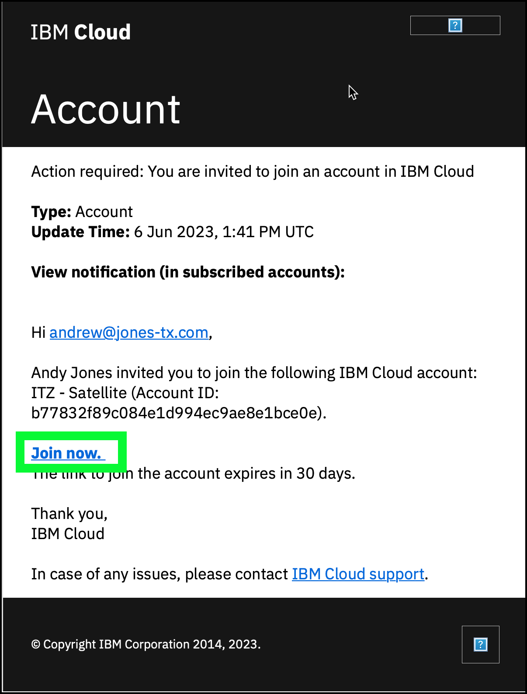

As mentioned earlier, this activity requires a reservation for the IBM Technology Zone (ITZ) {{ tz_environment.name }} demonstration environment. 

The full collection can be accessed <a href="{{ tz_environment.collectionURL }}" target="_blank">here</a>.

From the collection page, click the "Complete learning activity for..." link in left hand menu bar to view all the resources for the collection. 

To make a reservation for the shared environment, click the **{{ tz_environment.environmentName }}** tile or go <a href="{{ tz_environment.environmentURL }}" target="_blank">here</a>.

!!! important "Plan your time!"

    While it will take approximately 4 hours to complete all sections of this activity once the reservation is ready, additional time may be needed to practice the demonstration script, complete the required Stand and Deliver (IBM employees), complete the business partner quiz (partners only), or to perform an actual client demonstration. 

A reservation can be made for immediate use by selecting **Reserve now**, or for future access using the **Schedule for later** option. 

When completing the reservation form, select **Practice/Self-Education** from the **Purpose** pull-down menu and specify **Level 3 Training** in the **Purpose description** field. The ITZ policy for this environment is a 2 day reservation that can be extended for a maximum of 6 days. Note, if you select a different **Purpose** option, the default duration for the reservation will vary (as short as 12 hours). If you are performing a client demonstration, select **Customer Demo** and provide a **Sales Opportunity number**. 

The environment reservation will go through a provisioning process and then it should move to a **Ready** state. Several e-mails should be received during this process. Review the emails received. One will be from **IBM Cloud** with the title **Account: You are invited to join an account in IBM Cloud**. Within the content of the email is a link to **Join Now**. Click the link and then **Accept** the invitation on the IBM Cloud portal.

??? error "Did not get an e-mail from IBM Cloud?"

    If you did not receive an e-mail from IBM Cloud inviting you to join the {{account}}, but you did receive a notification from ITZ that your environment was ready, try the following:

    - Log into cloud.ibm.com using your IBM Cloud ID.
    - Click the .
    - Look for a new notification with the subject: **Action required: You are invited to join an account in IBM Cloud**.
    - Click on the notification and then click the **Join now** link.

    If you do not see a notification or an e-mail, try deleting the existing reservation in ITZ and try creating a new one. If that doesn't work, open a support ticket in the <a href="https://ibmsf.my.site.com/ibminternalproducts/s/createrecord/NewCase" target="_blank">ITZ ticketing system</a>. Include the reservation ID and summarize the problem in your message.

!!! warning "This environment not suitable for Proof-of-Concept (PoC), Proof-of-Technology (PoT), or Proof-of-Experience (PoX) activities!"

    As this is a shared environment that provides limited access, this environment should NOT be used for PoCs, PoTs, or PoXs. Other ITZ environments or IBM Cloud trial accounts are available for those types of activities, simply search for **Satellite** in the <a href="https://techzone.bim.com/" target="_blank">ITZ portal</a>. 
    
    Additionally, there are two (2) valuable assets that can help quickly setup IBM Cloud Satellite demo environments in **your own cloud account** (charges will apply). At this time, these repositories and Slack channel are only available to internal IBMers. Use the <a href="https://ibm-technology-sales.slack.com/archives/C01PCPAB9HS" target="_blank">#try-sat-friends</a> Slack channel to communicate to the owner and the users of these assets.

    - Try-Sat - <a href="https://github.ibm.com/garage-satellite-guild/try-sat" target="_blank">https://github.ibm.com/garage-satellite-guild/try-sat</a>
      This project provides a full terraform config for creating a Satellite location in an IBM Cloud VPC and installing a Red Hat OpenShift on IBM Cloud cluster into the location, all in a single terraform config. It is great for quickly setting up a scenario that can be used in client demonstrations.

     - Try-Sat-Stack - <a href="https://github.ibm.com/drschrag/try-sat-stack" target="_blank">https://github.ibm.com/drschrag/try-sat-stack</a>
     This project takes much of its content from try-sat, but instead provides a layered approach to creating a full Red Hat OpenShift on IBM Cloud on Satellite environment. This allows the install to stop at any point and just create a Satellite location, or stop at the point when control plane nodes are assigned but a ROKS cluster is not yet created. It also is very configurable with variables to specify what gets created.

Proceed to the next section to learn about provisioning IBM Cloud Satellite Locations, Services, and Link endpoints.