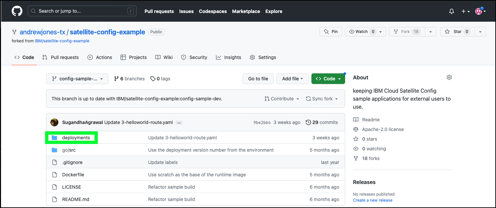
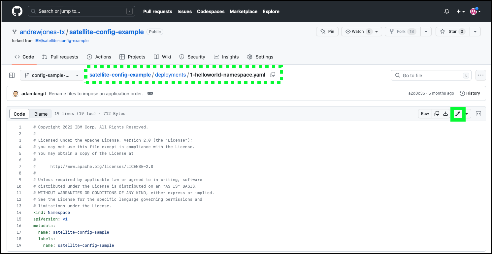
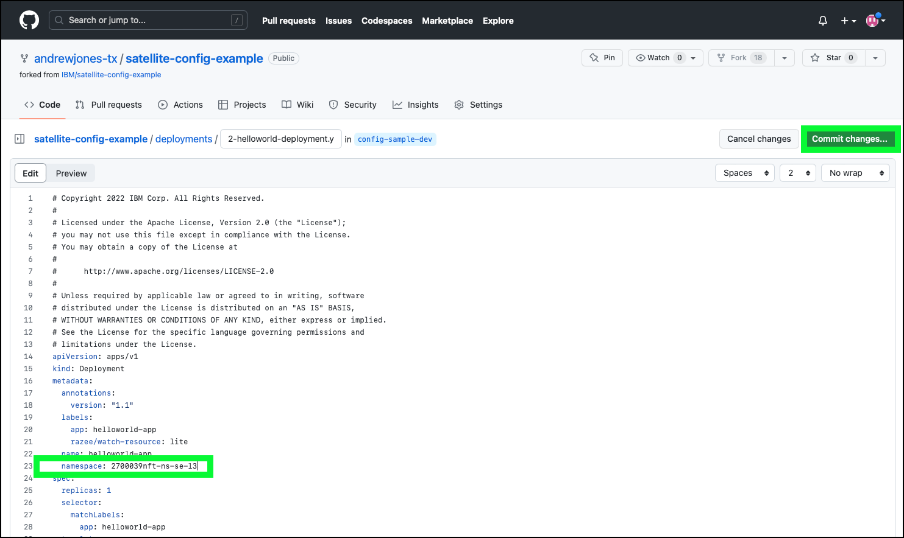
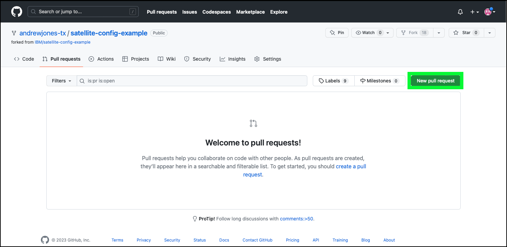
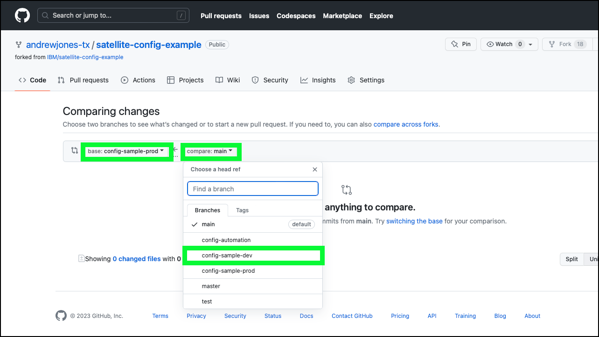
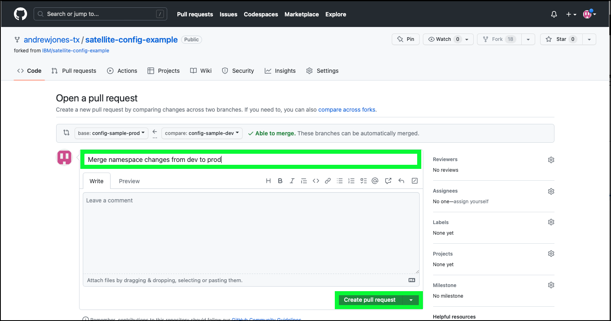
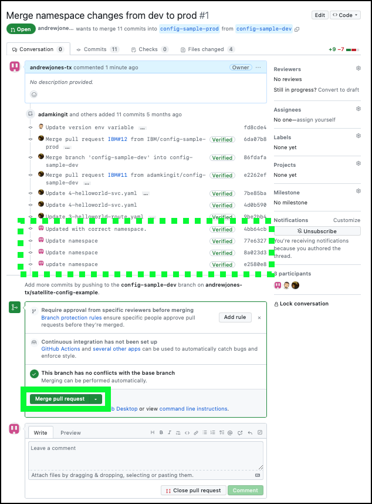
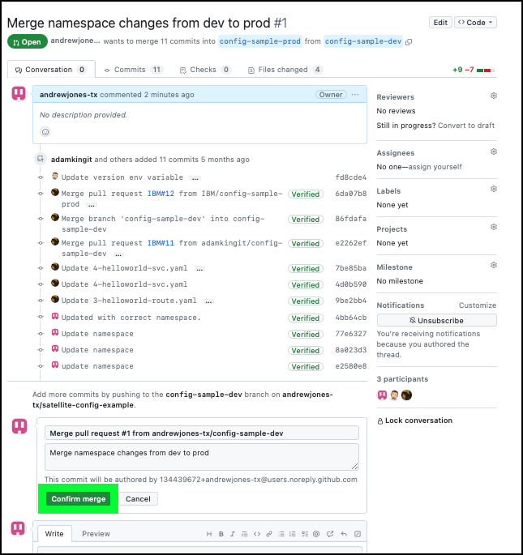
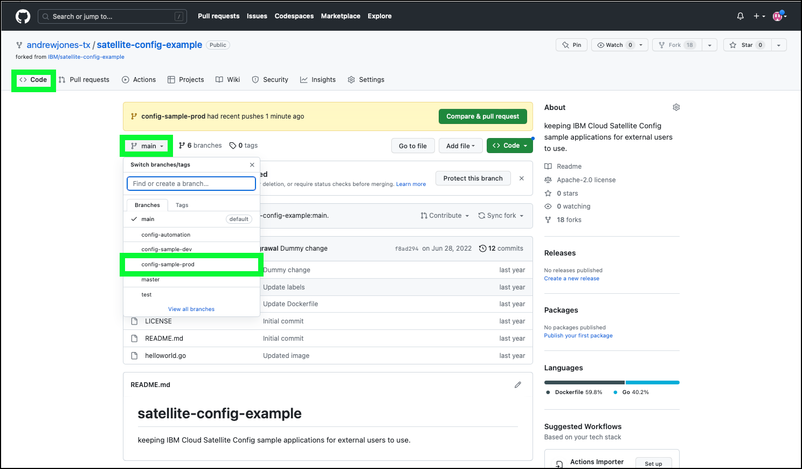

Before proceeding, a reservation for the IBM Cloud Satellite Level 3 IBM Technology Zone (ITZ) environment must be available and in the **Ready** state.  If you do not have an active reservation, return to the previous section to learn how to make the reservation.

**Required for technical sales only**

The steps below are **required for technical sales only**, however, all are highly encouraged to complete all sections. The steps below were carefully written to allow even the most novice GitHub users to complete the activity. Once you have a GitHub (or IBM Enterprise GitHub) user account, all should be able to follow along. No Git specific knowledge is required as the steps to be completed can all be done so using the GitHub browser interface. 

To learn more about GitHub check out these resources:

- <a href="https://resources.github.com/topics/fundamentals/" target="_blank">GitHub Fundamentals</a>
- For a very basic Git and GitHub tutorial, check out this <a href="https://www.youtube.com/watch?v=mJ-qvsxPHpY" target="_blank">Git Tutorial for Dummies</a>.

To complete the exercise, utilize either a public GitHub identification, or for IBM employees, a IBM Enterprise GitHub ID. The directions below are based on using a public GitHub identification. 

1. Log in to GitHub by opening a browser window to  <a href="https://github.com/login" target="_blank">https://github.com/login</a>.

!!! note 

    If you do not already have a GitHub user ID, you can create a free one by clicking the **Create an account** link on the sign in page.

2. Open a browser window to <a href="https://github.com/IBM/satellite-config-example" target="_blank">https://github.com/IBM/satellite-config-example</a>.

3. Click the **Fork** button.

4. Uncheck the **Copy the main branch only** checkbox and click **Create fork**.

The browser should redirect to the new repository in your GitHub workspace.

5. Select the **config-sample-dev** branch in the **branch** pull-down menu.

6. Click the **deployments** folder.

Next, update each of the four (4) YAML files with the namespace created specifically for you in the IBM Technology Zone (ITZ) environment. The namespace name can be found on the ITZ reservation page (see the example below) or in the e-mail sent by ITZ for the reservation. The value will be in the format "######ABCD-ns-se-l3". In the images below "2700039nft-ns-se-l3" is used, but **you must use your specific value in order to successfully complete this exercise**.

??? note "Why am I doing this?"

    Because the ITZ environment is shared by all users of this demonstration guide, a common namespace cannot be used or else users would overwrite each other and cause issues when attempting to follow the instructions. Each ITZ reservation sets up a unique namespace for each user. By changing this value in the deployment YAML files for the sample application, each user is able to deploy their own copy of the application in the OpenShift clusters managed by IBM Cloud Satellite.

Sample ITZ reservation page:

Sample ITZ e-mail:

7. Click the **1-helloworld-namespace.yaml** file in the deployments directory.

8. Edit the file by clicking the **pencil** () icon.

9. Change the value of the **name** field to the name of your ITZ-created namespace, remove the **name: satellite-config-sample** line under the **labels** section, and add the line **deploy.razee.io/mode: "EnsureExists"** under the **labels** section as shown below.

!!! warning "Formatting in YAML is important"
  
    The YAML language is very sensitive to formatting. Make sure each line aligns as illustrated in the image above. Use spaces and not tabs (2 spaces before **name:** and **labels:** and 4 spaces before **deploy.razee.io/mode:**).

Because the namespace is already created for you by the ITZ reservation, the **deploy.razee.io/mode: "EnsureExists"** label tells Satellite config to ignore this step if the namespace already exists.  

10. Click **Commit changes...**.

11. Update the **Commit message** text field with an appropriate message and then click the **Commit changes** button.

12. Click **deployments** to navigate back to the list of YAML files.

Next, the other three (3) YAML files need to be updated. For each of these, only the **namespace** field needs to be updated. The next set of steps walk you through updating one of the files, but you must do it for all three files:

- 2-helloworld-deployment.yaml
- 3-helloworld-route.yaml
- 4-helloworld-svc.yaml

13. Click the **2-helloworld-deployment.yaml** file name.
14. Edit the file by clicking the **pencil** () icon. 
15. Change the **namespace** field from **satellite-config-sample** to your ITZ specific namespace name.

!!! warning "Do not use **2700039nft-ns-se-l3**"
  
    You must use the namespace name created specifically for you as shown in your ITZ reservation!

16. Click the **Commit changes...** button.
17. Update the **Commit message** text field with an appropriate message and then click the **Commit changes** button.
18. Click **deployments** to navigate back to the list of YAML files.

Repeat steps 13-18 for each of the other 2 files in the **deployments** directory:

- 3-helloworld-route.yaml
- 4-helloworld-svc.yaml

For this demonstration, 2 branches in GitHub are used: development (dev) and production (prod). The changes just made in the dev branch need to be made in the prod branch as well. This can be done manually using the steps above, or a pull request can be completed to copy all changes from the dev branch to the prod branch. This process will be used in the demonstration as well, so instead of manually making the changes, lets practice doing a pull request.

19. Click the **Pull requests** link at the top of the GitHub page.

20. Click the **New pull request** button.

21. Change the **base repository** field from **IBM/satellite-config-example** to your GitHub fork of the repository.

!!! warning "Select **your** repository fork!!!"

22. Change the **base** field from **main** to **config-sample-prod** and the **compare** field from **main** to **config-sample-dev**.

This will tell GitHub to pull all changes in the **dev** branch into the **prod** branch.

23.  Verify the pull request can be merged, and click **Create pull request**.

24. Enter a comment for the request and click **Create pull request**.

25. Review the changes that are being made with the pull request and click **Merge pull request**.

26. Click **Confirm merge** to perform the merging of the dev and prod branches.

Verify the changes in the **prod** branch.

27. Click the **<> Code** link and then change the **branch** pulldown menu to **config-sample-prod**.

Notice the status above the table.  It should reflect the recent merge of the pull request. You can also view the changes to each file by clicking the **deployments** directory and viewing the individual YAML files.

To summarize, at this point you have copied (forked) sample code from one GitHub repository to your personal repository and updated the associated YAML files that will be used to deploy the sample application for both the dev and prod branches.  

In the next section, learn how to provision IBM Cloud Satellite and IBM Cloud Satellite enabled IBM Cloud services.