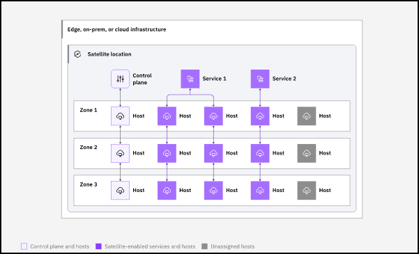
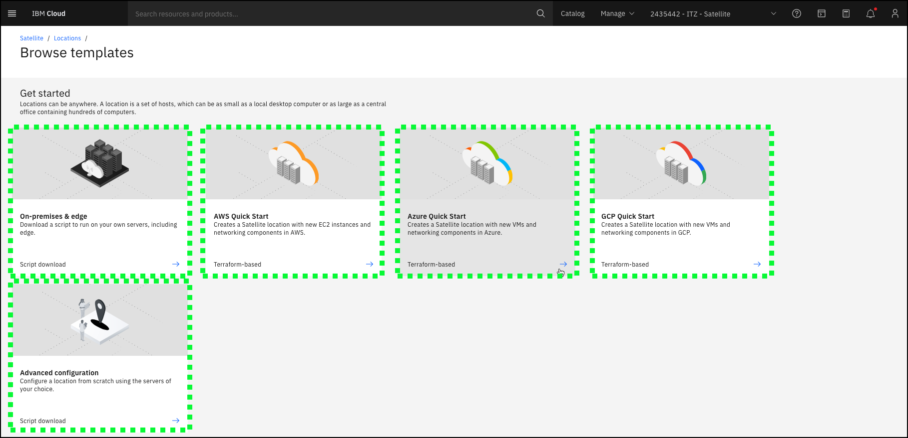
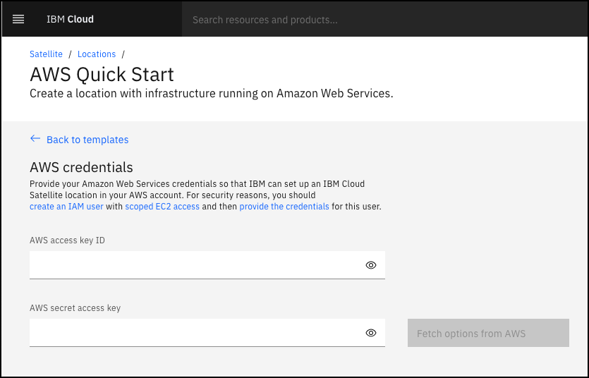
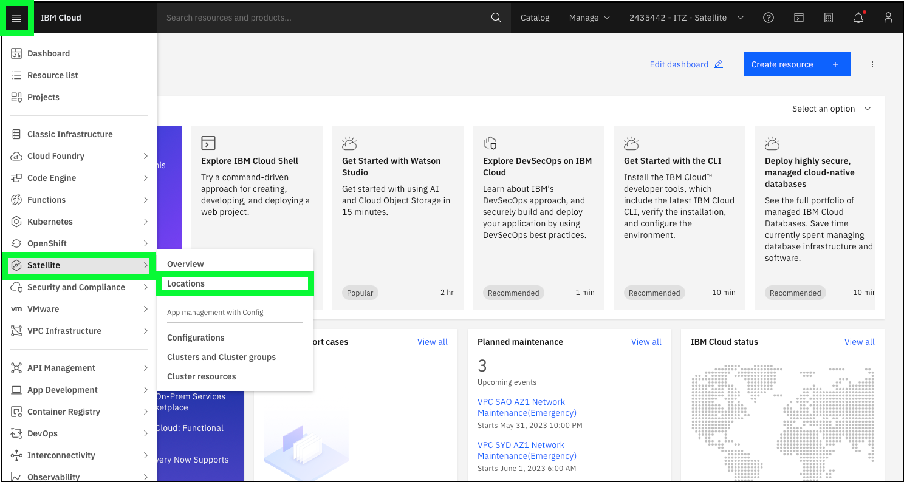
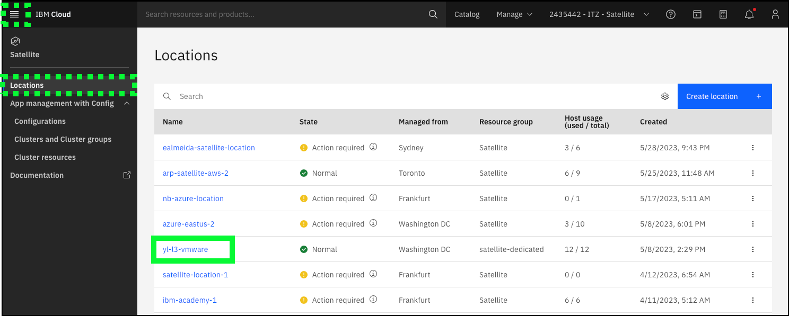
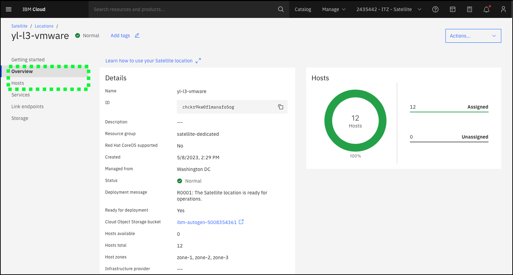
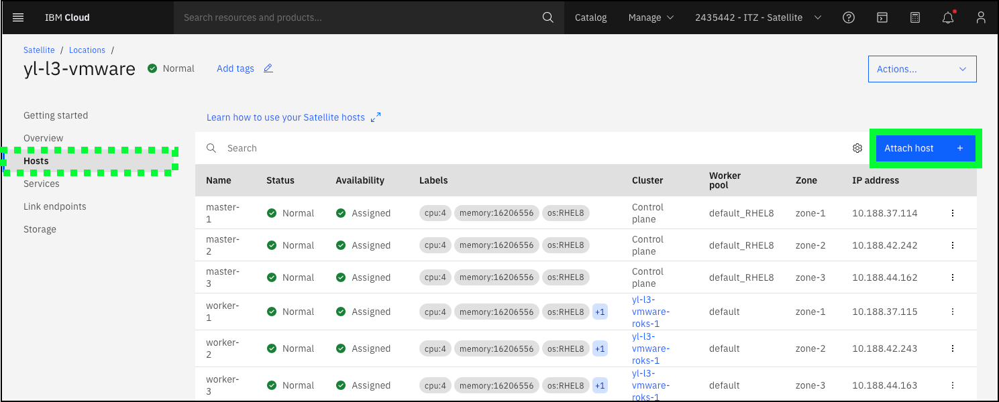

The first step to utilize IBM Cloud Satellite is to create a **Location**. A Location is a representation of an environment in a client's choice of infrastructure, such as an on-premises data center or public cloud. Below is a high-level architectural view of a Satellite Location.

Creating a Satellite Location can be achieved through the IBM Cloud Portal, via the IBM Cloud Satellite command line interfaces, or application programming interfaces (APIs). For other public cloud providers, IBM Cloud Satellite provides automation via <a href="https://cloud.ibm.com/docs/schematics?topic=schematics-about-schematics" target="_blank">IBM Cloud Schematics</a> to set up the Location. For on-premises deployments, scripts are provided that will need to be executed on each of the target host machines. Planning for the creation of a Location is critical. Detailed planning information is provided in the IBM Cloud Satellite documentation in the <a href="https://cloud.ibm.com/docs/satellite?topic=satellite-infrastructure-plan" target="_blank">Planning your environment for Satellite</a> section.

There are many requirements associated with creating a Satellite Location including minimum host requirements (operating system, CPU, memory, storage, etc.) and minimum network latency between Satellite Location hosts and IBM Cloud data centers. To learn more about Satellite Locations, refer to the Satellite Location product documentation: <a href="https://cloud.ibm.com/docs/satellite?topic=satellite-locations" target="_blank">https://cloud.ibm.com/docs/satellite?topic=satellite-locations</a>.

The image below is from the <a href="https://cloud.ibm.com/satellite/locations/create" target="_blank">IBM Cloud Portal</a>. There are tiles that provide a wizard-based creation process for 3rd party cloud providers as well as on-premises, edge, and advanced configurations. 

# Provisioning a location in 3rd party cloud provider 

!!! reminder "Permission to perform these steps are not provided in the ITZ demonstration environment."

    The steps are detailed here to completeness. If users have their own AWS account, they can follow along; however, any charges incurred are the responsibility of the user. Users should stop before actually provisioning resources. 

The Terraform-based creation wizards for 3rd party cloud providers first prompt users for credentials for the users account in the 3rd party cloud. An example is shown below for Amazon Web Services (AWS).

Once credentials are provided, prompts are provided for completing the required information to provision the Location. These include:

- The data center or region in the 3rd party provider where the Location should be created.
- The number and hardware configuration (CPU, Memory, Storage) of the virtual servers that will be provisioned for the location.
- And the IBM Cloud Object Storage bucket that will be used to store information about the Location. ofr 

The video below shows the provisioning of an IBM Cloud Satellite Location in AWS. The video has been edited to minimize the viewing time and does not reflect the actual provisioning time of a Satellite Location. The actual provisioning time (from clicking "Create location" to the Location being ready) will vary. When this video was created, it took approximately 25 minutes for the 12 hosts to be provisioned in AWS and configured as a Satellite Location.

Watch this video to understand the talking points when describing the provisioning process. 

!!! tip
    If the video appears blurry, click the full screen  or  icon.

??? tip "Don't like the green highlights in the video above?"

    This is the same video without audio or the highlights.
    
    [type:video](./_videos/IBMCloudSatellite-Seller-L3-ProvisionLocation-final.mp4)

# On-premises or edge 

Provisioning a Location in a client's datacenter or edge location is accomplished through customized scripts. These scripts can be run manually or incorporated in automation tools like Schematics. 

Once all the planning is complete and hardware that meets the required Satellite specifications is available, the high-level process to create a Location is:

1. Create the Location using the IBM Cloud Portal or command line interface
2. Generate and download the **host attach** script using the IBM Cloud Portal or command line interface
3. Copy and run the **host attach** script on each local physical or virtual server
4. Assign hosts to the location control pane
5. Assign additional hosts to various satellite-enabled services (e.g RedHat OpenShift on IBM Cloud, Cloud Object Storage, Event Streams, etc.)

A more detailed explanation of these steps can be found <a href="https://cloud.ibm.com/docs/satellite?topic=satellite-location-host" target="_blank">here</a> in the product documentation.

Watch this video to understand the talking points when describing the provisioning process. The video also covers provisioning a Satellite-enabled service which is the topic of the next chapter of this activity.

!!! tip
    If the video appears blurry, click the full screen  or  icon.

## More about the ITZ environment used in this activity

As mentioned earlier, this activity utilizes a shared, pre-provisioned IBM Cloud Satellite Location. The **Satellite location** is deployed on a set of VMware-based virtual servers that are actually running in a IBM Cloud for VMware vCenter Server (VCS) environment. This deployment model is only supported for testing purposes, however, it mimics one of the most common deployment models for IBM Cloud Satellite which is a set of VMware-based virtual machines running in a client's datacenter.

!!! important "Before proceeding"

    A reservation for the IBM Cloud Satellite Level 3 IBM Technology Zone (ITZ) environment must be available and in the **Ready** state before proceeding. Once requested, the reservation takes approximately 15 minutes to provision. Upon completion, an e-mail is sent and the reservation appears in the ready state on the <a href="{{ tz_environment.myresURL }}" target="_blank">ITZ My reservations</a> page. **The information contained in the email and reservation detail page is required to proceed to the next section.**

The pre-provisioned Location used for this activity is located in the ITZ Cloud account called **{{ account }}** and is called **{{ sat.location }}**. To view the Location details, follow these steps:

1. Login to the IBM Cloud portal here: <a href="https://cloud.ibm.com" target="_blank">https://cloud.ibm.com</a>.

2. Once authenticated, change to the **{{ account }}**.

??? error "Don't see the {{ account }}?"

    Verify the ITZ reservation is in the **Ready** state and the invitation to join the account has been accepted. Refer to the **Create environment reservation** chapter in the previous section of the demonstration guide.

3. Navigate to the Satellite Location page by clicking the hamburger menu icon  at top left, selecting **Satellite** and then **Locations**.

4. Locate and click on the **{{ sat.location }}** in the Locations table.

!!! hint "Finding the correct location"

    This ITZ cloud account is used by many different ITZ environments. If the **{{ sat.location }}** location is not visible in the table, use the table's search or sort feature to find it.

5. Explore the details of the Location including the **Overview** and **Hosts** views.

6. On the **Hosts** page, click the **Attach host +** button.

Here is where administrators come to generate and download the shell script to add hosts to the location. This is done when provisioning the control plane as well as additional servers needed for cloud-enabled services. In this ITZ environment, users do NOT have permission to generate the script.

If the audience is very technical and would like to see the script, [here](../4demo/_downloads/attachHost-yl-l3-empty-location.md){target=_blank}.

Continue to the next section to learn about IBM Cloud Satellite-enabled services.