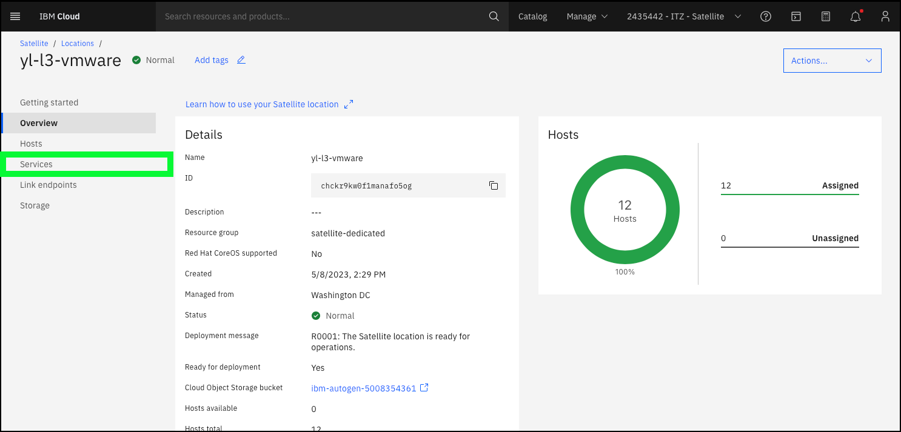
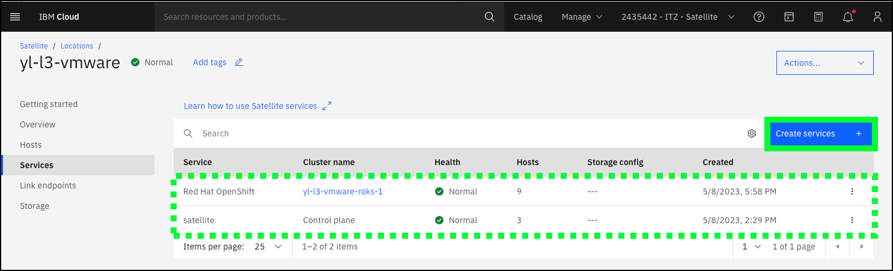
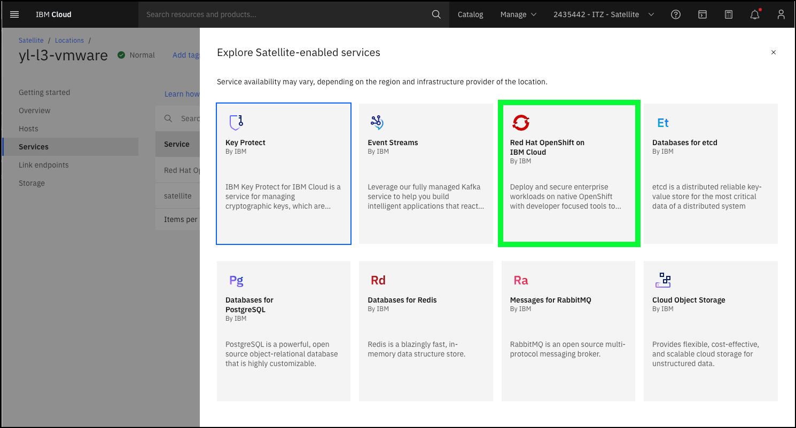
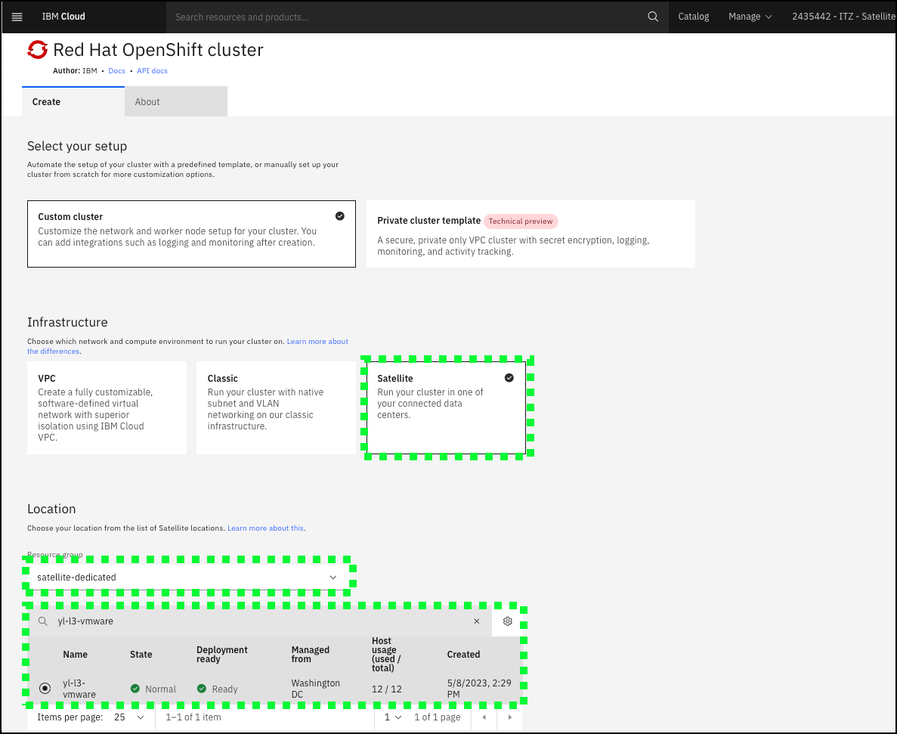

Many IBM Cloud services are enabled for IBM Cloud Satellite including IBM Cloud databases, IBM Event Streams, IBM Key Protect, Red Hat OpenShift on IBM Cloud, and others. In the future, more services will be enabled for IBM Cloud Satellite. For a full list of Satellite-enabled services, use the IBM Cloud Portal as described below, or check out the documentation page <a href="https://cloud.ibm.com/docs/satellite?topic=satellite-managed-services" target="_blank">Supported Satellite-enabled IBM Cloud services</a>.

To successfully deploy any satellite-enabled service, hosts must be available and unassigned at the Location. As seen in the previous chapter about Locations, all the hosts at the **{{ sat.location }}** are already assigned either to the Location control plane, or an already deployed Red Hat OpenShift on IBM Cloud cluster. 

Continuing from the previous chapter on Locations, in the steps below, explore how Red Hat OpenShift on IBM Cloud is deployed to a Location. 

1. Click the **Services** link on the **{{ sat.location }}** page in the IBM Cloud Portal

2. Review the already deployed services, and then click the **Create services +** button.

3. Review the list of available services, and then click the **Red Hat OpenShift on IBM Cloud** tile.

4. Explore the **Red Hat OpenShift cluster** provisioning page in the IBM Cloud Portal.

The image above is only part of the provisioning page. Notice how the **Satellite** tile under the **Infrastructure** section, the **Resource group**, and the **{{ sat.location }}** Location under the **Locations** section have been pre-selected.

Scroll down to see the other parameters required to provision the OpenShift cluster. Notice the **Minimum host requirements are not met** warning. This is identifying the fact no unassigned hosts are available in the **{{ sat.location }}**. If unassigned hosts were available for the specified worker pool configuration, the **Create** button at the far right of the page would be enabled.

Continue to scroll further in the dialog. Take special notice of the **Satellite Config** section. **Satellite Config** will be covered in more detail later in this guide. For now, note that in order to use **Satellite Config** to deploy Kubernetes resources to the cluster, it must be enabled at the time the cluster is created or a manual script must be run later.

As mentioned earlier, an OpenShift cluster has already been deployed to the **{{ sat.location }}** Location. The deployment of the cluster took approximately 30 minutes.

5. Return to the **Location** details page by clicking on the browsers **back** button or clicking <a href="https://cloud.ibm.com/satellite/locations/{{ sat.location_id }}/overview" target="_blank">here</a>.

At this time, feel free to explore the other Satellite-enabled services before proceeding to the next chapter to learn about **Link Endpoints**.