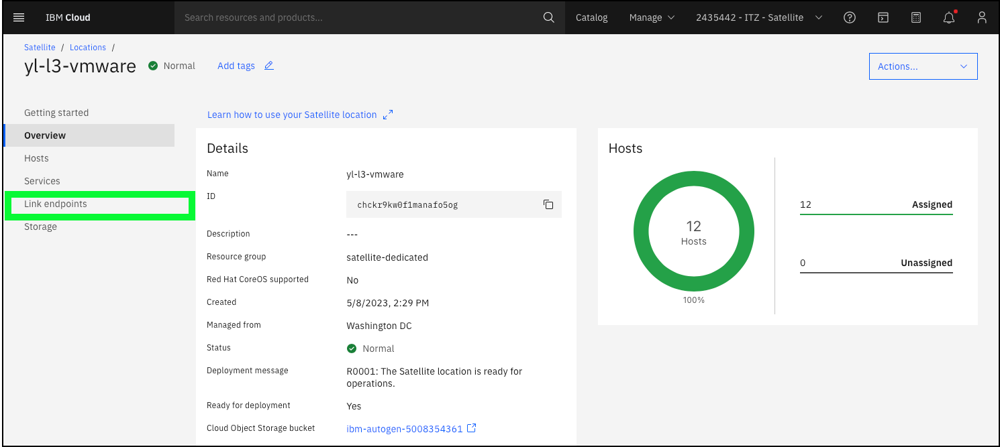
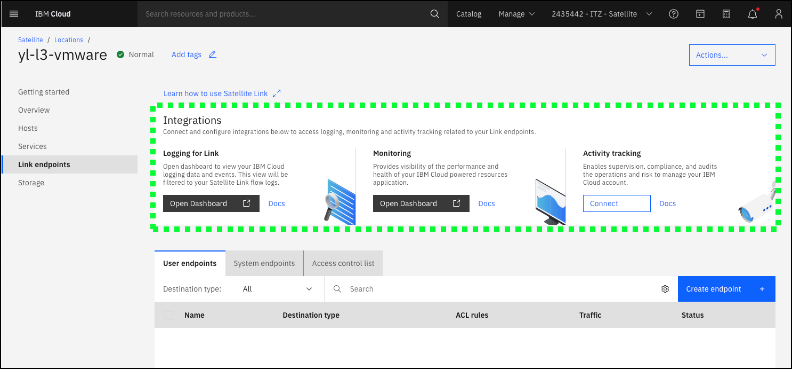
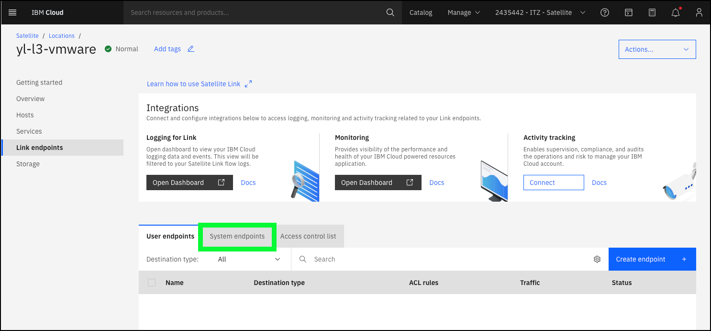
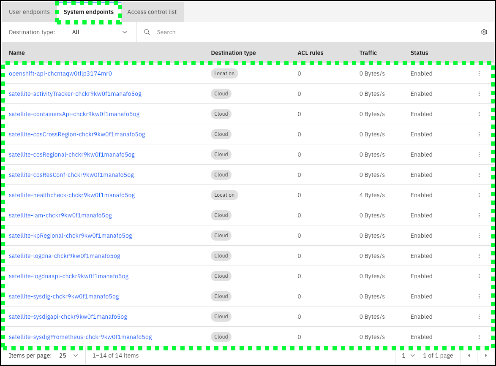

Networking is a critical aspect of a IBM Cloud Satellite deployment and should be diligently planned. The product documentation provides detailed guidance on host network requirements, outbound connectivity from the Location datacenter to IBM Cloud, and additional details. To learn more, start <a href="https://cloud.ibm.com/docs/satellite?topic=satellite-reqs-host-network" target="_blank">here</a>.

IBM Cloud Satellite **Link endpoints** provide controls for network traffic to and from a Satellite Location and services, servers, and/or applications that run outside of the Location. **Satellite Link endpoints** allow software that runs in a Satellite location to connect to a service, server, or application that runs outside of the Satellite Location. Links can also allow software that is connected to the IBM Cloud private network to connect to a service, server, or application that runs in your Satellite Location.

To establish the connection, the destination resource's fully qualified domain name (FQDN) or IP address, port, the connection protocol, and any authentication methods at the endpoint must be specified. The endpoint is registered with the Satellite Link component of the Location's Satellite control plane. To help maintain enterprise security and audit compliance, **Satellite Link endpoints** provide additional built-in controls to restrict client access to endpoints, and to log and audit traffic that flows over endpoints.

While Satellite Links are not used explicitly in this demonstration, there are **Link endpoints** defined in the shared ITZ environment, and are an important concept to understand. For more information on Links, read the documentation <a href="https://cloud.ibm.com/docs/satellite?topic=satellite-link-location-cloud" target="_blank">here</a>.

In the following steps, learn more about **Link endpoints**.

1. If not already open in a browser, return to the **Location** details page by clicking <a href="https://cloud.ibm.com/satellite/locations/{{ sat.location_id }}/overview" target="_blank">here</a>.

2. Click **Link endpoints** in the left-hand navigation pane.

3. Review the **Integrations** that are available between IBM Cloud Satellite and IBM Cloud logging, monitoring, and event tracking services.

Note, access to these integrated services is not provided in this shared ITZ environment. These are used by ITZ to monitor the health of the environment. However, the availability of these integrations is a critical benefit of IBM Cloud Satellite for clients and provide logging, monitoring, and event tracking capabilities the most clients will expect.

4. Click the **System endpoints** tab.

5. Review the configured **System endpoints**. 

These endpoints control access between the Satellite Location and other IBM Cloud services like logging, monitoring, and IBM Cloud Object Storage. Notice the 2 different values under **Destination type** in the table.

- **Cloud endpoint**
  
  By default, source clients in a Satellite location cannot reach destination resources that run outside of the location because the destination resource's IP address is not routable from within the location. A **Cloud endpoint** enables resources running in the Location to reach outside resources.

- **Location endpoint**

  By default, source clients that are connected to the IBM Cloud private network cannot reach destination resources that run in a Satellite Location because the destination resource's IP address is not routable from outside the location. **Location endpoints** allow outside resources to reach resources running inside the Location.

Proceed to the next section to learn about IBM Cloud Satellite Config and how it is used to deploy Kubernetes resources to OpenShift clusters managed by IBM Cloud Satellite.