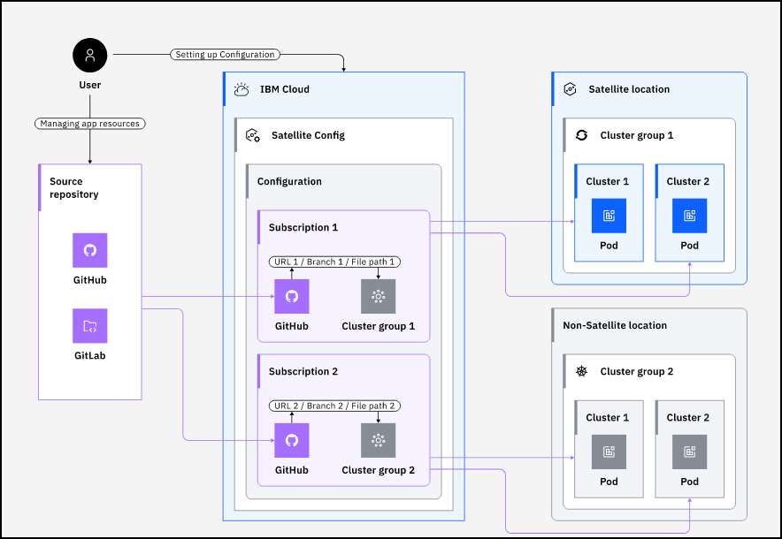

IBM Cloud Satellite provides the ability to deploy Kubernetes resources to Red Hat OpenShift on IBM Cloud clusters that run in IBM Cloud, IBM Cloud Satellite Locations, and on-premises. This capability is called **Satellite Config**. Learn more about Satellite Config <a href="https://cloud.ibm.com/docs/satellite?topic=satellite-cluster-config#satcon-terminology" target="_blank">here</a>. Satellite Config is a continuous delivery tool based on the Razee open source project. Learn more about Razee <a href="https://razee.io" target="_blank">here</a>.

To fully understand and use **Satellite Config** it is important to know a few more terms:

- Clusters

The previous chapter discussed deploying a Red Hat OpenShift on IBM Cloud cluster to a Satellite Location and how during that process the option to enable **Satellite Config** to access that cluster. In addition, IBM Cloud Satellite provides the ability for **Satellite Config** to access other OpenShift cluster's running on IBM Cloud. This is accomplished by manually registering the cluster with **Satellite Config**. 

Registering clusters is a two step process. The first is to register the cluster with **Satellite Config** through the IBM Cloud Portal or command line interface. This will create a record in the **Satellite Config** configuration data store (ConfigMap) and generate a command line that will need to be executed on the OpenShift cluster. Step 2, a user with administrative privileges on the OpenShit cluster will need to execute the generated command line. The command creates the razeedeploy project, custom resource definitions, and role-based access control (RBAC) policies on the cluster that are required to make the cluster visible to Satellite Config.

- Cluster groups

A cluster group specifies a set of OpenShift clusters that are registered with Satellite Config. A cluster group consists of one or more registered clusters that can reside in different Satellite Locations or IBM Cloud.

- Configuration

A Satellite configuration, also referred to as **Config**, is a continuous delivery tool that is used to consistently roll out versions of Kubernetes resources across cluster groups. For more information, see <a href="https://cloud.ibm.com/docs/satellite?topic=satellite-setup-clusters-satconfig" target="_blank">Deploying Red Hat OpenShift resources across clusters with Satellite configurations</a>.

- Version

A version represents a Kubernetes resource file that is uploaded or manually created in a **Config**. The version can include any Kubernetes resource definition and a configuration can have any number of versions. Kubernetes uses YAML (Yet Another Markup Language) for resource files. For help developing a Kubernetes YAML resource file, see <a href="https://cloud.ibm.com/docs/openshift?topic=openshift-openshift_apps" target="_blank">Developing apps to run on OpenShift</a>.

- Subscription

A Satellite subscription is created for a **Config** and specifies which version of the Kubernetes resource is to be deployed to one or more cluster groups. 

- Source repository

A source repository can be thought of as a datastore for different resource definitions (like a version) of YAML files (and more). **Satellite Config** supports both <a href="https://github.com" target="_blank">GitHub</a> and <a href="https://gitlab.com" target="_blank">GitLab</a> as source repositories. In this activity, GitHub is used as the source repository.

**Satellite Config** supports two models for creating configurations. One is a *GitOps-based* configuration which utilizes a source repository. GitOps is an operational framework that takes Development and Operations (DevOps) best practices used for application development such as version control, collaboration, compliance, and Continuous Integration/Continuous Deployment (CI/CD), and applies them to infrastructure automation. The other is a *Direct Upload* model where a version file is created or uploaded directly into the configuration via the IBM Cloud Portal or command line utilities.

In this activity, the focus will be on the GitOps-based model. Subscriptions will be created in a configuration that will deploy resources stored in GitHub. After an initial deployment, if the resources change in GitHub, they are automatically deployed by **Satellite Config**. This process is illustrated in the diagram below.

This demonstration using GitHub is borrowed from the <a href="https://cloud.ibm.com/docs/satellite?topic=satellite-begin-sat-config-tutorial&interface=ui" target="_blank">Deploying apps to clusters with Satellite Config</a> tutorial in the IBM Cloud Satellite documentation.

Before creating a configuration using the **Satellite Config** GitOps model, a source repository will need to be created along with a sample application.