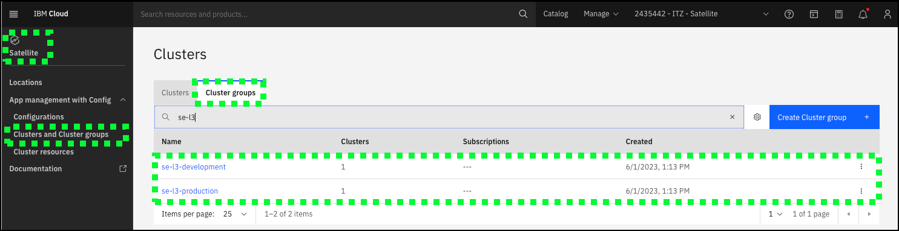
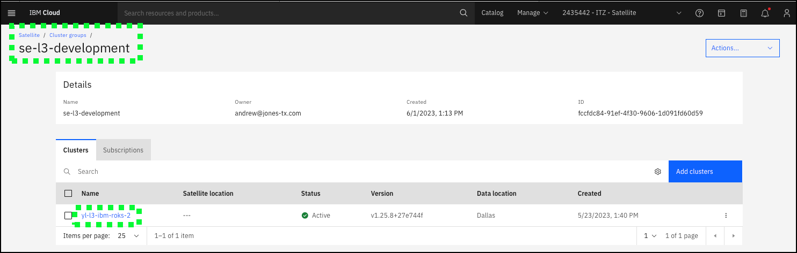
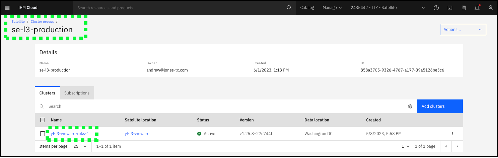
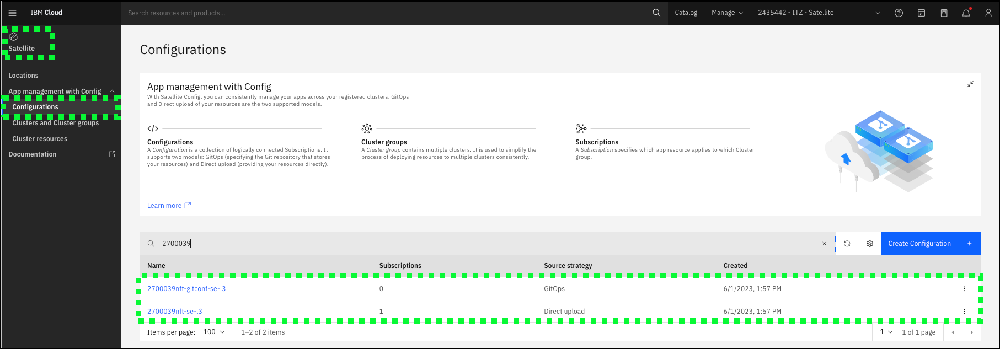
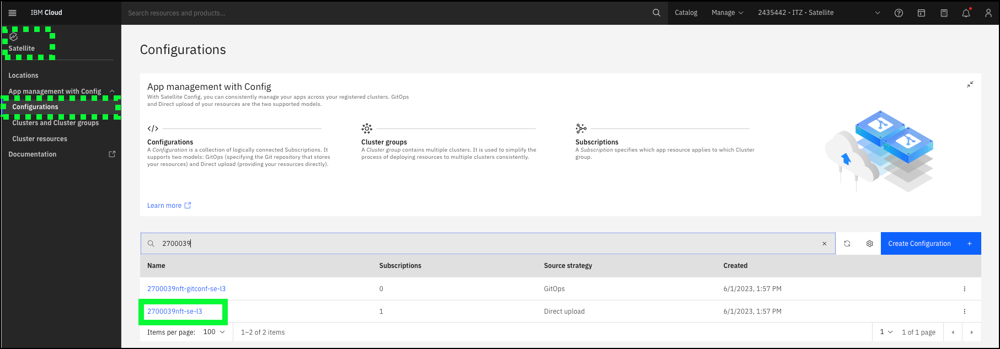
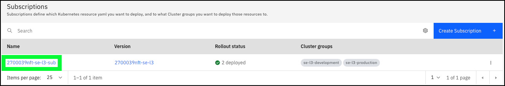
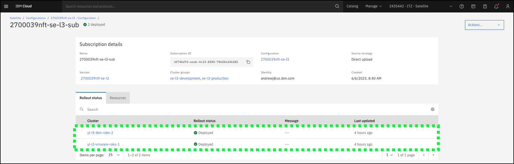

Now it is time to create a **Satellite Config** configuration that utilizes the GitOp model to deploy a sample application to a set of OpenShift clusters. For this activity, two OpenShift clusters will be utilized as shown below.


The cluster running in IBM Cloud, which has been registered with **Satellite config**, will be called the **development** cluster. The cluster running at the Satellite Location, will be called the **production** cluster. Each of these clusters have been defined in a cluster group: {{ clusterGroups.development }} and {{ clusterGroups.production }}. 





Remember, cluster groups can contain one or more clusters, but for this activity each is a single cluster. In an actual client environment, there could be several clusters in both the development and production groups and each could be in different IBM Cloud datacenters or Satellite Locations any where in the world.

Take a few minutes to explore the Cluster and Cluster groups pages in the IBM Cloud Portal.

Recall, in the IBM Technology Zone (ITZ) environment used in this activity only limited access is provided to users. Specific to **Satellite config**, users are NOT given permissions to create new clusters, cluster groups, or configurations. As seen above, the 2 cluster groups have already been configured. Additionally, two configurations have also been created for each user. The name of these configurations include a unique user identifier (as described in the previous chapter) and a suffix of **-se-l3** and **gitconf-se-l3**. 

1. If not already open, open a browser window to the <a href="https://cloud.ibm.com/satellite/configuration" target="_blank">Configurations</a> page under IBM Cloud Satellite.

2. Filter or find the 2 pre-provisioned configurations using the unique name created in the ITZ reservation (**2700039nft** in the examples below).



3. Click your unique configuration with the **-se-l3** extension in the table.



The *-se-l3** configuration utilizes the *Direct Upload* model of **Satellite config**. It contains a single version that creates a **namespace** (referred to as a **Project** within OpenShift) resource in OpenShift if it does not already exist. The YAML for this version looks like:

```yaml
apiversion: project.openshift.io/v1
description: "2700039nft-se-l3"
displayName: 2700039nft-se-l3
kind: Project
metadata:  
  name: 2700039nft-se-l3  
  labels:    deploy.razee.io/mode: "EnsureExists"
```


4. Click the unique subscription for the configuration in the Subscriptions table.



5. Verify the subscription is deployed to the 2 cluster groups: {{ clusterGroups.development }} and {{ clusterGroups.production }}. The **Rollout status** should be **Deployed**.



Next, learn how to bring everything together to prepare for and deliver client facing demonstrations of IBM Cloud Satellite.