The following steps assume all of the prior sections of this activity have been completed. 

1. Login to the IBM Cloud portal here: https://cloud.ibm.com and change to the {{ account }}.

If introductions have not already been done, now is the time. If the client is not an existing IBM Cloud user, then provide some high level statements about IBM Cloud (e.g. world wide coverage, 300 cloud based services including fully managed Software as a Service (SaaS) offerings, etc.).

2. Navigate to the Satellite Overview page.

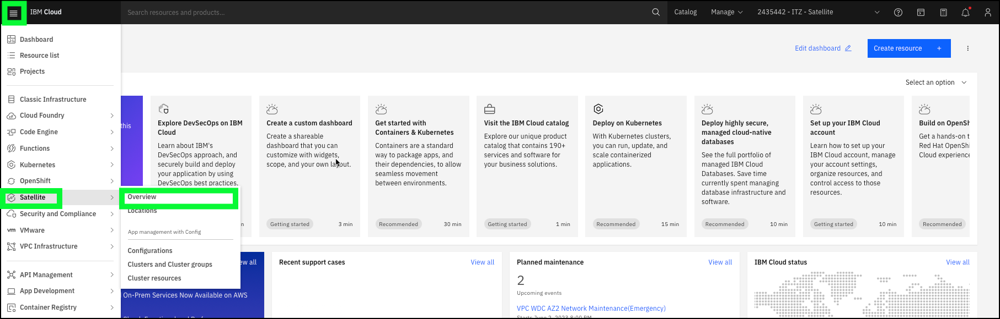

If earlier discussions were not focused on IBM Cloud Satellite, describe the offering and its values. Leverage the talking points from the IBM Cloud Satellite Client presentation (from the IBM Cloud Satellite Level 2 learning plan). The overview provides some useful descriptions on three topics that will be covered: IBM Cloud services, Application management, and network traffic management.

3. Click the **Create a Satellite Location +** button.

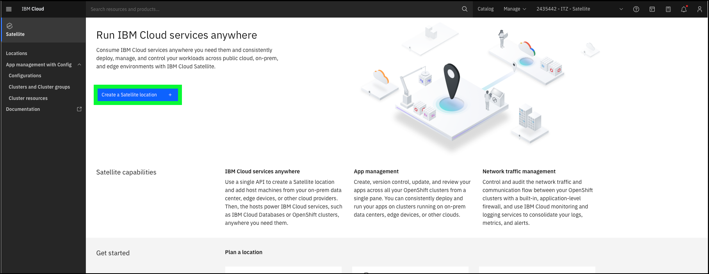

If it is known the client uses a specific cloud provider, focus on that specific provider and how IBM Cloud Satellite provides automated, terraform-based scripts to both provision the remote resources as well as deploying the control plane resources for a Satellite Location. 

In lieu of the next steps which use the **Advanced configuration** option, consider creating an account in one of the 3rd party clouds and using those credentials to show the Satellite location provisioning page (see image below for how it looks in AWS). Alternatively, the video in the **Provisioning** chapter can be used as part of the demonstration to show the process for a Location in AWS.

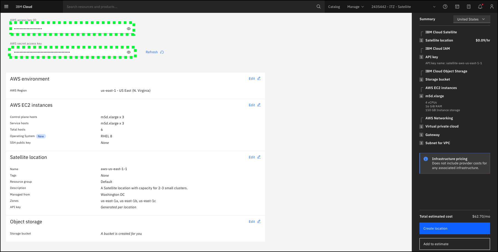

4. Click the **Advanced configuration** tile.

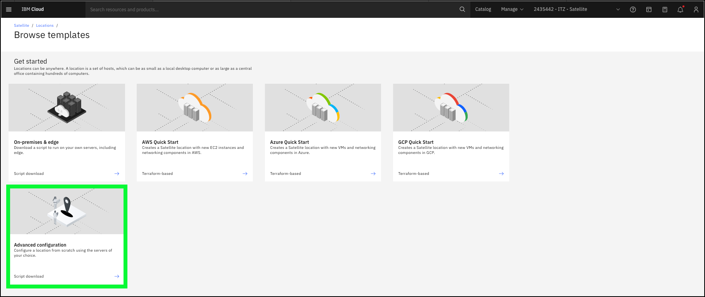

Notice there is very little information required to create a **Satellite location**. As learned earlier, the real provisioning work is done by the attach host script that are generated for the location which is executed on each of the physical servers. This will be explored shortly. The key fields on the location creation screen are the **Managed from**, zone names, support for Red Hat CoreOS, and an object storage bucket.

5. Click the **Managed from** pull down option.

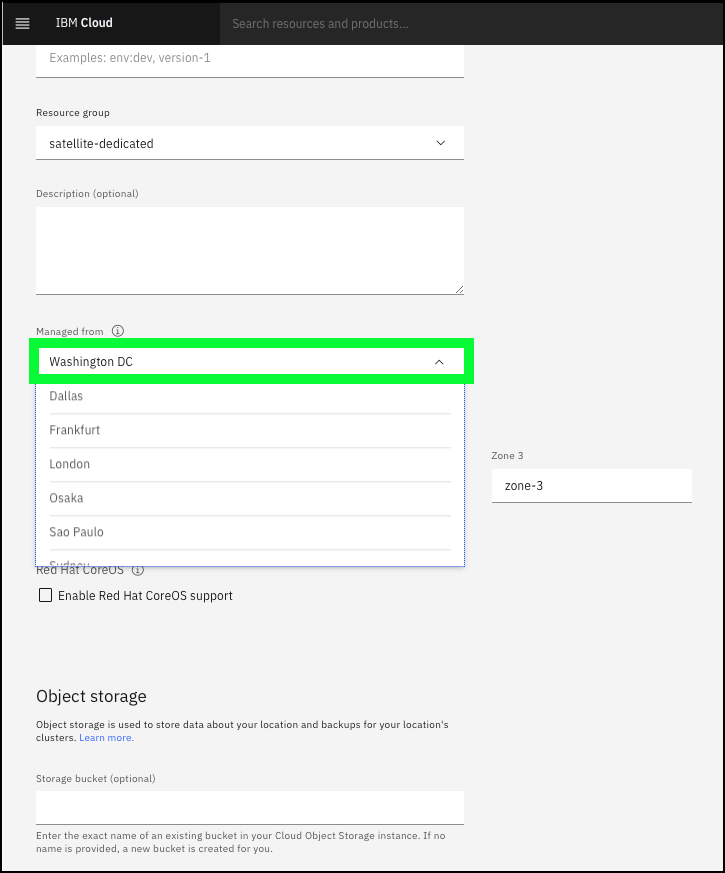

When provisioning a **Satellite location**, clients should choose the IBM Cloud datacenter that is nearest to the physical servers in the remote location. The hosts attached to the **Satellite location** control plane must have a low latency connection of less than or equal to 200 milliseconds (<= 200ms) round-trip time (RTT) to the IBM Cloud region that the **Satellite location** is managed from. Learn more about this requirement <a href="https://cloud.ibm.com/docs/satellite?topic=satellite-sat-regions" target="_blank">here</a>.

Depending on the audience, discuss the following topics:

- Zones - The **Zone** fields allow the user to specify names used for the network availability zones where control plane and worker nodes will be assigned. High availability (HA) is a key to keeping applications up and running, even after a partial or full site failure. The main purpose of high availability is to eliminate potential points of failures in an infrastructure. 

- Red Hat CoreOS - Enabling Red Hat CoreOS support comes with both pros and cons. A Red Hat CoreOS enabled location unlocks more features such as minimal outbound network requirements, HTTP proxy for outbound traffic, OpenShift virtualization, and single node cluster topology. But it has a higher infrastructure requirement. On the other hand, a non-CoreOS enabled location supports a smaller feature set but can run at a smaller footprint, allowing more clusters per same capacity. For more information about the key benefits of CoreOS, see <a href="https://docs.openshift.com/container-platform/4.10/architecture/architecture-rhcos.html" target="_blank">Red Hat Enterprise Linux CoreOS</a>.

- IBM Cloud Object Storage - An object storage bucket is required to store data about the **Satellite location**> and backups of the OpenShift clusters. 

Once all the required information is provided, a user would click **Create location**. Users of this IBM Technology Zone (ITZ) environment will NOT have permission to create a location. Inform the client that creating a **Satellite location** using the advanced configuration method only takes a few minutes, where as using one of the automated approaches for 3rd party cloud providers will take longer as the actual servers are provision in the client's account and the host attach scripts are executed. 

6. Click the **Locations** bread crumb trail at the top of the **Advanced configuration** page.

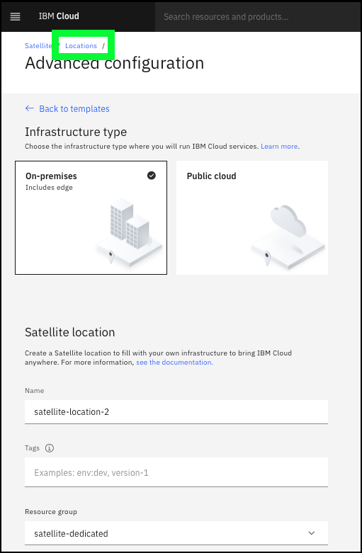

Inform the audience that a pre-provisioned location will be used to show how hosts are added to the location.

7. Enter **yl-l3** in the **Locations** table search bar and then click the **{{ sat.location_stub }}** entry.

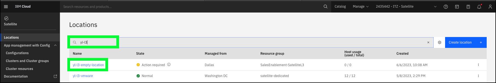

The **Setting up your new location** provides the basic flow for adding hosts and setting up the location.

8. Click the **Hosts** link in left-hand menu.

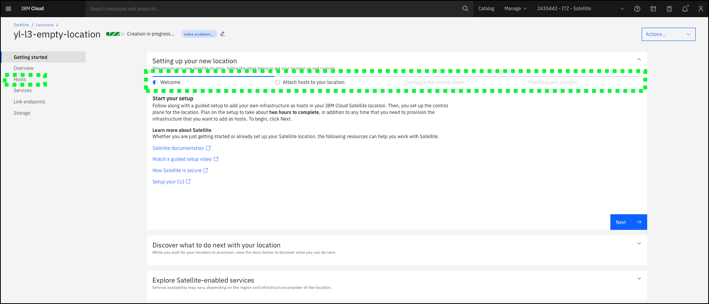

The next step is to add a host to the location. As mentioned earlier, this involves downloading a host attach script and executing that script on each server that is to be added to the location.

9. Click the **Attach host +** button.

In this ITZ environment, access is not provided to generate the script or download the script. If there is a very technical audience, a sample script is located [here](_downloads/attachHost-yl-l3-empty-location.md){target=_blank} that can be downloaded and displayed. Continuing with the baking show approach, now show a location that already has hosts attached.

10. Click the **Locations** bread crumb trail at the top of the **hosts** page.

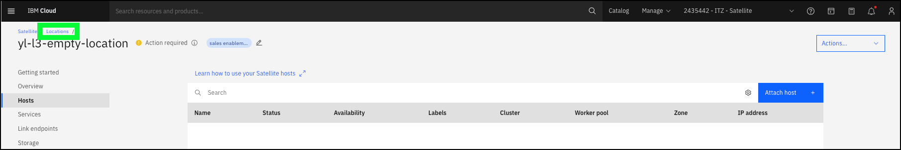

11. Enter **yl-l3** in the **Locations** table search bar and then click the **{{ sat.location }}** entry.

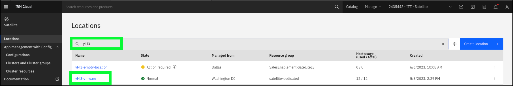

The overview page for a **Satellite location** provides general information about the location and the location's health. 

12. Click the **Hosts** link in left-hand menu.

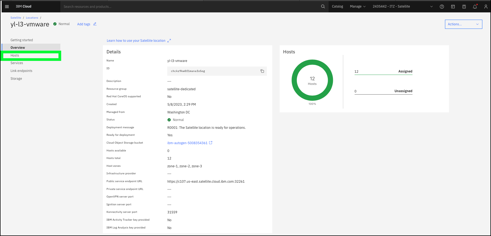

On the **Hosts** notice that 12 hosts have been added to this location. Initially when added, the host's **Availability** would be listed as **Unassigned**. The next step for creating the location would be to assign a minimum of 3 hosts to the **Control plane**. **Control plane** hosts do not run any client workloads, rather the location control plane runs resources that are managed by IBM to manage the hosts, clusters, and other resources that you attach to the location. Sizing of the control plane is an important exercise that needs be done early in the planning phase, but keep in mind additional hosts can be added to the control plane at any time by running the **attach host** script on new servers.

13. Click the **Services** link in left-hand menu.

IBM Cloud Satellite provides clients the ability to run Satellite-enabled services at remote locations. As seen here, Red Hat OpenShift on IBM Cloud, an IBM-managed deployment of OpenShift, has already been deployed at this location. Lets explore how this was done.

14. Click the **Create services +** button.

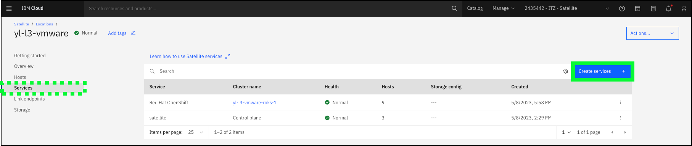

There are several Satellite-enabled services available in the IBM Cloud catalog and can be easily deployed to a **Satellite location**. Take a few minutes to highlight each of the available services and the capabilities they provide.

15. Click the **Red Hat OpenShift on IBM Cloud** tile.

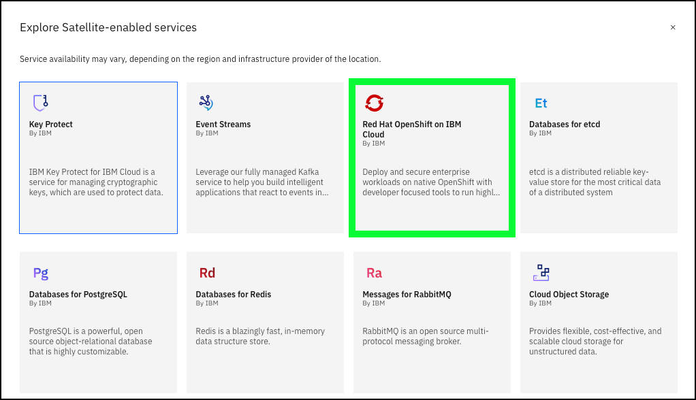

With Red Hat OpenShift on IBM Cloud, is a Platform as a Service (PaaS) that provides an IBM managed environment for running Kubernetes resources. These could be client applications and/or IBM offerings like IBM Cloud Paks. As a Satellite-enabled service, the deployment of OpenShift is fully automated. 

Using the **Red Hat OpenShift cluster** deployment page, describe the required parameters for the deployment. The key fields to highlight are the **Location**, number of worker nodes, OpenShift version, licensing, and Satellite Config enablement.

- Location - The location is pre-selected since the request was to add a service to the {{ sat.location }} location. 

- Worker pool - These settings allow users to specify what availability zones should be used and now many worker nodes should be deployed to each zone as well as the number of virtual CPUs (vCPU) and memory for each worker node. Sizing of the worker pool is a critical activity. Hosts can be added and removed, but it is important to size the pool based upon the planned workloads.

- OpenShift version - There will typically be 3-4 versions of OpenShift available. As new version's are made available by Red Hat, the older versions will roll off of the selectable list. While Red Hat OpenShift on IBM Cloud is a managed service, there are client responsibilities which include updating the workers nodes. This will be discussed again later.

- Licensing - OpenShift licensing can be added here or Red Hat OpenShift Cluster Manager can be used by the client to manage the OpenShift licenses.

- Satellite Config - Satellite config can be enabled for the cluster now, or later by running the register cluster script as described earlier in this activity.

Notice the warning that the **Minimum host requirements are not met** message is displayed. This is due to the fact all the hosts in the location are already utilized. Hosts most be available and in the **Unassigned** state in order for a new service to be deployed to the location.

Once all the required parameters are provided, the **Create** button would be enabled and the automated deployment could be started. Note, the deployment of OpenShift in this ITZ environment took approximately 30 minutes to complete.

When the **OpenShift** tile was clicked, this provisioning dialog opened in a new browser tab or window. Close this window and return to the Location Services page.

16. Click the **x** at top right.

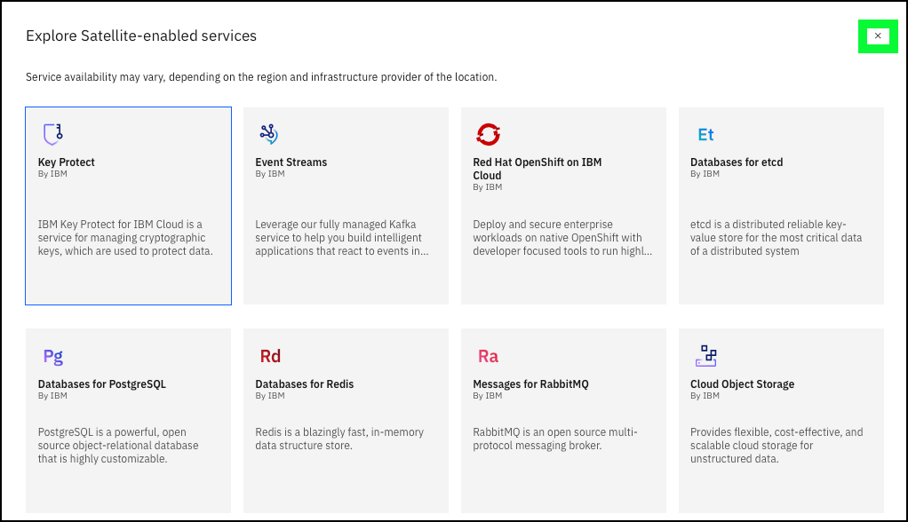

17. Click the **Link endpoints** link in left-hand menu.

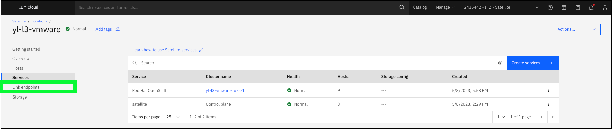

As described earlier, **Link endpoints** are used to control and audit network traffic between the IBM Cloud Satellite location and services, servers, and applications that run outside of the location.

IBM Cloud Satellite provides clients the ability to integrate with IBM Cloud logging, monitoring, and activity tracking to **Link endpoints**. These integrations are outside of the scope of this demonstration and access to the dashboards are not provided for this ITZ environment, rather is used by ITZ to monitor and managed the shared environment.

18. Click the **Create endpoint +** button.

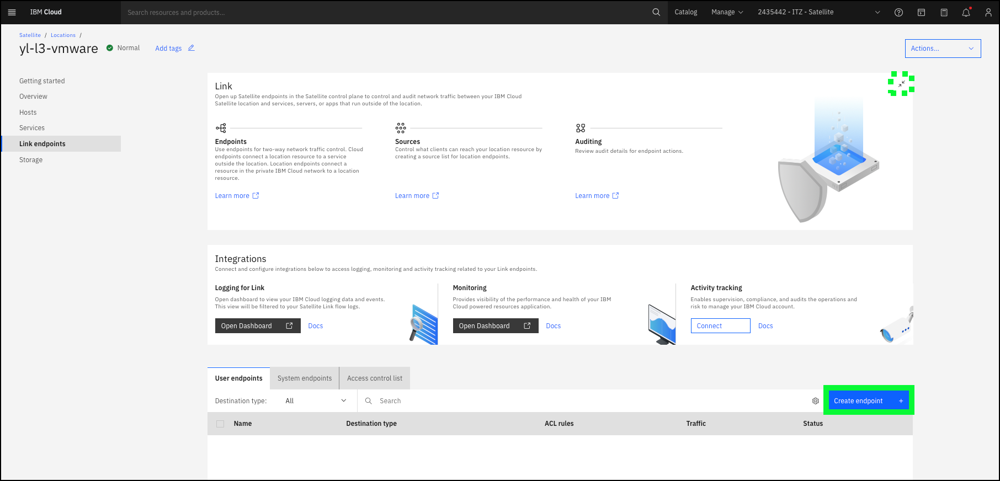

There are two types of **Link endpoints** as described in the earlier chapter on **Link endpoints**. A **Satellite location** endpoint specifies that the destination resource runs on a cluster or host in the Satellite location, where as a **Cloud endpoint** specifies that the destination resources run in IBM Cloud. 

Depending on the audience and technical comfort with the topic, click the **Next** button to walk through the information required to create an endpoint. If details are not required, simply describe the **Link endpoint** as a networking rule that allows in and outbound access over a secure tunnel between the resources at the **Satellite location** and the outside world over the Internet.

The other important resource at a **Satellite location** is storage. The access controls in this ITZ environment does not provide access to this page in the IBM Cloud portal. **Storage configurations**. In addition to the storage that may be directly associated with the worker nodes added to a location, additional storage may also be added to the location and made available to the clusters and resources running in the **Satellite location**. Templates are available for 3rd party cloud storage types (AWS, Azure, Google), various IBM System Storage types, NetApp storage systems, VMware, and OpenShift Data Foundation (ODF). Additionally, Satellite supports bring-your-own storage drivers installed using the OpenShift Catalog, OperatorHub, Helm charts, or by deploying images to the clusters that include the required storage drivers. For more information on **Satellite storage read <a href="https://cloud.ibm.com/docs/satellite?topic=satellite-storage-template-ov" target="_blank">Understanding Satellite storage</a>.

At this point, the creation of a IBM Cloud Satellite location and the deployment of a Satellite-enabled service (Red Hat OpenShift on IBM Cloud) has been demonstrated. Next, follow and learn how to demonstrate the power of IBM Cloud Satellite Config to automate the deployment of Kubernetes services to OpenShift clusters managed by IBM Cloud Satellite.