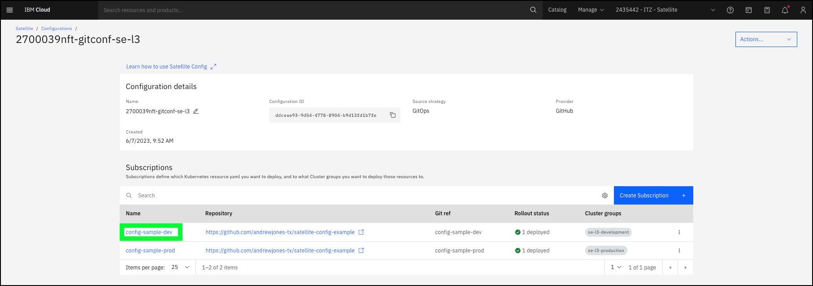

Now it is time to demonstrate the power of **Satellite config**. Recall the high-level architecture of the IBM Technology Zone (ITZ) environment as illustrated below.

In this part of the demonstration, **Satellite config** will be used to:

- deploy the sample application to the **Development** cluster from the **Development** branch of the  GitHub repository
- deploy the sample application to the **Production** cluster from the **Production** branch of the  GitHub repository 
- update the **Production** deployment of the application using the GitHub Development and Operations (DevOps) model by updating the **Development** branch in GitHub and initiating GigHub **pull request** of the **Development** branch to the **Production** branch

To achieve this, **subscriptions** need to be created for both the **Development** and **Production** branches to deploy the application to the respective OpenShift clusters.

1. Open the **Configurations** page in the IBM Cloud Portal: <a href="https://cloud.ibm.com/satellite/configuration" target="_blank">https://cloud.ibm.com/satellite/configuration</a.>

2. Use the **Search** function to display only the configurations you have control over using the **Namespace** field from the ITZ reservation.

??? error "Don't see your configurations?"

    Make sure the {{ account }} is selected in the IBM Cloud Portal. 
    

3. Click the **Configuration** with the **-gitconf-se-l3** extension.

4. Click the **Create Subscription +** button.

5. Enter the URL for **your** fork of the GitHub repository for the sample code. This is the URL recorded in step 28 in the **Setup GitHub repository** chapter.

??? question "Are private GitHub repositories supported?

    Yes, private GitHub repositories are supported. Additional configuration steps are required to create a **secret** on the target cluster that contains a personal access token with at least **read** access to the private repository. Learn more <a href="https://cloud.ibm.com/docs/satellite?topic=satellite-satcon-manage-gitops&interface=ui#create-satconfig-ui-gitops" target="_blank">here</a>.

6. Enter **{{ git.DevBranch }}** in the **Branch name** text entry field.
7. Enter **deployments/*.yaml** in the **Path** text entry field.
8. If not entered automatically, enter **{{ git.DevBranch }}** in the **Subscription name field**.

9. Check the checkbox for the **{{ clusterGroups.development }}** cluster group in the table of cluster groups.

!!! hint "Enter **se-l3** in the search field to filter the **Cluster Groups** table. 

10. Click the **Create** button.

11. Before validating the application is deployed, repeat steps 4 through 10 to create a **Subscription** for the **{{ git.ProdBranch }} as shown below.

Usually, in less than a minute, both subscriptions should show a **Rollout status** of **deployed** as shown below.

Now, verify the deployments are successful by using the Red Hat OpenShift web console for each of the clusters.

12. Click the **{{ clusterGroups.development }}** link.

13. On the **{{ clusterGroups.development }}** subscription details page, click the **{{ ibm.cluster_name }}** link to open the IBM Cloud Portal page for the OpenShift cluster running on IBM Cloud

14. Click the hamb
-------
Continue to the next section to learn how to complete the IBM Cloud Satellite Level 3 learning plan.