Now it is time to demonstrate the power of **Satellite config**. Recall the high-level architecture of the IBM Technology Zone (ITZ) environment as illustrated below.

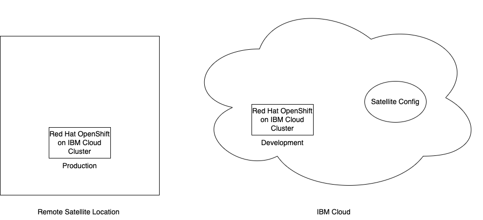

In this part of the demonstration, **Satellite config** will be used to:

- deploy the sample application to the **Development** cluster from the **Development** branch of the  GitHub repository
- deploy the sample application to the **Production** cluster from the **Production** branch of the  GitHub repository 
- update the **Production** deployment of the application using the GitHub Development and Operations (DevOps) model by updating the **Development** branch in GitHub and initiating GigHub **pull request** of the **Development** branch to the **Production** branch

To achieve this, **subscriptions** need to be created for both the **Development** and **Production** branches to deploy the application to the respective OpenShift clusters.

1. Open the **Configurations** page in the IBM Cloud Portal: <a href="https://cloud.ibm.com/satellite/configuration" target="_blank">https://cloud.ibm.com/satellite/configuration</a>.

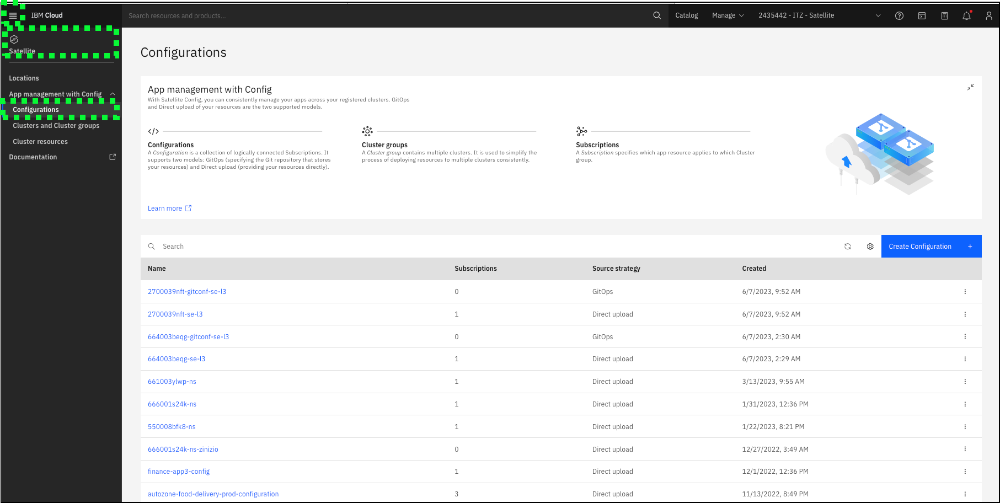

2. Use the **Search** function to display only the configurations you have control over using the **Namespace** field from the ITZ reservation.

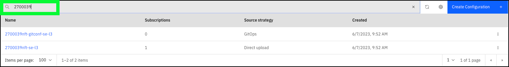

??? error "Don't see your configurations?"

    Make sure the {{ account }} is selected in the IBM Cloud Portal. 
    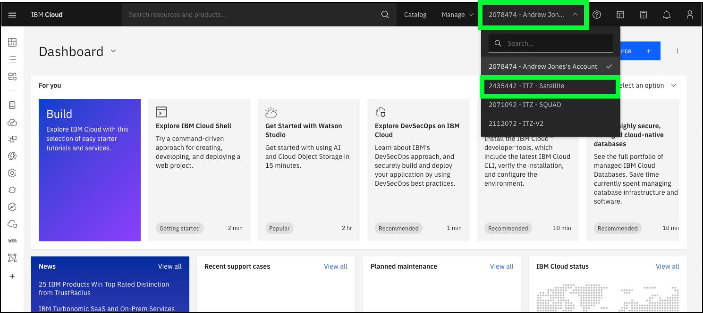

3. Click the **Configuration** with the **-gitconf-se-l3** extension.

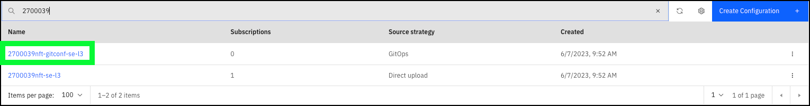

4. Click the **Create Subscription +** button.

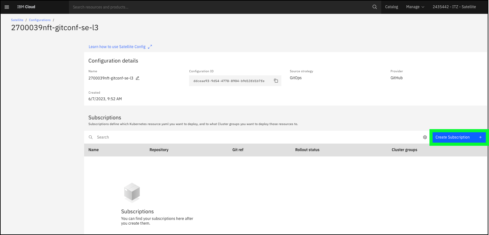

5. Enter the URL for **your** fork of the GitHub repository for the sample code. This is the URL recorded in step 28 in the **Setup GitHub repository** chapter.

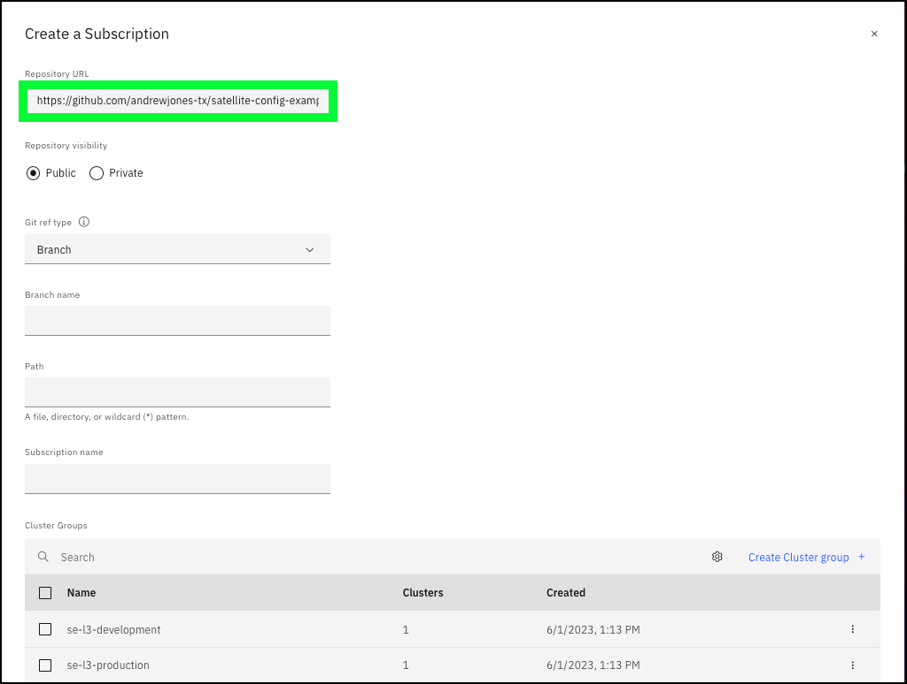

??? question "Are private GitHub repositories supported?

    Yes, private GitHub repositories are supported. Additional configuration steps are required to create a **secret** on the target cluster that contains a personal access token with at least **read** access to the private repository. Learn more <a href="https://cloud.ibm.com/docs/satellite?topic=satellite-satcon-manage-gitops&interface=ui#create-satconfig-ui-gitops" target="_blank">here</a>.

6. Enter **{{ git.DevBranch }}** in the **Branch name** text entry field.
7. Enter **deployments/*.yaml** in the **Path** text entry field.
8. If not entered automatically, enter **{{ git.DevBranch }}** in the **Subscription name field**.

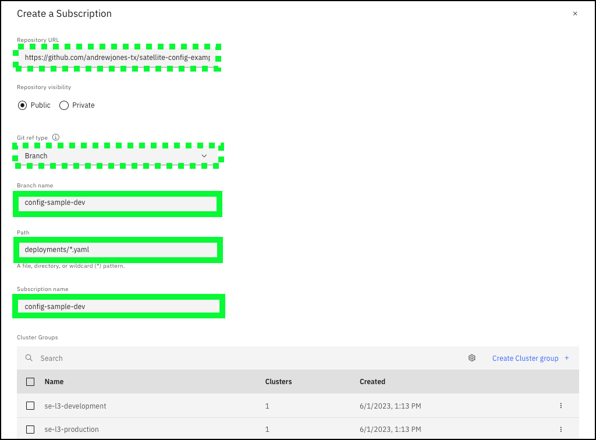

9. Check the checkbox for the **{{ clusterGroups.development }}** cluster group in the table of cluster groups.

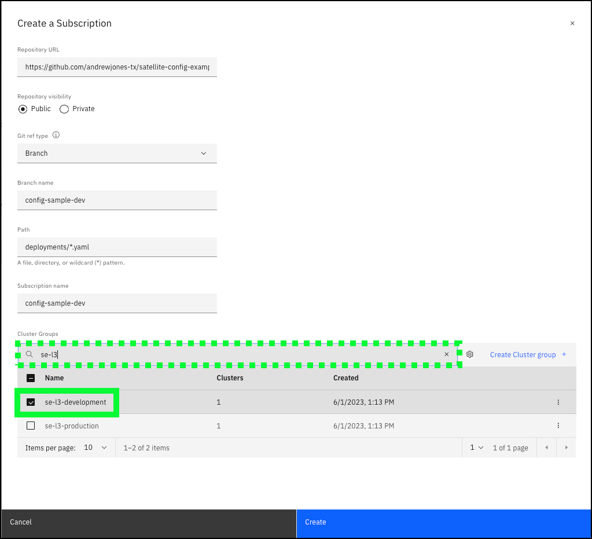

!!! hint "Enter **se-l3** in the search field to filter the **Cluster Groups** table. 

10. Click the **Create** button.

11. Before validating the application is deployed, repeat steps 4 through 10 to create a **Subscription** for the **{{ git.ProdBranch }} as shown below.

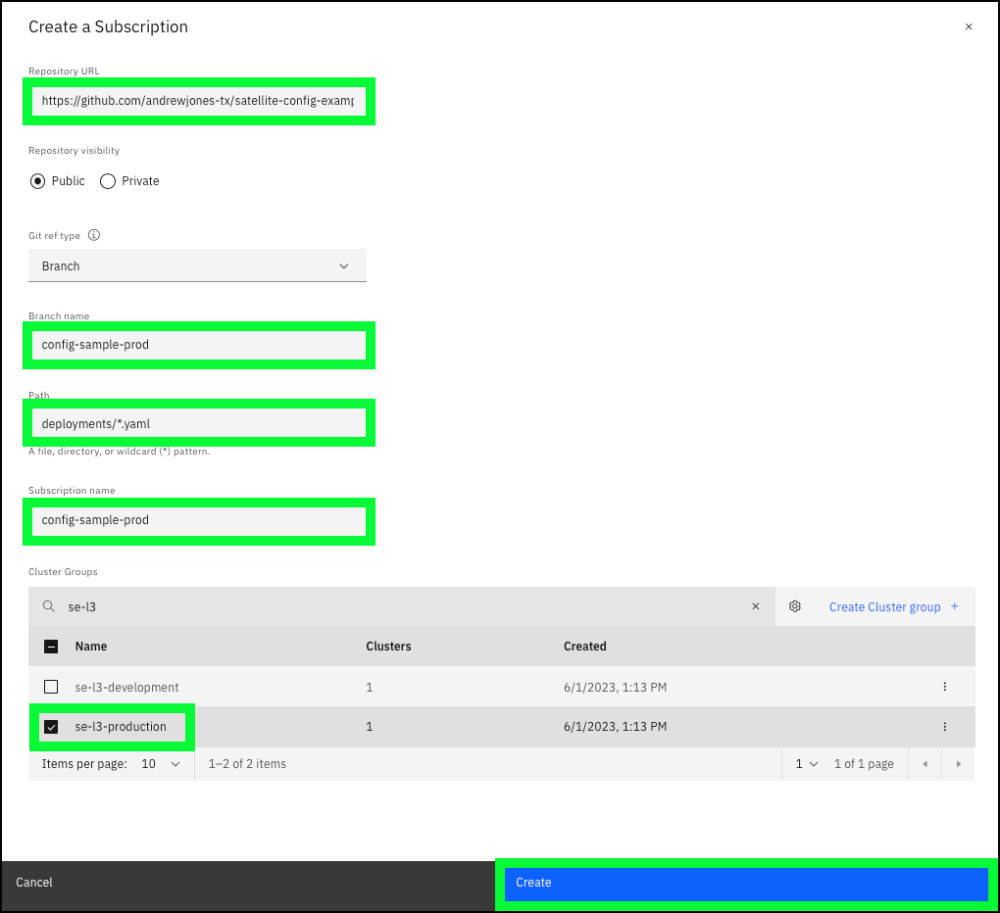

Usually, in less than a minute, both subscriptions should show a **Rollout status** of **deployed** as shown below.

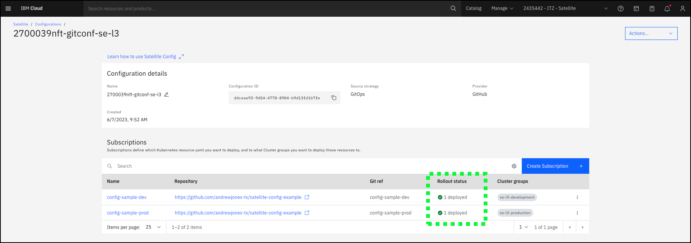

Now, verify the deployments are successful by using the Red Hat OpenShift web console for each of the clusters.

12. Click the hamburger menu  icon at to left and then **OpenShift** and **Clusters**.

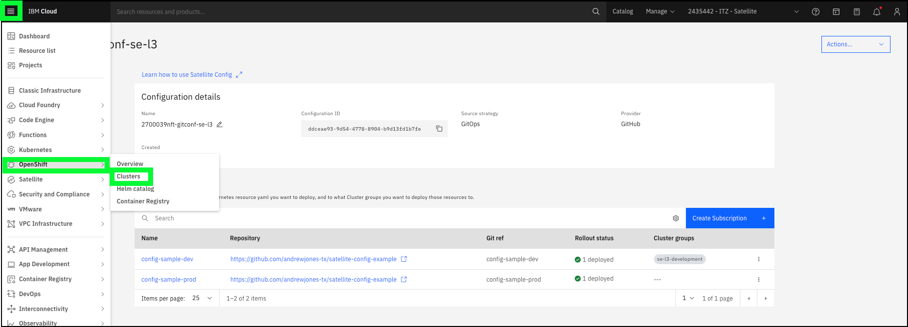

13. Click **{{ ibm.cluster_name }}** in the table of clusters. This is the cluster assigned to the **{{ clusterGroups.development }}** cluster group which is the **development** cluster in this environment.

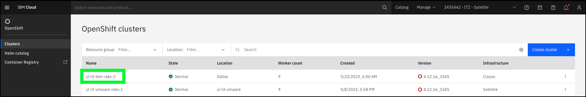

14. Click the **OpenShift web console** button at top right.

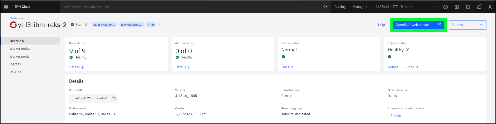

The OpenShift web console will take a few seconds to open in a new browser tab or window. The default view may vary when the web console open. 

15. If not already set, select the **Developer** perspective in the OpenShift web console.

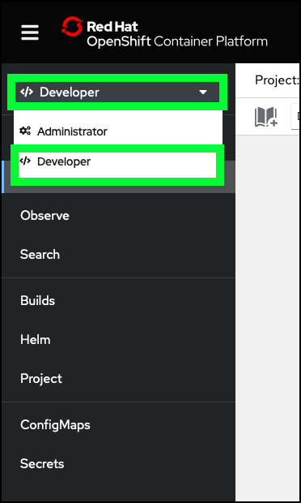

16.Click the **Topology** option in left-hand menu.

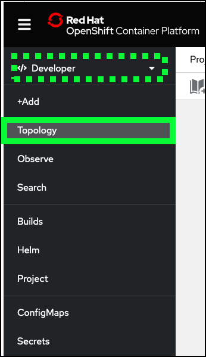

17. Select **your** unique namespace as shown in the ITZ reservation.

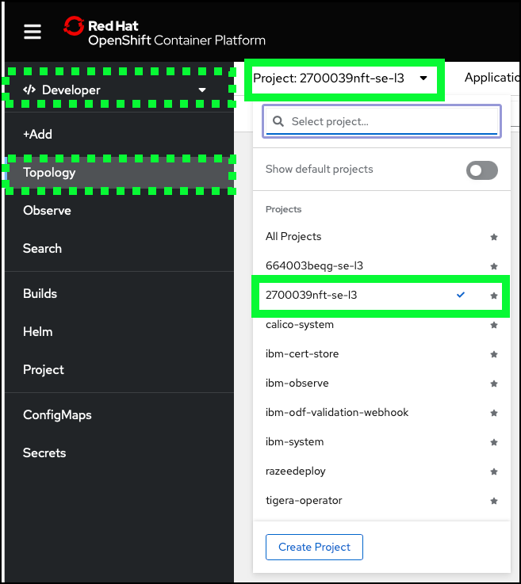

In the topology view of **your** namespace, the sample **helloworld-app** deployment should be shown. 

18. Click the route link  icon to open the web page front end to the deployed application.

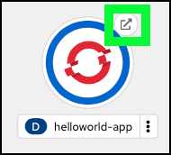

A new browser tab or window should open to the web page front end of the deployed application. Which will look like the following:

Return to the browser page for the IBM Cloud Portal and repeat steps 12 through 18 using the **{{ sat.cluster_name }}** cluster which is the OpenShift cluster running in the **production** environment. 

Notice the output of both applications is the same! Recall, during the GitHub configuration steps earlier, the contents of the **{{ git.DevBranch }}** were copied to the **{{ git.ProdBranch }}** when the pull request merged the two together.

Leave all these windows or tabs open but be sure to track which windows/tabs are the **production** web page and OpenShift web console, and which are the pages for the **development** branch.

!!! hint "Keeping the windows in order"

    During this demo, several browser windows and tabs will be used. While there are many ways to manage them, consider moving all the **developer** pages to one browser window including:
    - IBM Cloud Portal
    - GitHub repository
    - OpenShift web console
    - Sample application web front end

    And move the two **production** pages to another browser window:
    - OpenShift web console
    - Sample application web front end
    
    Then split the two browser windows on the monitor.

    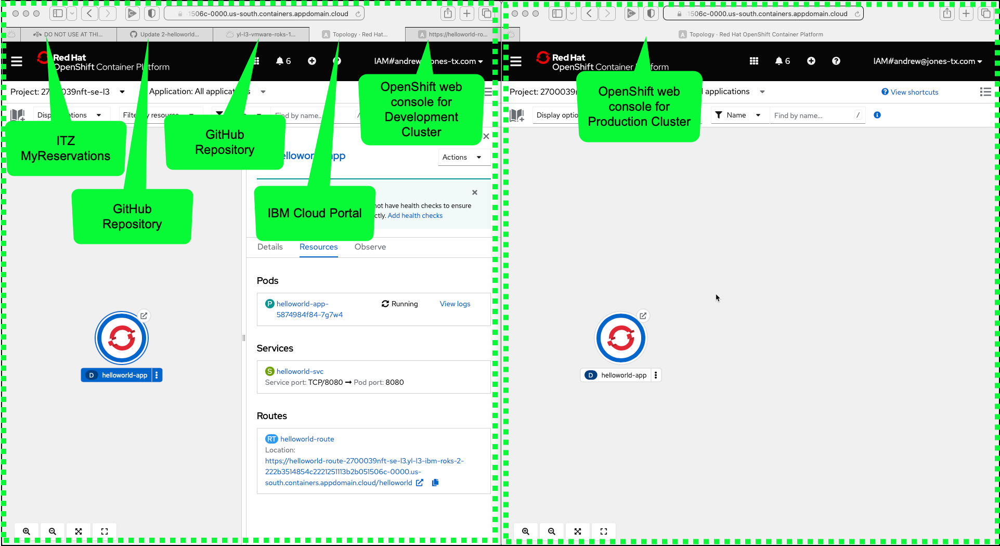

In the next stage of the demonstration, modify the **{{ git.DevBranch }}** web page by editing the **2-helloworld-deployment.yaml** file.

19. In **your** GitHub repository, click the branch pull-down menu and select the {{ git.DevBranch }} branch.

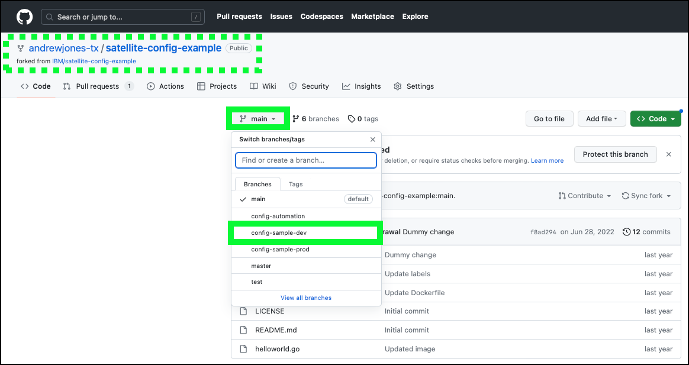

20. Click the **deployments** folder.

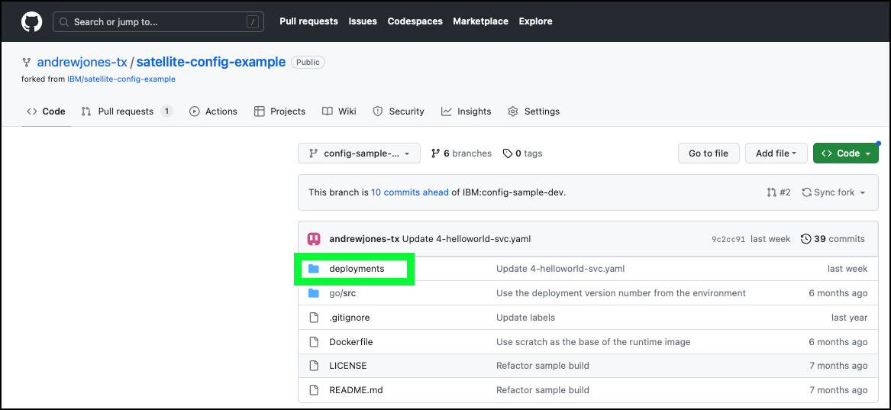

21. Click the **2-helloworld-deployment.yaml** file.

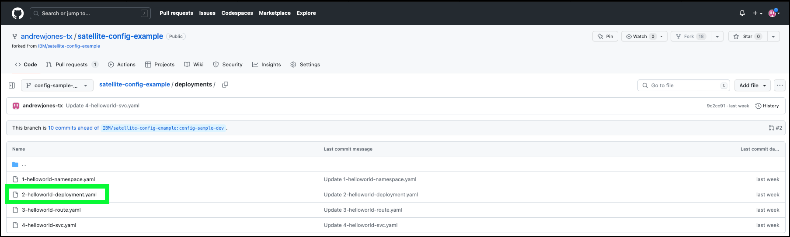

22. Click the pencil  icon to edit the file.

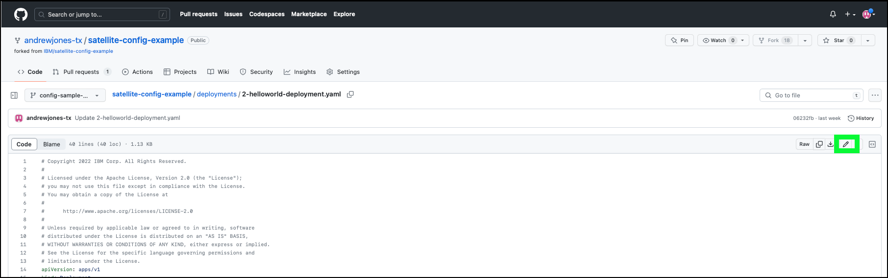

23. Scroll to the very last line of the file and change the **value** attribute from **"1.1"** to **"1.2"**.

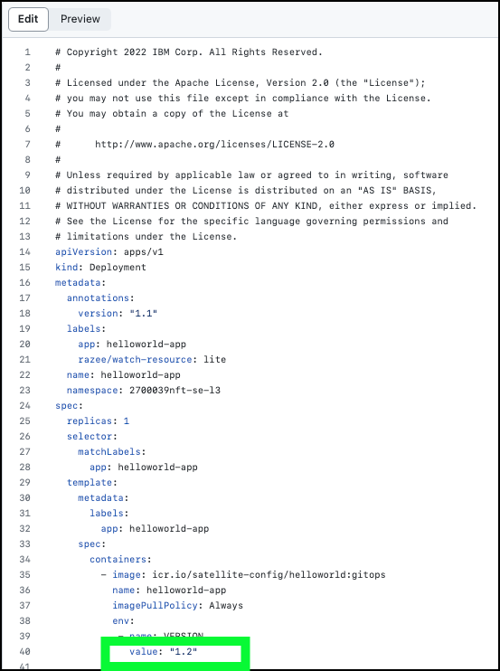

!!! warning "Do not change any other values and maintain proper spacing"

    Remember, YAML is a very strict language. Make sure all spacing and quotes remain the same. Any string can be used in stead of "1.2". The value just needs to be different in order for GitHub to notice the change.

24. Click the **Commit changes...** button.

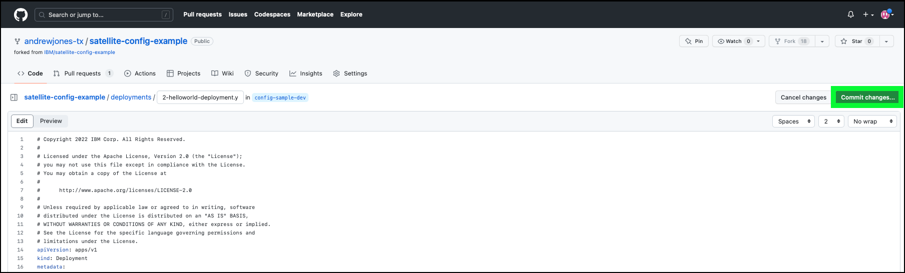

To see **Satellite config** in action, complete the next two steps without a long delay between the two. **Satellite config** runs subscriptions approximately every 5 minutes. When performing a client demonstration, consider building talking points into the time between the next two steps.

25. Click the **Commit changes** button in the pop-up dialog. Optionally, modify the **Commit message** text entry field.

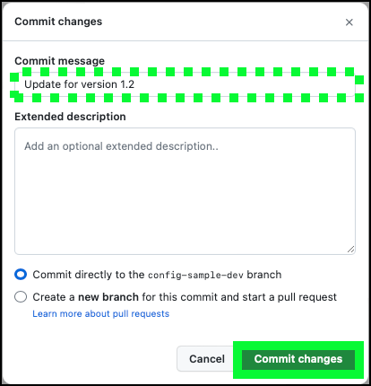

26. Return to the OpenShift web console for the **{{ ibm.cluster_name }}** cluster (**development**) and click the middle of the **helloworld-app**.

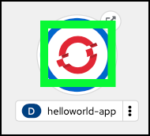

A side window will open with the details of the sample application's deployment.

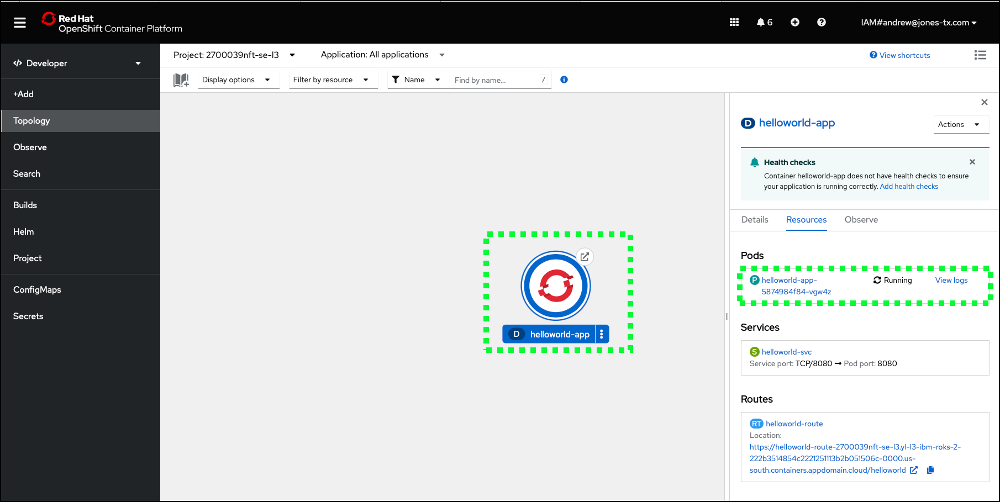

Now observe the two highlighted sections. Several things will be occurring, as seen in the animation below. First **Satellite config**, at its ~5 minute interval, will notice a change in the GitHub repository for the **{{ git.DevBranch }}** repository. It will then process the YAML files just as it did when the subscription was first run. This will deploy the updated **2-helloworld-deployment.yaml** to the OpenShift cluster. In OpenShift, as illustrated in the animated give below, a new **pod** will be created with executing the new deployment with the changes made. This creates a new instance of the application. Once the new **pod** is running, the old **pod** is deleted. This process prevents downtime.

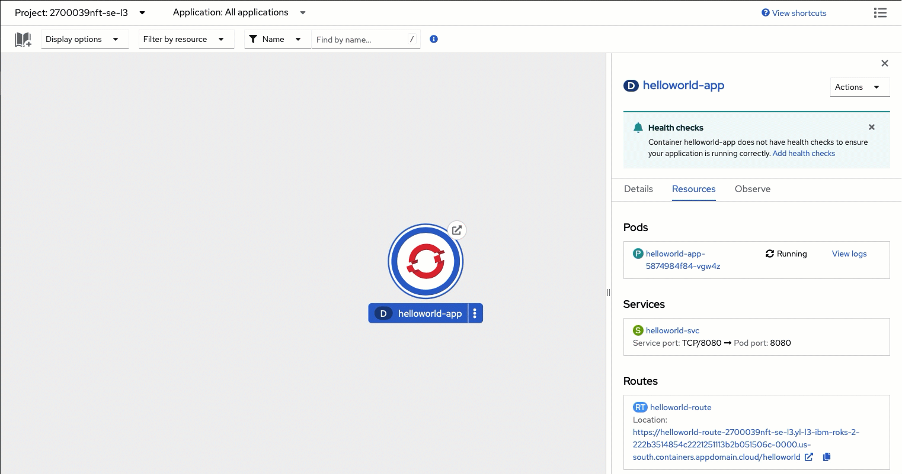

27. Click the route link  icon to open the web page front end to the deployed application in the **{{ ibm.cluster_name }} cluster.

Notice the string displayed should reflect the change made from the edit of the **2-helloworld-deployment.yaml**.

??? error "Still seeing 1.1?"

    Make sure at least 5 minutes has passed from when the code was changed in GitHub. After 5 minutes, click the deployment route link in the OpenShift web console, or refresh the browser page where teh Hello World application is running.

As part of the DevOps process, the next step after modifying and testing any changes made is to perform a **pull request** from the **{{ git.DevBranch }}** to the **{{ git.ProdBranch }}**. Once the **pull request** is **merged** in GitHub, the **Satellite config** for the **{{ clusterGroups.production }} cluster group will be processed. 

28. Switch to the browser tab for the **{{ git.ProdBranch }}** cluster and verify the sample application is still at version **1.1**.

29. Switch to the GitHub browser tab and click the **Pull request** link.

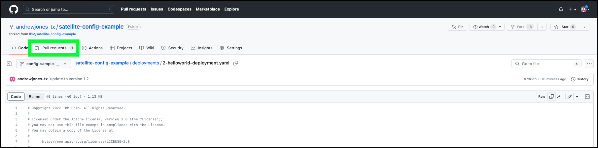

30. Click the **New pull request** button.

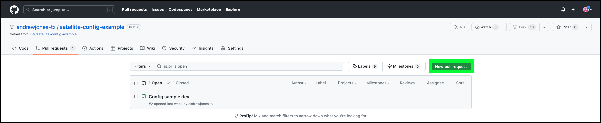

31. Change the **base repository** pull-down to **your** repository.

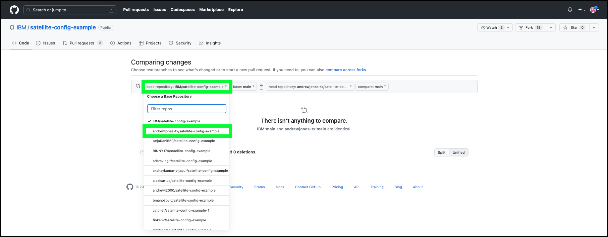

33. Change the **base** branch to **{{ git.ProdBranch }}** and the **compare** branch to **{{ git.DevBranch }}.

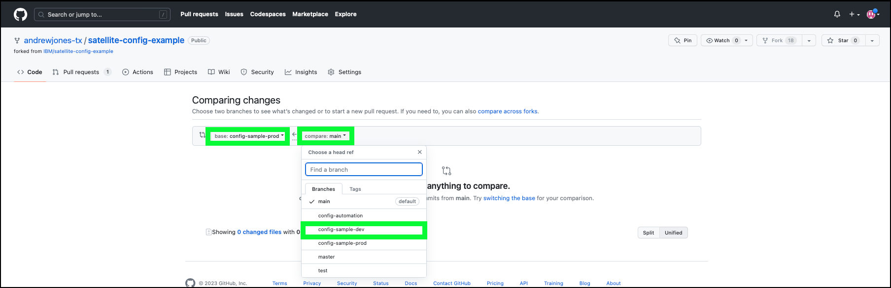

34. Click the **Create pull request** button.

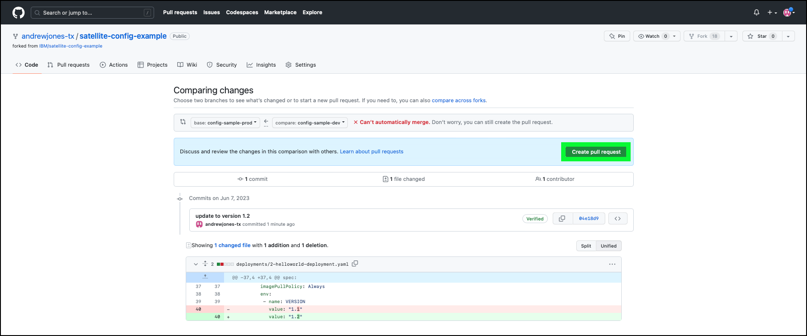

35. Once again, click the **Create pull request** button.

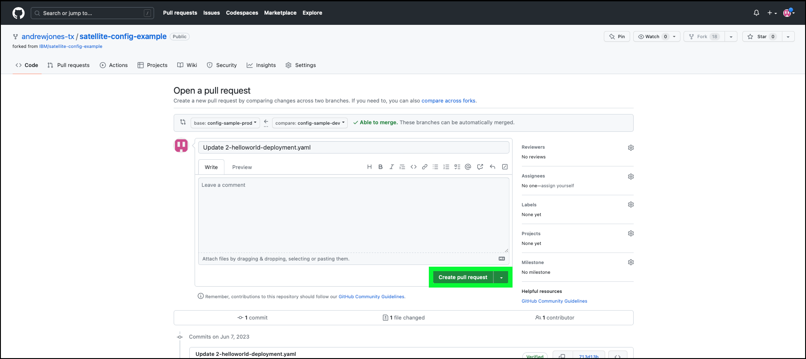

36. Click the **Merge pull request** button.

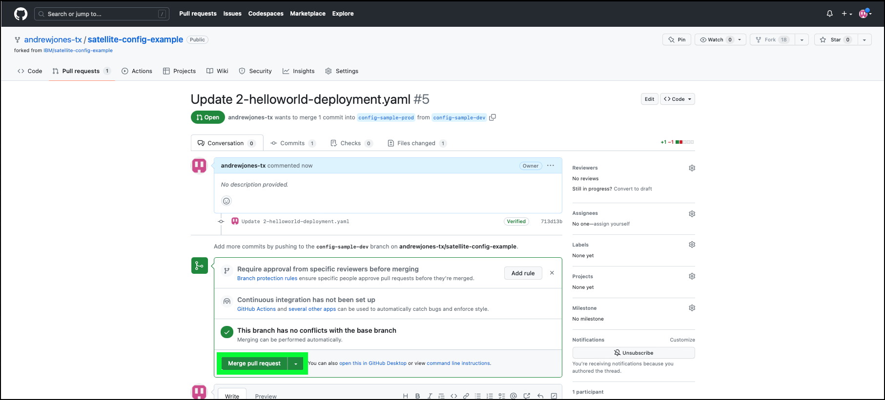

37. Click the **Confirm merge** button.

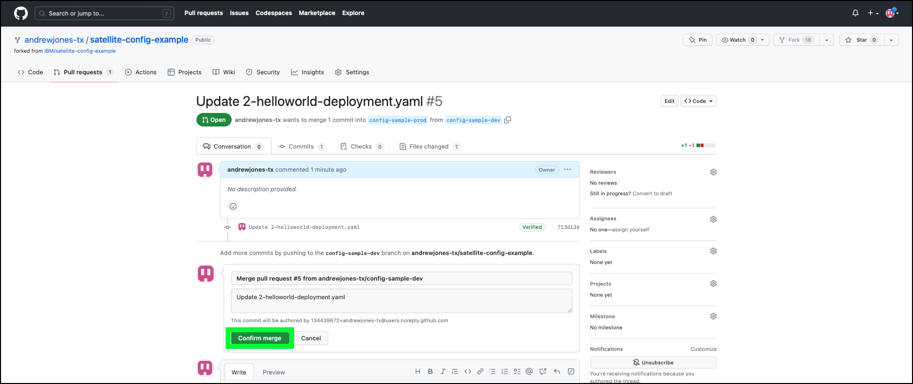

Now that the merge has been performed in GitHub, the changes will be propagated to the {{ clusterGroups.production }} cluster group via the **Satellite config** subscription.

38. Return to the OpenShift web console for the **{{ sat.cluster_name }}** cluster (**production**) and click the middle of the **helloworld-app**.

A side window will open with the details of the sample application's deployment.

Just as observed with the **development** copy of the sample application, the **production** copy will be updated. A new pod will be created and the old one will be removed. **It may take a full 5 minutes before the update occurs.**

39. Click the route link  icon to open the web page front end to the deployed application in the **{{ sat.cluster_name }} cluster.

Notice the string displayed should reflect the change made from the edit of the **2-helloworld-deployment.yaml**.

That concludes to demonstration of **Satellite config** and how it can be used in conjunction with GitHub and a DevOps process.

Continue to the next section to learn how to complete the IBM Cloud Satellite Level 3 learning plan.