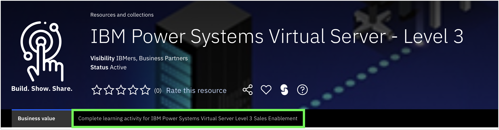
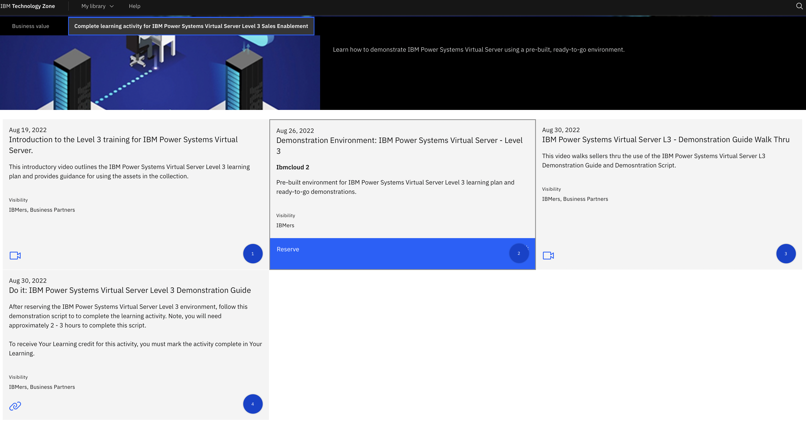
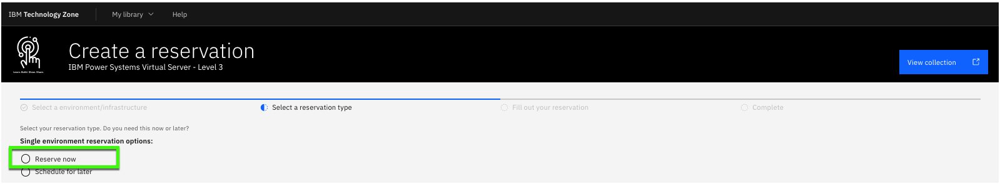
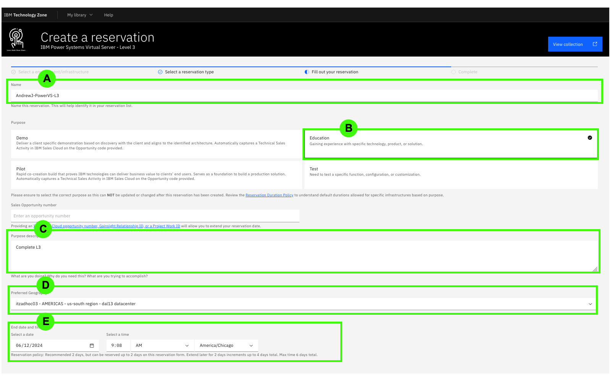
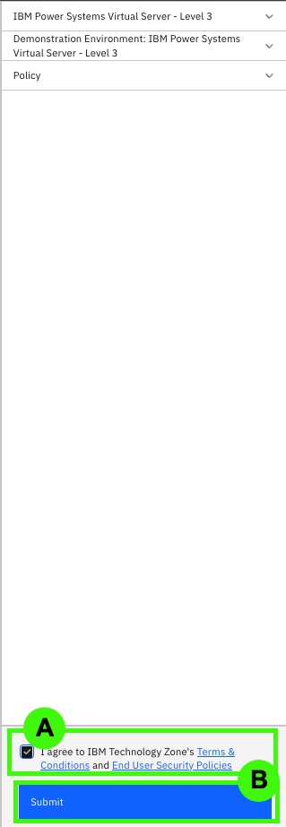
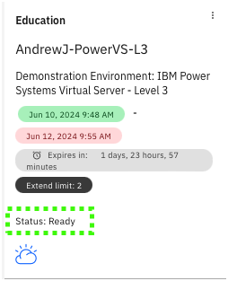
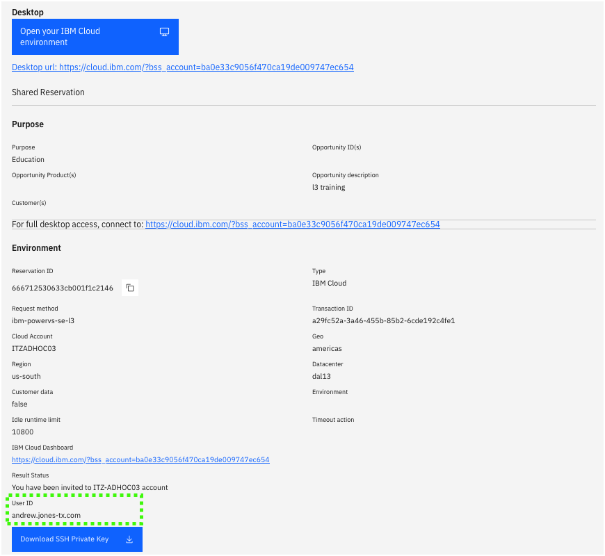
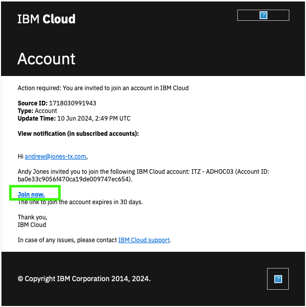

The steps below outline how to reserve access to the pre-provisioned demonstration environment in IBM Technology Zone (ITZ).

!!! tip "Remember to reserve a demonstration environment in IBM Technology Zone"
    Reserve an IBM Technology Zone environment ahead of time so that the instance has time to provision.

1. If not already done, go to the <a href="https://techzone.ibm.com/collection/ibm-power-systems-virtual-server-level-3" target="_blank">IBM Technology Zone collection for PowerVS L3</a> and click the tab (at the top of the page) labeled "Complete Learning Activity for IBM Power  Virtual Server Level 3 Sales Enablement," as shown in the following screenshot.

2. Click the **Demonstration Environment** tile that has the blue **Reserve** icon to create a request for a reservation.

3. Select the **Reserve Now** option.

4. Complete the required fields for the reservation.

  a. Provide the instance a unique name. For example, 'AndrewJ-PowerVS-L3'.
  b. Set the value of **Purpose** to **Practice / Self-Education**.
  c. Write a brief note into the **Purpose Description** field explaining what the environment is to be used for.
  d. Under the **Preferred Geography** field, select **Dallas 13** (or a closer location if available).
  e. Specify the **End Date and Time** for the reservation. The default reservation is for two (2) days. Once reserved, you should be able to extend the reservation for up to an additional 4 days.

5. When satisfied, scroll down to the bottom of the page and (a) accept the terms and conditions and then (b) click **Submit** to initiate the environment provisioning request.

6. Wait for IBM Technology Zone to finish provisioning the PowerVS environment — this process takes approximately 5 to 10 minutes. When ready, an email will be sent _and_ the <a href="https://techzone.ibm.com/my/reservations" target="_blank">Reservations</a> page will show a PowerVS tile with the status of **Ready**. If marked as ready, click anywhere on the tile to drill down into details of the reservation.

!!! important
    Clicking the PowerVS tile before it is marked as Ready (for example, if it shows as "scheduled" or "provisioning") will display incomplete data. Wait until the environment is **Ready** before continuing to the next step.

7. Click the reservation tile.

8. Locate the field labelled as **User ID** and record this value, as it will be needed later. It should look like your email address used to request the environment but with a period instead of an *at* sign (@).

9. Click **Download SSH Private Key**.

This SSH key will be used later to access the PowerVS virtual server instances.

!!! tip "Record the file name and location!"
    
    The private key file will be used later when accessing virtual machines on PowerVS. 

10. Review the emails received. One will be from **IBM Cloud** with the title **Account: You are invited to join an account in IBM Cloud**. Within the content of the email is a link to **Join Now**. Click the link and then **Accept** the invitation on the IBM Cloud portal.

    If you do not receive an e-mail, try deleting the existing reservation in ITZ and try creating a new one. If that doesn't work, open a support ticket in the #itz-techzone-support Slack channel.  Include the reservation ID and summarize the problem in your message.