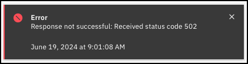

Using the IBM Cloud Portal, clients can control and manage many aspects of their provisioned IBM Power Virtual Server (PowerVS) workspaces and virtual server instances (VSIs). 

In the next chapter, explore how to manage individual VSIs. You will explore managing the workspace later in Part 7.

Remember, the IBM Technology Zone environment used for this course is a shared service for multiple students and geographies, safeguards have been put in place ahead of time to ensure that the environment remains stable. Attempts to modify workspaces and VSIs will result in an error like the one below. 

However, you can still explore and even demonstrate how changes can be easily made to resources through the IBM Cloud portal. To avoid the message from being seen, simply click cancel instead of create or submit when performing an action and describe to the audience what would occur.
