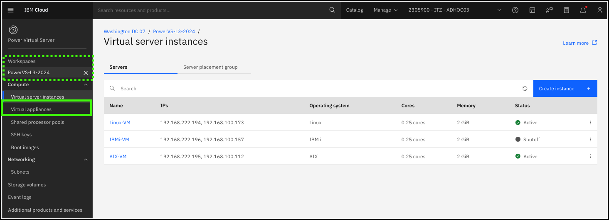
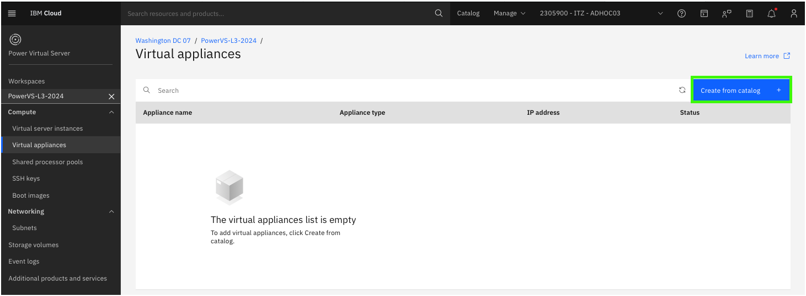
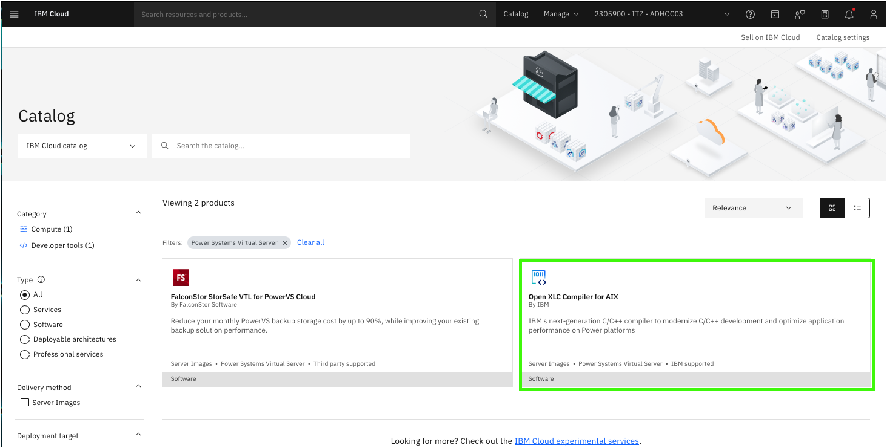
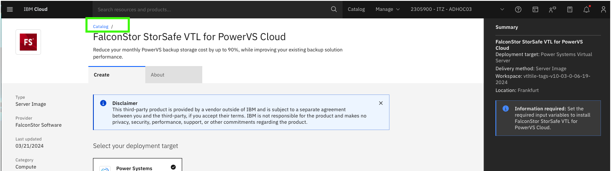
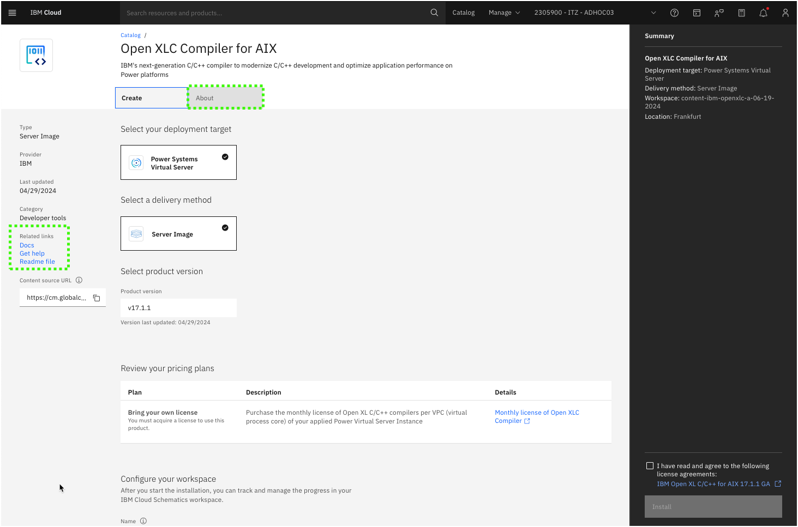

Virtual appliances are pre-configured virtual machine image, that can easily be provisioned in a IBM Power Virtual Server (PowerVS) workspace. 

1. Click **Virtual appliances** option in the side menu under the {{powerVS.serviceInstanceName}} workspace.

2. Click **Create from catalog +**.

A new browser tab will open to the IBM Cloud catalog showing the currently available virtual appliances. As of June 2024, there are 2 virtual appliances available in the IBM Cloud catalog for PowerVS.

3. Click the **FalconStor StorSafe VTL for PowerVS Cloud** tile.

FalconStor StorSafe Virtual Tape Library (VTL) is a software solution that optimizes backup and restore, to improve performance and significantly reduce backup storage costs, all without requiring changes to the existing requirement. With its integrated deduplication, the solution removes redundant copies of data, thereby reducing capacity requirements, decreasing storage costs, and minimizing replication and restore times. StorSafe VTL can be used with all leading backup solutions, and enables both hybrid and native-cloud backup, as well as both workload and tape migration to the cloud. 

Review the provisioning page for  FaclonStor StorSafe VTL for PowerVS Cloud. Notice the **Required input variables** and **Optional input variables**  sections and the values that are used to configure the virtual appliance. These include parameters like the number of vCPUs, memory, and storage tier. Also note the **About** tab and links to additional information.

Once all the required fields are defined, clients can provision the virtual appliance. The automation will provision the required virtual server instance using a base image with the FaclonStor software already installed and configure the software with the required and optional values specified. Once complete, the FalconStor solution is ready to be used.

4. Click the **Catalog** link at the top of the page.

5. Click the **Open XLC Compiler for AIX** tile.

IBM® Open XL C/C++ for AIX is IBM’s next-generation C/C++ compiler that facilitates the creation and maintenance of applications written in C/C++ for IBM Power. Taking advantage of the latest Power10 architecture, IBM Open XL C/C++ for AIX can generate code that leverages the capabilities of Power10 to maximize your hardware utilization.

Explore the provisioning page and additional information available for the virtual appliance.

Recall, the virtual appliance catalog was opened in a new browser tab or window. When ready, close the current browser tab or window to return the the IBM Cloud Portal virtual appliances page.