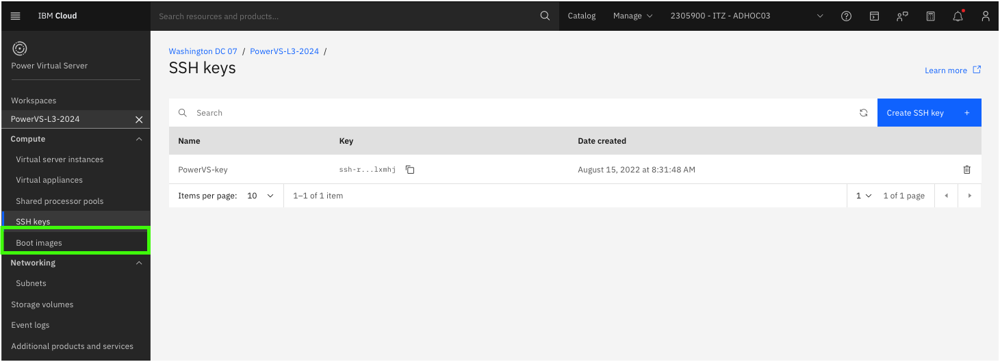
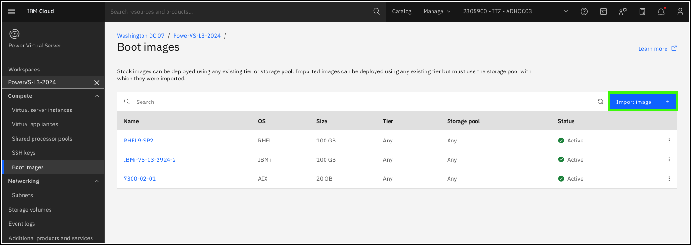
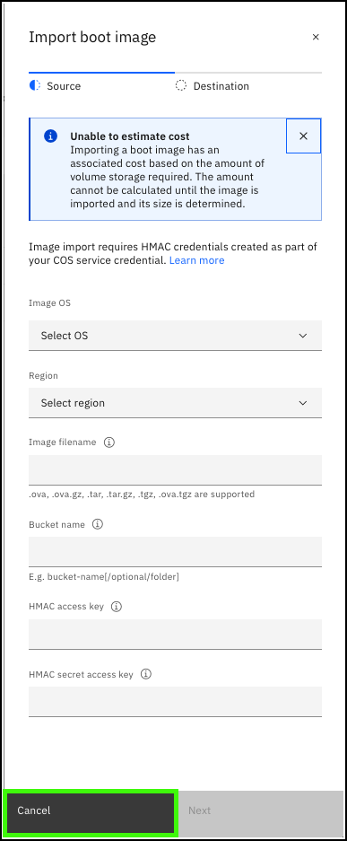
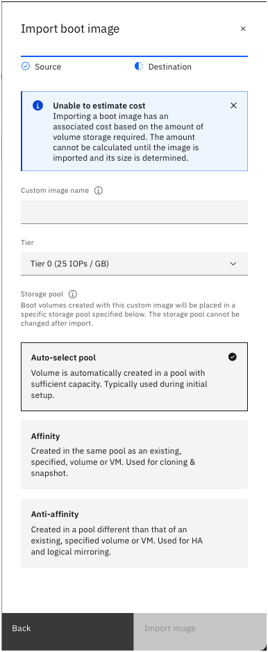

Every instance of IBM Power Virtual Server (PowerVS) consists of a mandatory boot volume. Boot images come from the PowerVS image catalog or can be imported by clients. Once a VSI is provisioned, a copy of the boot image is added the the client's boot image catalog.

1. Click the **Boot images** option in the side menu under the {{powerVS.serviceInstanceName}} workspace.

Notice the existing 3 boot images in the list.

These 3 boot images map are used by the 3 VSIs running in this demonstration environment. The **Active** status means the image is actively used by a running VSI.

2. Click **Import image +**.

PowerVS allows clients to add their own boot images to their PowerVS workspace. Only AIX, IBM i, and Linux on IBM Power images are supported. To add an image to the PowerVS workspace image catalog, the image must first be uploaded to a bucket in IBM Cloud Object Storage (COS). Image file type supported are: .ova, .ova.gz, .tar, .tar.gz, and .tgz.

To access the image in COS, the filename, bucket name and the hash-based message authentication code (HMAC) access and secrete access keys must be specified. Learn more about COS <a href="https://cloud.ibm.com/objectstorage" target="_blank">here<a>. Once these fields are specified and the user clicks **Next** additional parameters need to be provided for the boot image. 

!!! Warning "You will not be able to navigate to this screen."

On the second **Import boot image** screen, the user is prompted to specify a name for the image, the storage tier for the image, storage pool. You will learn more about storage pools later. Once those selections are made, the boot image is copied from COS to the PowerVS workspace boot image catalog.

3. Click **Cancel**.

Learn more about importing boot images <a href="https://cloud.ibm.com/docs/power-iaas?topic=power-iaas-importing-boot-image" target="_blank">here</a>.