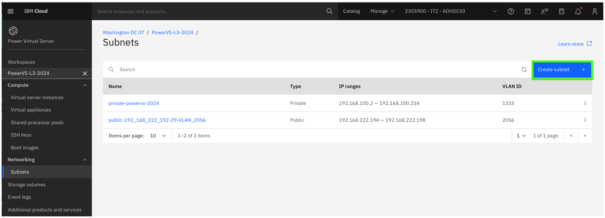
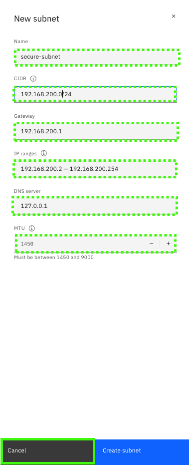

Network design for any cloud deployment is critical, this include for IBM Power Virtual Server (PowerVS) deployments. There are many options available for clients when designing both the connectivity from their on-premises environment(s) to the cloud as well as within their PowerVS workspaces. This section only covers the creation and management of private subnets within a PowerVS workspace. Learn more about PowerVS networks <a href="https://cloud.ibm.com/docs/power-iaas?topic=power-iaas-network-architecture-diagrams" target="_blank">here</a> and other related section of the PowerVS documentation.

1. Click the **Subnets** option in the side menu under the {{powerVS.serviceInstanceName}} workspace. Note, you may need to first expand the **Networking** section.

Two subnets are listed. 

One is the public subnet for for the workspace: {{powerVS.publicSubnet}}. This subnet was created when the public network option was selected when provisioning the first virtual server instance (VSI) in the workspace.  

The private subnet, {{powerVS.privateSubnet}} was created prior to provisioning the first VSI. In the next steps, explore how to create a private subnet.

2. Click **Create subnet +**.

To create a new subnet, the details about the subnet need to be specified. 

These include a name and:

- Classless Inter-Domain Routing (CIDR)

  CIDR is a method for allocating Internet Protocol (IP) network addresses for routing. The CIDR notation is a compact representation of an IP address and its associated network mask.

- Gateway

  The gateway address will typically be the first address in the range of available addresses defined by the CIDR; however, this can be changed.

- IP ranges

  The IP range field allows the user to specify either the full CIDR range as being available or a subset.

- Domain Name Server (DNS)

  The DNS server is used for name resolution for the VSIs in the subnet. If the VSIs have a public facing network, they can use a public DNS server, like IBM Clouds: 9.9.9.9. However, if a public network is not available, the DNS should be set to 127.0.0.1 to avoid issues with VSIs hanging during startup. Up to 20 DNS servers can be specified.

- Maximum Transmission Unit (MTU)

  MTU is used to specify the largest data packet size allowed over a network. A larger MTU produces less overhead, and a smaller value can reduce network delay. If Red Hat OpenShift will be deployed on VSIs in the subnet, the recommendation is to set the MTU size to 1450. To support jumbo frames (often required for applications with large data transfers), the MTU should be set to 9000.

3. Click **Cancel**.
   

Existing subnets can be edited; however, this is limited to changing the gateway, the IP ranges, and adding or removing DNS servers.