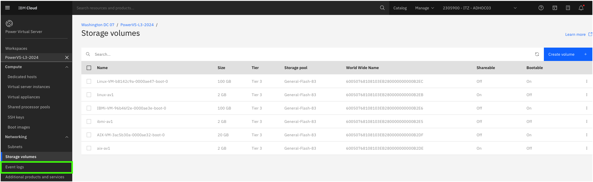
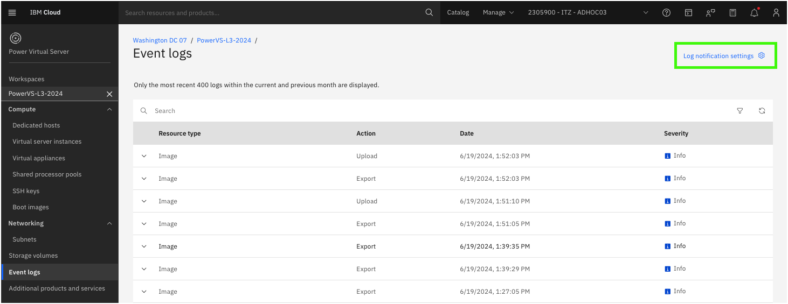
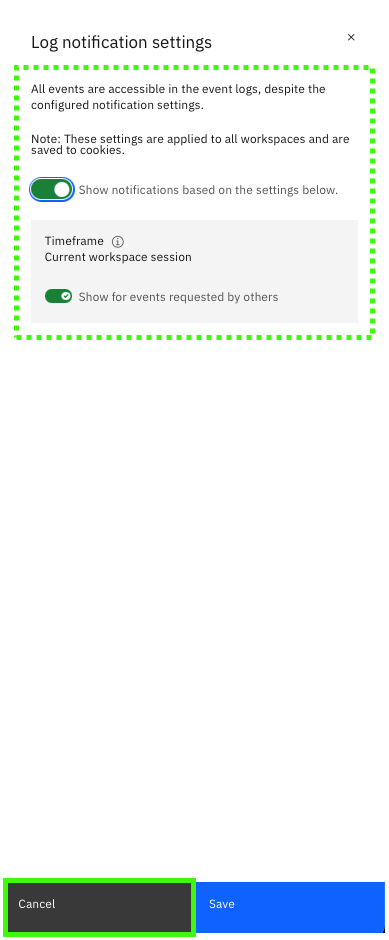
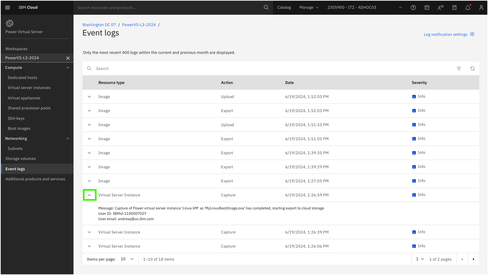
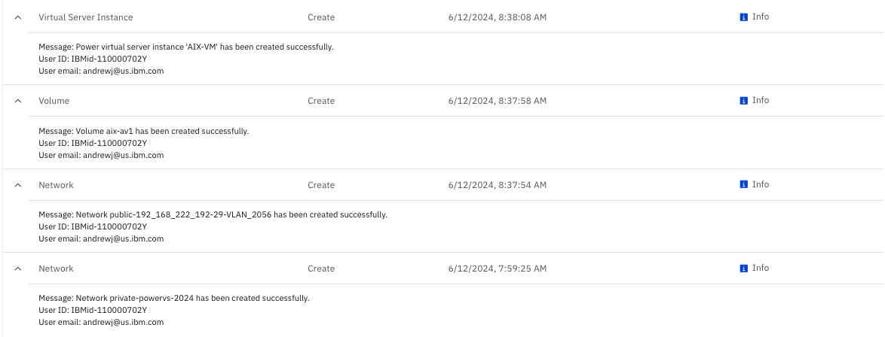

The **Event logs** pages for PowerVS workspaces provides a few of the 400most recent logs within the current and previous month. These logs show the recent activities, and provides some details (like who performed the action) about the event. It is also possible to integrate PowerVS with IBM Cloud Monitoring and IBM Cloud Activity Tracker. These options will be explored in Part 8 of this guide.

!!! Note "Deprecation of IBM Log Analysis and IBM Cloud Activity Tracker"

    IBM Log Analysis and IBM Cloud Activity Tracker are being replaced by IBM Cloud Logs in 2024. This demonstration guide will be updated to once IBM Cloud Logs in fully operational and integrated with PowerVS.

1. Click the **Event logs** option in the side menu under the {{powerVS.serviceInstanceName}} workspace.

2. Click **Log notification settings**.

3. Review the **Log notification settings** and then click **Cancel**.

!!! Important "You may not see any notifications!"

    Since event logs only displays events in the current and previous month, it is possible that you may not see any events. If that is the case, you won't be able to follow the steps below; however, the images below will help you understand the type of information that is logged and to what level of detail.

4. Expand on of the **Virtual Server Instance** events.

This event is related to a **Virtual Server Instance** (VSI) resource type and was triggered when an image capture was performed on one of the running VSIs.

Below are the events that were triggered when the first VSI in the demonstration environment was provisioned.

The events logged here are high-level events, but provide useful information as the longer running tasks are progressing. For instance, provisioning the AIX VSI took about 40 minutes as seen by the time stamps of the events above.

For more detailed information IBM Cloud Activity Tracker/IBM Cloud Logs should be used.

