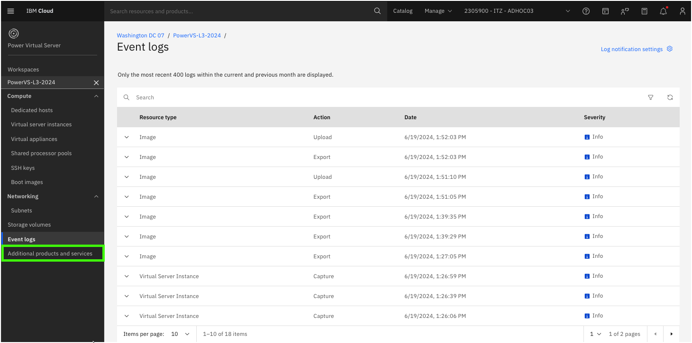
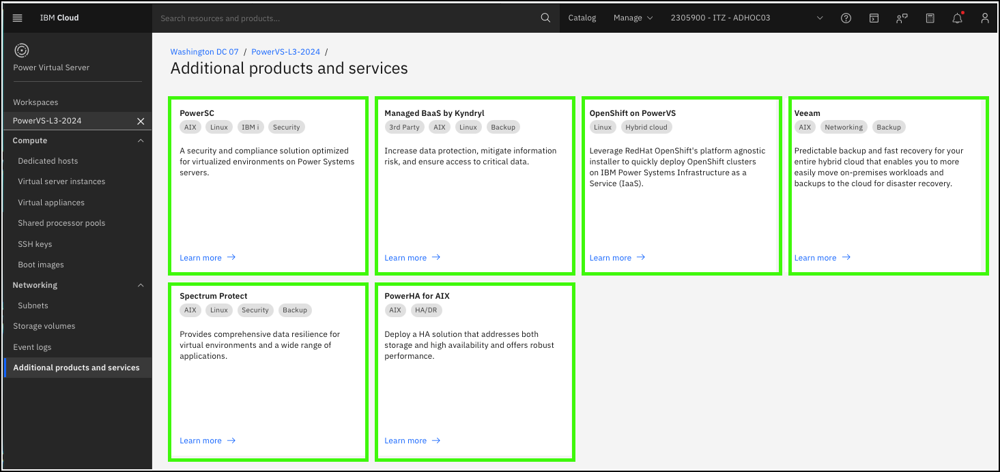

Complimentary products and services are available for {{offering.name}} (PowerVS).

1. Click the **Additional products and services** option in the side menu under the {{powerVS.serviceInstanceName}} workspace.

Each of the tiles listed represent additional products and services that can integrated with PowerVS.

You are encouraged to click on each of the tiles to learn about these products and services. 

Note, these are not all of the products and services available for PowerVS. Additional ones call also be found by going to the <a href="https://cloud.ibm.com/catalog" target="_blank">IBM Cloud catalog</a> and search on **PowerVS** and **Power Virtual Server**. Unfortunately, due to naming differences and the embedded search engine, the results for each yield different things.
Try both search strings to find other services and products that work with PowerVS.