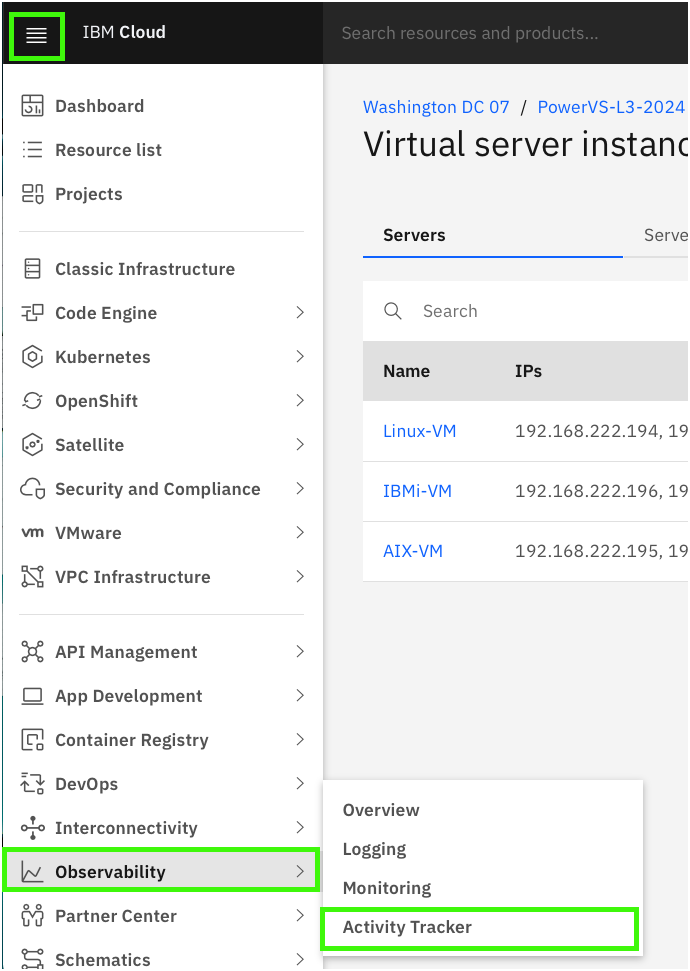
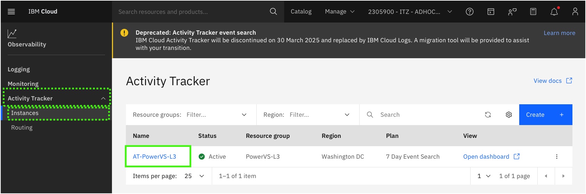
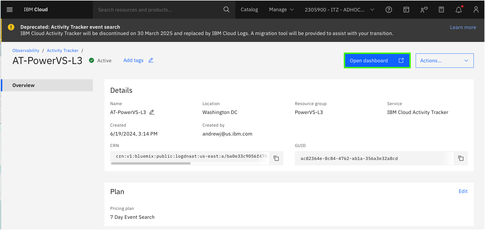
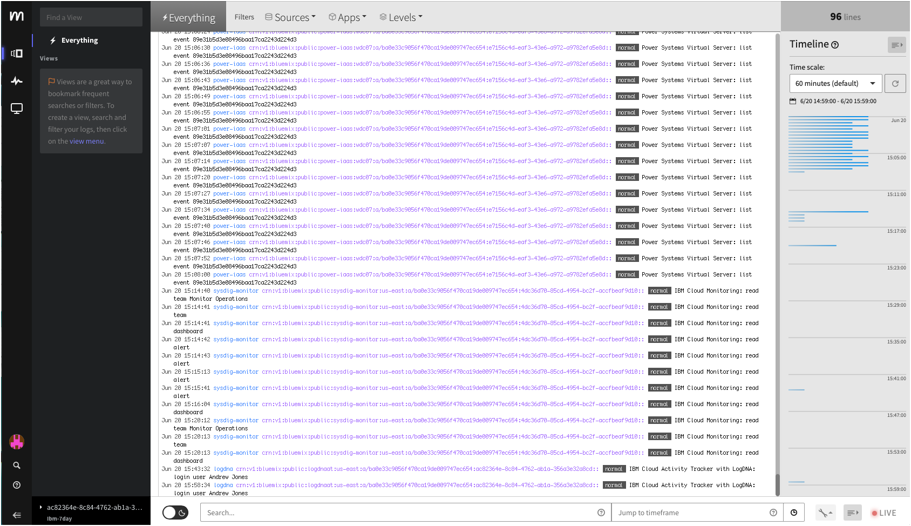
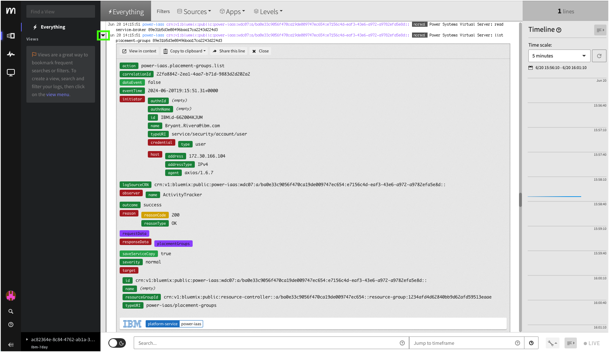
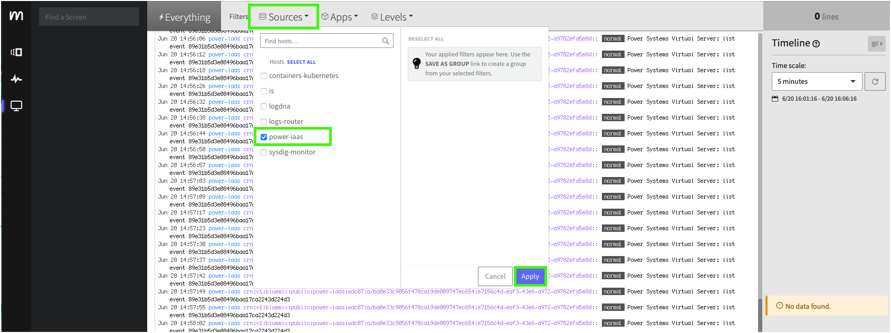

IBM Cloud Activity Tracker is used to record your IBM Cloud activities and monitor the activity of your IBM Cloud account. This services can be used to investigate abnormal activity and critical actions, and comply with regulatory audit requirements. It also has the ability to send alert with specific activities occur.

!!! Important "IBM Cloud Activity Tracker is deprecated."

   IBM Cloud Activity Tracker will be discontinued on 30 March 2025 and replaced by IBM Cloud Logs. A migration tool will be provided to assist with client transitions to the new service. Once fully IBM Cloud Logs is fully operational this demonstration guide will be updated.

For this demonstration guide, an IBM Cloud Activity Tracker instance has already been provisioned. This instance only tracks activities for the resources that are part of the PowerVS-L3 resource group in the shared cloud account. Your user ID has permission to open and view the IBM Cloud Activity Tracker dashboard. 

In the steps that follow, learn how to:

- access the IBM Cloud Activity Tracker instance using the IBM Cloud portal
- open the IBM Cloud Activity Tracker dashboard
- explore activity related to the PowerVS resources in this environment

Note, this demonstrate guide does not provide detailed information on provisioning, configuring, and customizing IBM Cloud Activity Tracker, nor does it provide details on the meaning of individual activities.

1. Click the IBM Cloud portal menu , expand the **Observability** menu and click **Activity Tracker**.

2. Click {{powerVS.atInstance}}.

Explore the settings for this monitoring instance.

3. Click **Open dashboard**.

The IBM Activity Tracker dashboard will open in a new browser tab or window. You may be asked to re-authenticate to IBM Cloud when the new window is opened.

!!! Note "Your view will look different from the images below."

    The images below were captured at a point in time. Activity Tracker provides a live view of events and displays the most recent events at the bottom of the page.

You can adjust the **Timeline** on the right to narrow or expand the events viewed.

4. Expand an event.

To expand an event, hover the mouse to the left of an event and click on teh down arrow when it appears for the event. 

This view provides detail about the select event including information like what the event was (action), who performed it (initiator), and the outcome of the event.

Explore a few of the different events that exist.

Note, IBM Activity Tracker can filter on specific events, specific time frames, and other attributes.

5. Click the **Sources** pull-down and select **power-iaas** and click **Apply**.

This should narrow the events in the current view to just those related to the PowerVS infrastructure resources.

Activity Tracker can also filter based upon the **Level** of the event. For example, informational, debug, warning, errors, and critical events. 

To see the most recent events, click the **Live** button at the bottom right of the dashboard.

Spend a few minutes exploring some of the recent activities that have been logged.

Learn more about IBM Cloud Activity Tracker <a href="https://cloud.ibm.com/docs/activity-tracker?topic=activity-tracker-about" target="_blank">here</a>.