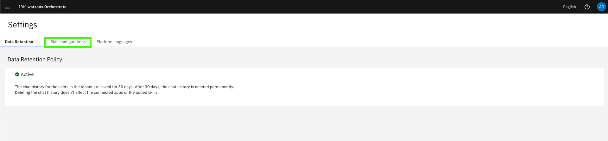
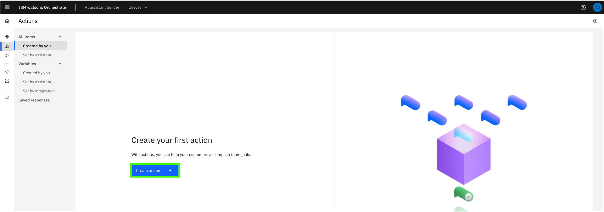
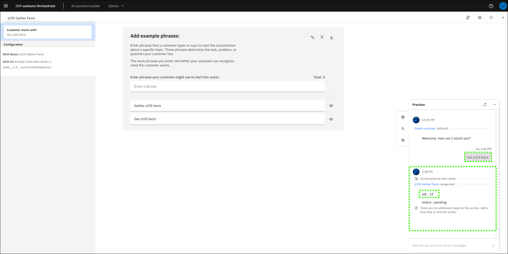
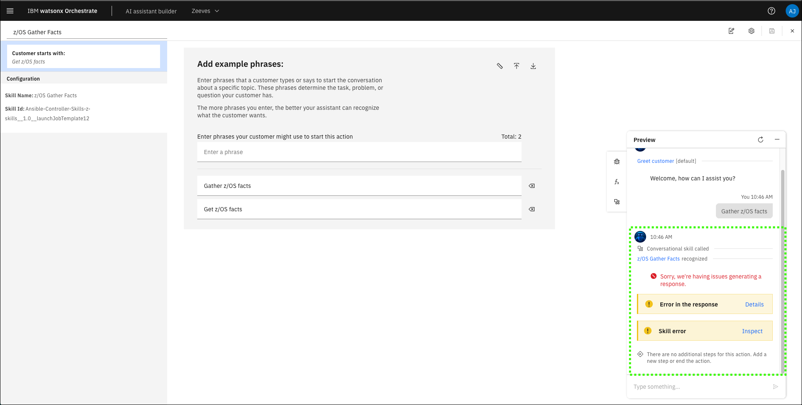
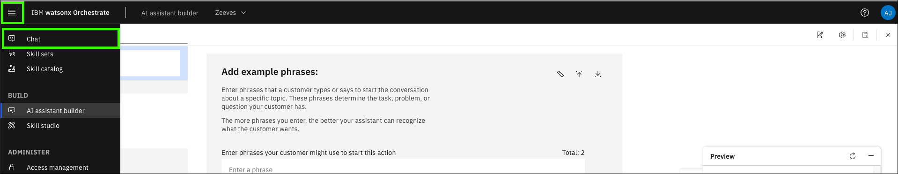
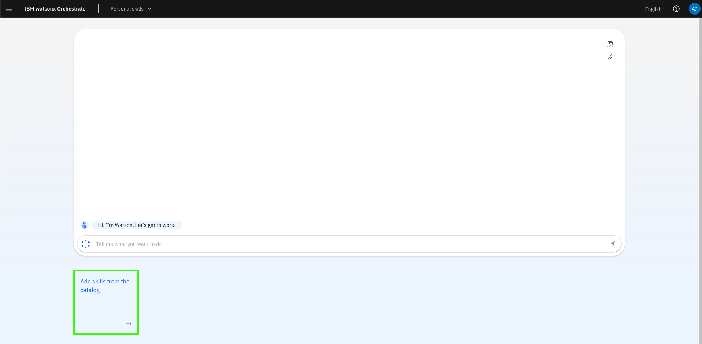
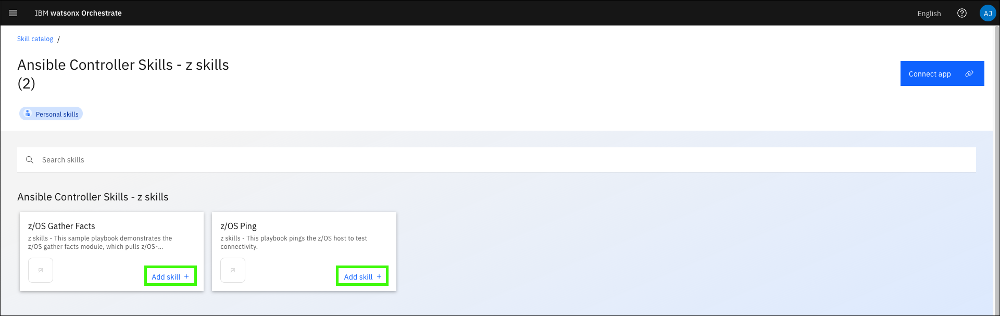

# Creating actions for your assistant
Once the skills in your application are connected to your assistant, you’re ready to begin creating actions tied to those skills. Learn more about building actions <a href="https://www.ibm.com/docs/en/watsonx/watson-orchestrate/current?topic=assistants-building-your-ai-assistant-actions" target="_blank">here</a>

# Configure the number of input fields
Before configuring actions, it’s important to modify a setting within watsonx Orchestrate that allows triggered skills to display as forms (versus conversational skills). 

1. Click your (a) profile icon and then click (b) **Settings**

    Learn more about configuring input fields <a href="https://www.ibm.com/docs/en/watsonx/watson-orchestrate/current?topic=actions-defining-how-interact-skill-in-conversation#configuring-multi-turn-conversations" target="_blank">here</a>.

    

2. Click the **Skill configurations** tab.

    

3. Enter **0** for the **Number of form fields**.

    

## Create actions
1. Click the main menu and select **AI assistant builder**.

    

2. Hover over the **Home** icon () and click **Actions**.

    

3. Click **Create action**.

    

4. Click the **Skill-based action** tile.

    

5. Select the **z/OS Gather Facts** tile and click **Next**.

    Note, it may take a minute for the page to display the action tiles. The date shown in the **z/OS Gather Facts** tile reflects when you added the skill to your application.

    

6. On the **New action** dialog, (a) enter a prompt a user of the assistant might use to initiate the action and then (b) click **Save**.

    !!! Bug "Be careful with the sample phrases you specify."

        During the development of the lab guide, it was discovered that some sample phrases with a `/` character can cause issues with the actions. Avoid using **z/OS** in the your sample phrases. This issue has been reported to the offering team.

    Sample prompts:

    ```
    Get zOS facts
    ```

    ```
    Gather zOS facts
    ```

    

7.  Add any (a) additional prompts and then (b) click the save ().

    

8.  Click **Preview**.

    

9.  Enter one of the prompts you specified in step 9 or 10.

    Prompt:
    ```
    Get zOS facts
    ```

    

10. Review the returned results and record the **job** number.

    In the execution of this skill-based action, the skill executed properly and the output is the job id. 
    
    !!! Warning "If an error is generated or the action is not performed and only search results are returned, review the Troubleshooting section below."       

    

# Verify the job in the Ansible Automation Platform console
Return to the Ansible Automation Platform (AAP) console and review the job information.

1. Click **Jobs** and then click the **job** number recorded in the previous step for the **z/OS Gather Facts** skill.

    

2. Review both the **Details** and **Output** for the **z/OS Gather Facts** job.

    Recall, that in the assistant, the contents shown in the **Output** of the Ansible job were not displayed. 

    
 
IBM watsonx Assistant for Z provides utility skills to retrieve the job output. It is also possible to create a skill flow that executes the **z/OS Gather Facts** skill followed by the **Retrieve job output** utility skill in sequence; passing the job id from the first skill to the second, in order to view the output within the assistant. Creating a skill flow is covered in the next section.

## Troubleshooting

??? Failure "Skill returns "***Sorry, we're having issues generating a response***" or the action is not performed and only search results are returned."

    

    This error appears to be an intermittent issue when a skill is first added. To resolve, add the skill to your personal skills catalog using the steps that follow. If you encounter the issue, try the steps that follow:

    1. Expand the main menu and select **Chat**.
   
        

    2. Click **Add skills from the catalog**.
   
        

    3. Search for the skill app you created earlier and click the tile for your app.
   
        
    
    4. Click **Add skill** for all the skills you want to add.

        

    5. Click **Connect app**.
   
           

    6. Enter the (a) **username** and (b) **password** using the username (admin) and password for your IBM Technology Zone (ITZ) watsonx Assistant for Z Pilot - AAP & z/OS reservation (AAP User Password (Use SSH key to login, only use password for UI)), and then click **Connect app**.

         

    7. Expand the main menu and select **Chat**.

         
    
    8. Try one of the prompts you created for your skill.

        Prompt:
        ```
        Gather zOS facts
        ```

         

    You should now be able to run the skill through the assistant preview.