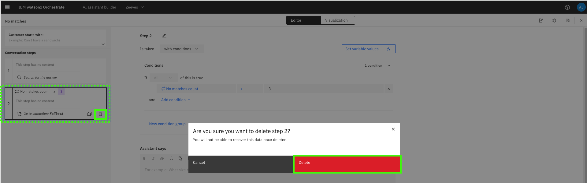
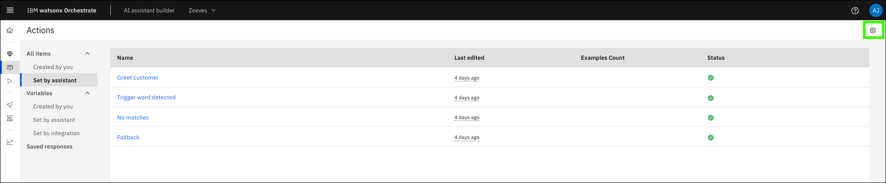
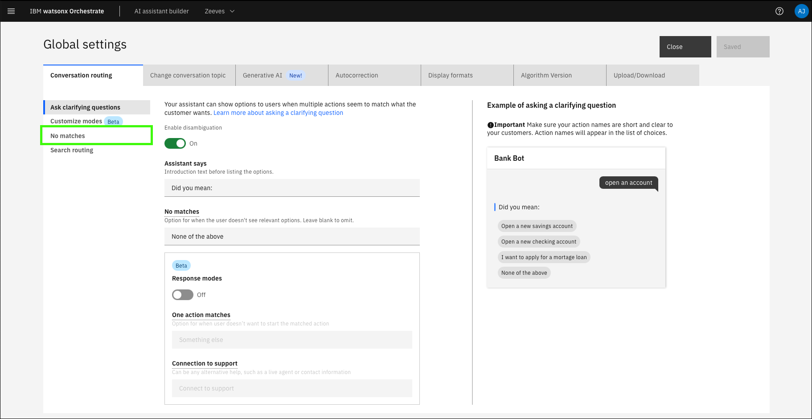
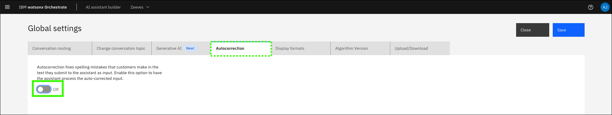
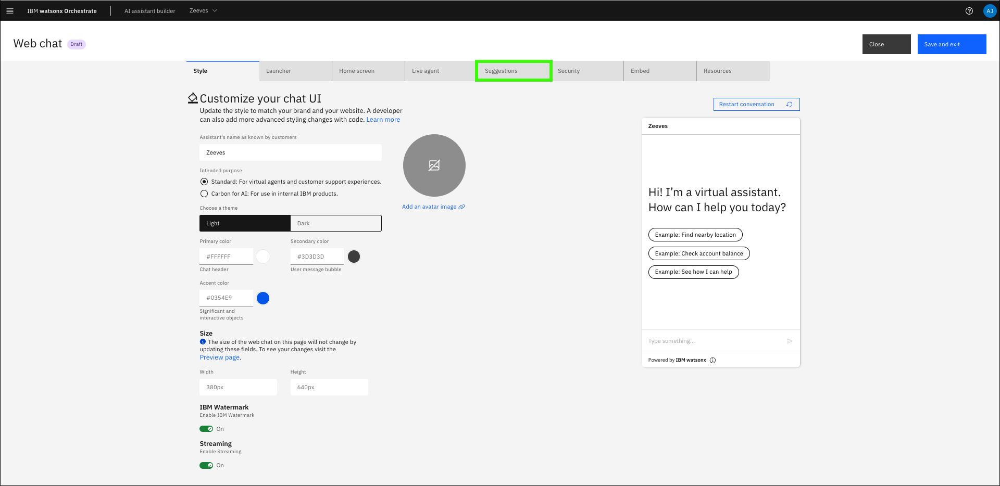
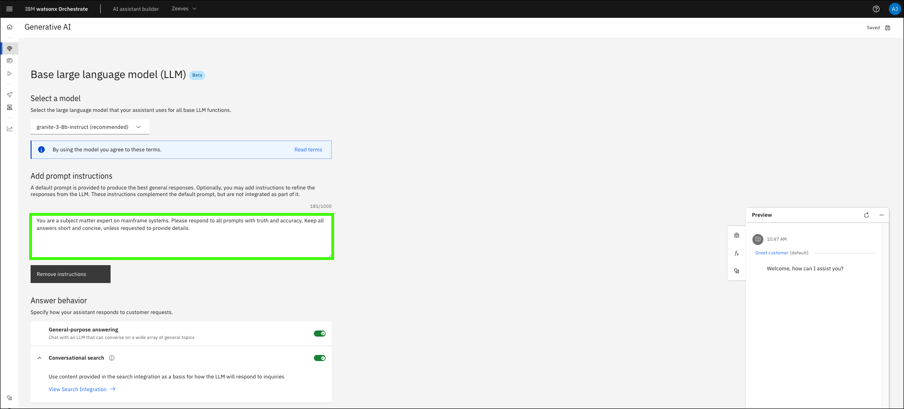

# Creating an assistant and configuring conversational search
[Watsonx Orchestrate](https://www.ibm.com/products/watsonx-orchestrate?p1=Search&p4=43700077722754881&p5=e&p9=58700008198244496&gad_source=1&gclsrc=ds) allows you to create and configure an assistant with conversational search capabilities. Configure your assistant to use conversational search by using a hosted [OpenSearch](https://opensearch.org/) instance. The pre-configured instance of watsonx Orchestrate in IBM Technology Zone (ITZ) boasts over 220 knowledge sources and supports Retrieval Augmented Generation (RAG). The large language model (LLM) providing conversational AI augments this knowledge based on IBM Z documentation, generating IBM Z context-aware responses to queries with content-grounded knowledge.

A high-level, logical architecture of the environment is illustrated in the following diagram.


## Access the ITZ IBM Cloud account for the watsonx Assistant for Z Pilot environment
1. In the IBM Technology Zone portal, expand **My TechZone** and select **My Reservations**, or click the following link.

     <a href="https://techzone.ibm.com/my/reservations" target="_blank">**ITZ My reservations**</a>
   
    

2. Click the **watsonx Assistant for Z Pilot - watsonx Orchestrate** tile.

    

3. Record the ITZ IBM Cloud account name associated with the reservation.

    **Did you read the tip on the welcome page about creating a reference card? Check it out [here](../index.md#cheatsheet).**
       
    

4. Click the **IBM Cloud Login** link.

    

    !!! Note "Steps to authenticate to IBM Cloud are not illustrated here."

        You may need to authenticate to IBM Cloud after clicking the link. These steps are not shown here as they may vary by individual.

5. Verify that the current IBM Cloud account is the same as the account name recorded in step 3. If the account is not the same, switch to the proper account.

    **Note**: The formatting of the name can appear differently than what is shown in the ITZ reservation.

    

    If the proper account is not listed, click the account drop down and select the proper account. 

    **Note**: If your browser window is narrow, the account drop down can be depicted with the Switch Account icon ().

    

## Create your Assistant
1. Click the **Resources** icon ().

    

2. Expand the **AI / Machine Learning** section and click the **watsonx Orchestrate** instance listed (the instance name is different than shown in the following image).

    

3. Click **Launch watsonx Orchestrate**.

    

4. Click the **AI assistant builder** tile to start creating a new assistant.

    

5.  Enter a name and optional description for your assistant and click **Next**.

    

6.  Complete the **Personalize your assistant** form and click **Next**.

    Explore the personalization options. In creating an assistant for a client pilot, consider specifying attributes that align with the client's business.

    **a**. Select **Web**.

    **b**. Select the industry of your choice.

    **c**. Select the role of your choice.

    **d**. Select the need of your choice.

    

7.  Complete the **Customize your chat UI** form and click **Next**.

    Explore the customization options. When creating an assistant for a client pilot, consider specifying attributes that align with the client (for example, colors and logos).

    

8.  Preview your assistant and then click **Create**.

    

    The assistant is now created.

    

<a name="configureCustomSearchURL"></a>
## Configure conversational search
In the next steps you will be to configure **conversational search** for your assistant that uses a hosted instance of OpenSearch.

1. Click **Generative AI** menu item () in the left navigation.

    

2. Select the base large language model (LLM) settings.

    !!! Important "If available, set the LLM model to **granite-13b-chat-v2**."

        Notice their are several LLM models available. **The current recommendation is for pilots, to use the *granite-13b-chat-v2* model as it provides the best results in recent testing.** However, this model has been deprecated as of 2024-11-04 and will may not be available after 2025-01-19. **Note**: screen captures that follow show the **granite-3-8b-instruct** LLM as being selected.

    

3.  Click **Set up your Search Integration**.

    By default, conversational search is not enabled when an assistant is created. Conversational search takes priority over general-purpose answering if both are enabled. Learn more about conversational search in watsonx <a href="https://www.ibm.com/docs/en/watsonx/watson-orchestrate/current?topic=assistants-conversational-search" target="_blank">here</a>.

    

4.  Click **Custom service**.

    

5.  Complete the **Custom service** (**a-e**) form and then click **Next** (**f**).

    **a**. Select **By providing credentials**.

    **b**. Enter the following value in the **URL** field (use the copy icon to avoid typographical errors). This is the URL for the shared [OpenSearch](https://opensearch.org/) instance. In later sections, you create and customize a dedicated instance.
    ```
    {{itz.hostedOpenSearchInstance}}
    ```

    **c**. Select **Basic authentication** in the **Choose an authentication type** drop-down list.

    **d**. Enter `{{itz.hostedOpenSearchID}}` in the **Username** field.

    **e**. Enter `{{itz.hostedOpenSearchPW}}` in the **Password** field.

    ```
    {{itz.hostedOpenSearchPW}}
    ```

    

6.  Enable **conversational search** and then click **Save**.

    
       
7.  Update the conversational search **custom service** settings based on your requirements.

    **Note**: The **Settings** page is divided into two sections in the following images to enhance the visibility of the screen captures. 
    
    Learn more about these **custom service** settings <a href="https://cloud.ibm.com/docs/watson-assistant/watson-assistant?topic=watson-assistant-conversational-search#tuning-the-generated-response-length-in-conversational-search" target="_blank">here</a>.

    The following settings are proven to work well. You can experiment with these settings to see how they affect queries for your client's pilot.

    **a**. Enable **Conversational search**.

    **b**. Select **Single turn**. **Multi-turn conversation** (by selecting Entire conversation) is supported by the offering, but has not been fully included in the lab guide. See the callout in the [Testing conversational search](creatingAssistant-configuringConvoSearch.md#testing-conversational-search) section below.
    
    **c**. Specify the text that appears to instruct the user to expand the list of citations in the assistant (except web chat client).

    **d**. Select **Lowest** for the **retrieval confidence threshold** setting. This setting checks the confidence of the retrieved citations before a response is generated.

    **e**. Select **Verbose** for the **generated response length**. This setting affects the average response length. Depending on user input, variations from the selected length can occur.

    **f**. Select **Lowest** for the **response confidence threshold**. This setting checks the confidence of the generated citations after the response is generated.

    

    **g**. Keep the default setting of **All** for the listing of citations.

    **h**. Keep the **Default filter** field empty.

    **i**. The **Metadata** field provides a way to adjust your assistant’s behavior during conversational search for your OpenSearch instance. This option is explored in detail in the [Installing and using zassist to ingest client documents](../byosd/zassist.md). Leave the field empty for now.

    **j**. The **Search display text** options specify the default text displayed when no results are found or when connectivity issues to the backend search service occur. You can keep the defaults or customize the service.

    

8.  Click **Save** (**a**) and then click **Close** (**b**).

    

## Complete the configuration
After you save and close the **Conversational search** configuration page, a few more configurations are needed to get the best experience from your conversational chat. Details on these settings are available <a href="https://www.ibm.com/docs/en/watsonx/waz/2.x?topic=cluster-configuring-your-assistant-use-byos" target="_blank">here</a>.

1.  Hover over the **Generative AI** icon () in the left navigation and click **Actions**.

    

2.  Click **Set by assistant** under the **All items** menu.

    

3.  Click **No matches**.

    

4.  Click **Step 1** under **Conversation steps**.

    

5.  Select **without conditions** (**a**) in the **Is taken** drop-down menu and then click **Clear conditions** (**b**).

    **Note**: the **Is taken** value does not change from **with conditions** after selecting **without conditions**.

    

6.  Delete the default text in the **Assistant says** entry field.

    

7.  Expand the **And then** drop-down menu and select **Search for the answer**.

    

8.  Click **Edit settings**.

    

9.  Click **After generation**.

    

10. Select **End the action after this step** and then click **Apply**.

    

11. Click **Save** ().

    

12. Select **Step 2** (**No matches count**) under **Conversation steps** and click **delete** ().

    

13. Click **Delete** in the confirmation dialog to delete **Conversation step 2**.

    

14. Click **Close** (the **x** icon) the **Editor** window.

    

15. Click **Fallback** in the **Actions** table.

    

16. Delete **all** of the **Conversation steps**.

    **Note**: The following image is edited. Only five steps are shown, but all six need to be deleted. You need to select each step individually. Click **delete** () and confirm the deletion.

    

17. Verify that all **Conversation steps** are deleted and then click the **x** to close the **Editor** window.

    

18. Click the **Global settings** ().

    

19. Click **No matches** under the **Conversation routing** tab.

    

20. Move the slider to **More often** (or select **More often** in the drop-down).

    The setting helps ensure that actions are triggered less often unless the user’s query specifically matches the action’s input.

    

21. Click **Autocorrection**.

    

22. Click the autocorrection toggle to turn the feature **Off**.
    
    

23. Click **Save** (**a**) and then **Close** (**b**).

    

24. Hover over the **Home** () and click **Environments**.

    

25. Click **Web chat**.

    

26. On the **Style** tab, click the **Streaming** toggle to enable streaming.

    The streaming setting allows responses to be streamed to the assistant as they are generated and returned versus waiting until the full response is received and then displayed.

    

27. Click the **Home screen** tab.

    

28. Customize the **Home screen** by setting a custom **Greeting message** and deleting the default **Conversation starters**. Optionally, adjust the **Background style**.

    

29. Click **Suggestions**.

    

30. Click the **Suggestions** toggle to turn this feature **Off**.
    
    

31. Click (**a**) **Save and exit** and then click (**b**) **Close**.

    

## Configure the base large language model
There are enhancements that you can make to configure how the large language model (LLM) responds to your queries, including adding prompt instructions and configuring the LLM’s answer behavior.
The options are summarized <a href="https://www.ibm.com/docs/en/watsonx/waz/2.x?topic=assistant-configuring-base-llm" target="_blank">here</a>.

1.  Hover over the **Home** () and click **Generative AI**.
    
    

2.  Click **Add instructions**.

    

3.  Enter a **prompt instruction**.

    Your assistant's LLM gives refined responses by following the prompt's instructions, which clarify how to achieve the end-goal of an action.

    Enter prompt instructions in the field. The maximum number of characters you can enter in the prompt instruction field is 1,000. 
        
    The following is an example prompt instruction that works well. Experiment with different prompt instructions.

    ```
    You are a subject matter expert on mainframe systems. Please respond to all prompts with truth and accuracy. Keep all answers short and concise, unless requested to provide details.
    ```

    **Note**: When the instructions are typed in, they are automatically saved and the LLM is immediately trained on them.

    

4.  Toggle **General-purpose answering** to **Off** and then click **Save** ().

    The ability exists to configure the answering behavior of your assistant to provide responses that are based on the preinstalled content or general content.

    On the **Generative AI** page (under **Prompt Instructions**), you see the **Answer behavior** section. After you configure **Conversational search**, you see that it is enabled (toggled on) with the search integration added.

    If you enable both general-purpose answering and conversational search, conversational search answering takes precedence over General-purpose answering. 
    
    **Recommendation**: For purposes of retrieving Z-specific answers and responses, it is recommended that you turn off general-purpose answering and leave only conversational search turned on.

    

## Testing conversational search
Now, you can begin issuing queries to test the assistant's responses. For more detailed responses, try appending "Please provide a detailed response." to the end of your question.

**Important**: Modify settings iteratively based on your assessment of response quality. Review and change them at any time. For example, add extra prompt instructions, change response verbosity, and modify OpenSearch indexes.

1. Hover over the **Home** () and click **Preview**.

    

2.  Experiment with different prompts and validate that the answers are reasonable and related to IBM Z.

    Other prompts and responses follow. 
    
    **Note**: The responses that you receive can vary from the ones shown.

    **Prompt**:

    ```
    What is z/OS continuous delivery?
    ```

    Example output:

    

    **Prompt**: 

    ```
    What is the APF list in z/OS? Provide a detailed explanation?
    ```

    **Example output**:

    

    **Prompt**:

    ```
    Why is Db2 different than other database systems?
    ```

    **Example output**:

    

    **Prompt**:

    ```
    What happens during an IPL on IBM Z?
    ```

    **Example output**:

    

    !!! info "Experiment with multi-turn (entire conversation) contextual awareness."

        In the December 2024 release of {{offering.name}} support for multi-turn contextual awareness was added. This capability enables the assistant to use an entire session history for retrieving search results and generating answers. This handles context-dependent questions well but may over-rely on past topics, even if the user has moved on.

        Experiment with this setting by changing your custom service contextual awareness setting from **Single turn** to **Entire conversation**.

        

        Once enabled, try sequential prompts like:

        ```
        What are some features of z/OS?
        ```

        ```
        Give me an itemized list?
        ```

        ```
        Tell me more about item 3.
        ```

You have a working assistant that uses IBM Watson Assistant for Z. Explore different prompt instructions and settings. If you encounter issues, refer to the Troubleshooting section that follows for resolution.

Continue to the [Creating a stand-alone OpenSearch instance for document ingestion](../byosd/documentIngestion.md) to learn how to configure a dedicated OpenSearch instance for ingesting client-specific documentation into the RAG model.

## Troubleshooting
The following are issues that you may encounter. If the provided resolutions do not work, contact support by using the methods that are mentioned in the [Support](../index.md#support) section.

??? Failure "Assistant responds to all prompts with, "I might have information related to your query to share, but am unable to connect to my knowledge base at the moment""

    This Assistant is unable to connect to the custom service URL specified. This could be a network issue, the service may be down, the service may be restarting, or the service is no longer running at that URL.

    Before reaching out to [Support](../index.md#support), try the following:

    - Wait a few minutes and try again. It may be the service was in the process of restarting.
        
    - If you printed this demonstration guide or saved a copy, verify you are using the most current version of the <a href="{{guide.url}}" target="_blank">lab guide</a> and the correct service URL ({{itz.hostedOpenSearchInstance}}). The URL may have changed since you saved or printed the lab guide.

