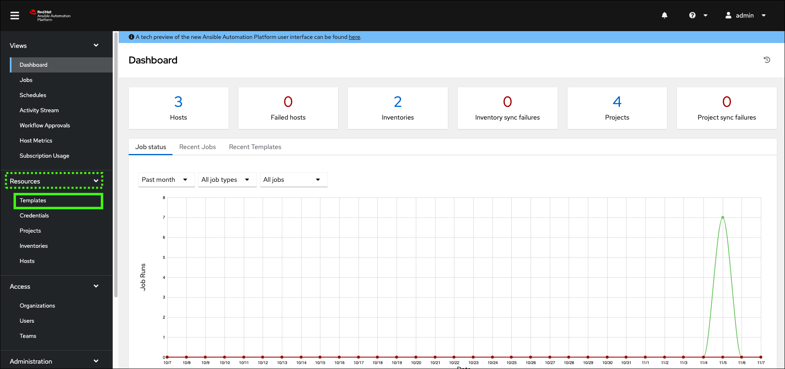

# Explore Ansible Automation Platform
After you reserved the Ansible Automation Platform (AAP) and Wazi z/OS environment in IBM Technology Zone (ITZ) and the reservation is in the **Ready** state, follow these steps to explore AAP. 

## Access the AAP and Wazi as a Service environment

!!! Tip "Be sure to record the information as instructed"

    Several of the steps below instruct you to record values from your ITZ reservation. Be sure to do this as they will not only be used in this section, but also in later sections of the lab guide.

1. In the IBM Technology Zone portal, expand **My TechZone** and select **My Reservations**, or click the following link.

     <a href="https://techzone.ibm.com/my/reservations" target="_blank">**ITZ My reservations**</a>
   
    

2. Click the **watsonx Assistant for Z Pilot - AAP & z/OS** tile.

    

3. Locate and record the **AAP User Name (For UI access)** and **AAP User Password** fields.

    

4. Record and then click the **Ansible Automation Platform UI** link.

    

5. Enter the **Username** and **Password** that is recorded in step 3 and click **Log In**.

    

6. Click **Templates** under the **Resources** section.

    

!!! Info "The AAP instance is preconfigured to the Wazi aaS instance"

    Note that because the AAP instance and the back-end z/OS system are preconfigured, no changes are needed to execute the templates and they will target your provisioned z/OS system by default.

7. Locate the **z/OS Ping** template and click the rocket () icon to start the template. 

    

8. Observe the **z/OS Ping** job run.

    

Take time to explore the other templates that are ready to use. Learn more about the automation capabilities <a href="https://ibm.ent.box.com/v/ansible4zos-demo-guide" target="_blank">here</a>.
