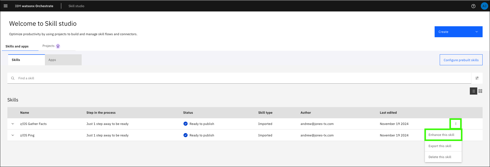

# Importing skills from Ansible Automation Platform 
Now that you understand Ansible Automation Platform (AAP) and the preinstalled automations available, you can import them as skills into your watsonx Orchestrate instance, which is used for assistant guided actions.

## Import skills into your assistant
The next steps assume that you have an active browser window to the watsonx Orchestrate ITZ cloud account. If you do not, refer to the initial steps in [Creating an assistant and configuring conversational search](creatingAssistant-configuringConvoSearch.md).

1. Return to your watsonx Orchestrate instance and expand the main menu and click **Skill studio**. 

    

2. Expand **Create** and click **Import API**.

    

3. Click the **z/OS Skills accelerator (Trial)** tile.

    

4. Enter the following values in the **z/OS Skills accelerator** form and then click **Connect**.

    Use the **URL**, **User Name**, and **Password** values recorded in the [Explore Ansible Automation Platform](exploreAAP.md) section earlier.

    **a**: Connection Type: `ansible`

    **b**: Application Name: <enter a meaningful name for the skills that you will import\> - *be sure to remember this name, you will need in the next section*

    **c**: Connection URL: <enter the URL for your AAP UI\>

    **d**: User Name: <enter the AAP User Name (for UI access)\>

    **e**: Password: <enter the AAP User Password\>

    **f**: Search Pattern: `*`

    

5. Expand the **Ansible Job Template Proj...** folder.

    !!! Note "Explore the other available skills"

        Take time to explore the available skills. There are many utility skills provided out of the box with the “Z Skills Accelerator” which are needed for actions such as retrieving the output of an Ansible skill. Consider importing these utility skills to enable more complete automation execution flows.

    

6. Click **aap4zos**.

    

7. Select the skills you want to import into your application and then click **Save as draft**.

    For this lab, select the **Z/os ping** and **Z/os gather facts** skills.

    

8. Click the ellipses () for the first skill and select **Enhance this skill**.

    

9.  Review the skill enhancement options and then click **Publish**.

    On the **Enhance this skill** page, you can specify enhancements to the default skill.  Refer to <a href="https://www.ibm.com/docs/en/watsonx/waz/2.x?topic=files-enhancing-publishing-skills" target="_blank">this documentation</a> for more information on enhancing skills.

    

10. Repeat steps 8 and 9 for each skill you imported.

    

The selected skills are now ready for use and available to your assistant. In the next section, learn how to connect them to your assistant.