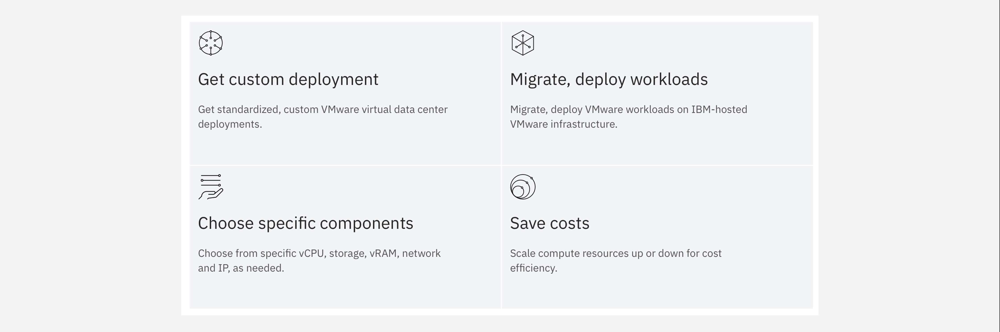

**IBM Cloud for VMware Solutions Shared** provides customizable deployment choices of VMware Virtual Data Center environments, all provisioned through automation via the IBM Cloud for standardized, reliable, enterprise-ready deployments. VMware Shared virtual data center instances can quickly and seamlessly migrate or deploy VMware workloads to the cloud — on top of IBM-hosted and VMware-certified infrastructure. The service provides Identity Access Management (IAM) out of the box and is validated for financial services use cases.

#
#IBM Cloud for VMware Solutions Shared is built around three key pillars:

1. **Cost-effective scalability**: customers pay for what they use, with the option to grow should they require additional resources over time (or need to contract to fewer resource commitments as their services find greater efficiencies). As a result, customers can minimize their unused capacity and save money. Instead of buying fixed-size virtual machines, clients can instead purchase compute capacity (as needed) and provision any number of virtual machines (of different sizes) within the capacity limit they set.

2. **Temporary migration, co-location, and burst**: multi-site data centers can be consolidated within a single location by migrating workloads from different sources.

3. **Disaster recovery**: a suite of pre-installed services— Veeam Availability Suite, Veeam Cloud Connect, and Zerto —provide options for disaster recover of critical workloads, achieving recovery point objectives (RPOs) within seconds, and maintaining application consistency.

The offering is ideal for enterprise clients that are currently operating VMware workloads on-premises, but need to adopt cloud as part of their digital transformation and modernization strategy. The automation and added support that is made available through an IBM Cloud deployment speeds the time to delivery and lowers the risks that would otherwise be present if a client attempted to "roll their own" cloud deployment.

Furthermore, the infrastructure supported by IBM Cloud is competitively priced and managed by IBM — ensuring that capital expenditures stay low. The scalability of cloud supports a pathway to further growth and investment, as well: **Shared** plan customers needing additional capacity or dedicated infrastructure have the flexibility to license **IBM Cloud for VMware Solutions Dedicated** offerings on the same cloud, should they need it.

#
# Next Steps

In the following modules, you will:

- Explore the process of provisioning a **VMware Shared** instance via the IBM Cloud.

- Delve deeper into various elements of the offering's management console, including: data centers, applications, virtual machines, networking, libraries, administration, and system monitoring.
