The following module guides Business Partners and IBM sellers through the features and management tools available in the VMware Shared instance dashboard on IBM Cloud. Explore various elements of the management pages including: data centers, applications, virtual machines, networking, libraries, administration, and monitoring.

#
# Click-Thru demonstration
-----------------------------

**Click-thru demo:** <a href="https://ibm.github.io/SalesEnablement-VMware-L3/includes/Shared-Managing-VCD/index.html" target ="_blank">Managing an instance of IBM Cloud VMware Solutions Shared</a>.

Use the click-thru demonstration to practice managing an instance of VMware Shared. The fields that require a text entry (for example service name) are pre-populated in the click-thru demonstration. Open the link and then click play  to begin the demonstration.

!!! note "NAVIGATION"
    Not sure where to click or what to do next? Click anywhere on the screen within the click-thru demo page and the spot to interact with next is highlighted. Step-by-step instructions on how to navigate the demonstration are provided.

#
# Step-By-Step Instructions
----------------------

VMware Solutions, including the **Shared** plan and other tiers, are accessible through the <a href="https://cloud.ibm.com/vmware" target="_blank">VMware portal on IBM Cloud</a>. If you provision a live VMware Shared instance that uses your *personal* IBM Cloud account, then your account (and credit card that is associated with that personal account) are for the deployment.

1. From the IBM Cloud dashboard, click the **VMware** tab from the left navigation menu, or alternatively search for ```VMware Solutions``` in the search bar.

2. Drill down into the **Resources** tab within the left navigation menu.

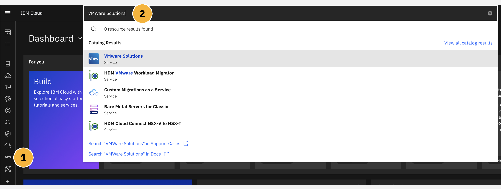

3. From the list of VMware Solutions plans available, click the **VMware Shared** option.

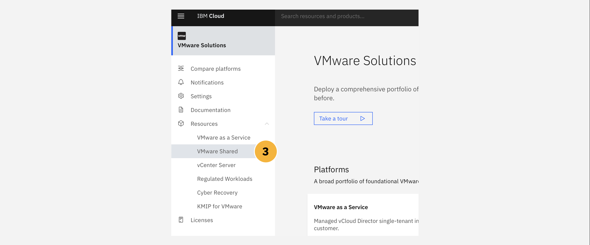

4. Locate the instance ```Dallas Director 01``` and click the **name** of the instance to open the summary page.

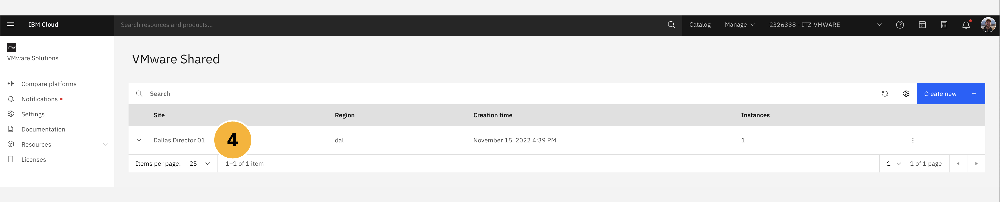

The browser will load a summary page for the VMware Shared instance. This page provides:

- details on access controls for the instance
  
- virtual data centers that are associated with the deployment

-  and other services that can be used with the instance

5. Before you can connect to the VMware Shared instance, you need to set an administrative password for the **vCloud Director console**. Do so by clicking the **Reset site admin password** button as shown.

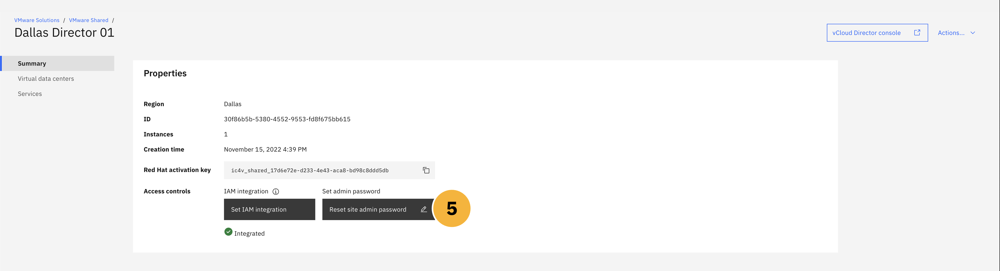

A dialog window opens, asking to confirm an administrative password reset for the instance. Confirm the selection and wait for the reset to complete. The **username** will always be set to ```admin``` by default. The **Password** is uniquely generated each time that a reset is conducted.

6. Click the "eyeball" icon to view the password and the "box" icon to copy the password to your workstation's clipboard. **Record** both of these values to a notepad. You need to reference these values later for connecting to the vCloud Director console. Click **Close** to continue. *Note:* the inspection and copy to clipboard steps are shown as a single interaction in the Click-thru demonstration.

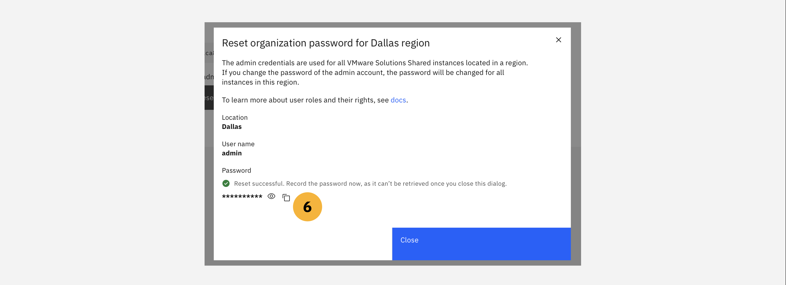

7. Locate the **VMware Shared** navigation link at the upper left of the page. Click the URL to return to the overview page for all VMware Shared instances.

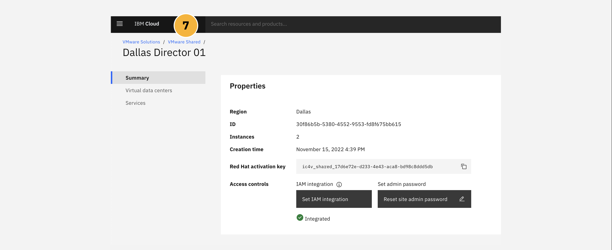

8. Just to the left of the ```Dallas Director 01``` instance is a drop-down arrow — click this arrow to expand the list of all Virtual Data Centers (VDC) belonging to that instance.

9. There might be multiple VDCs belonging to the ```Dallas Director 01``` VMware Shared instance. In this example, click the ```se-l3-shared``` VDC to open more details.

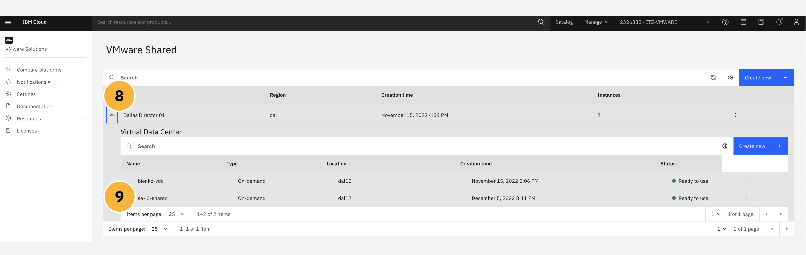

??? question "BP quiz question"
    Take note of both VDC names that are provisioned in **Dallas Director 01**.

10. Experiment with resizing the amount of vCPU and RAM resources that are assigned to the VDC. Recall how IBM Cloud enables scalable deployments of VMware Shared, which can be adjusted (up or down) as the resource requirements of the instance change over its lifecycle. Edit the **Resource Reservation** field by clicking the pencil icon, as shown below.


11. Adjust the **vCPU Limit** field down to ```50``` vCPU and reduce the **RAM Limit** field to ```5120``` GB.

??? question "BP quiz question"
    Take note of the vCPU and RAM limits before they are changed.

12.  Note the metered billing for the instance will be adjusted based on the reduced resource requirements. When satisfied, click **Modify** to confirm and implement the changes.

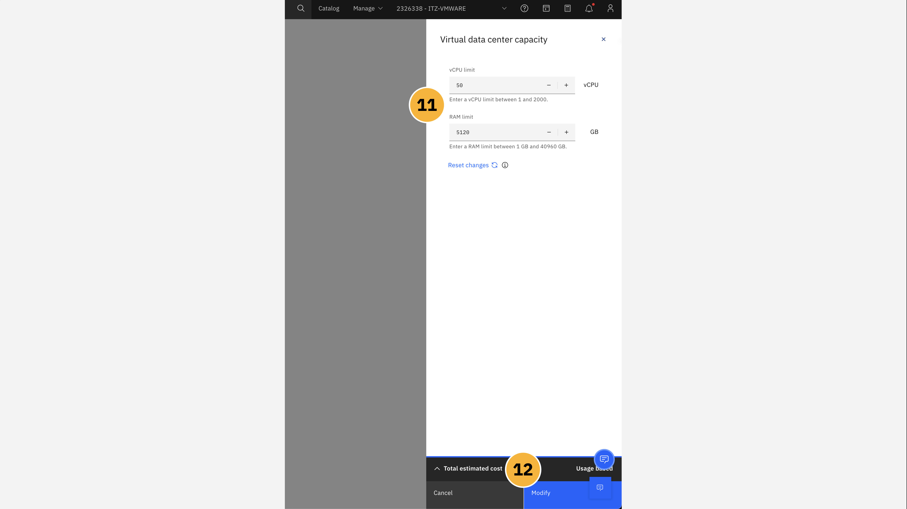

13. Back on the Summary page, locate the **vCloud Director console** button near the upper right of the screen. Before resetting the admin password, this button was greyed out and inaccessible. With the password reset complete, the button is now active (blue) — click it to continue to the console login page.


14. A new tab or window will open, prompting you to log in to the vCloud Director console. If one does not appear, check that software to block pop-up ad windows is not active. Use the ```admin``` and ```password``` fields that are recorded in **Step 6** to log in to the console. Click **Sign In** to continue.

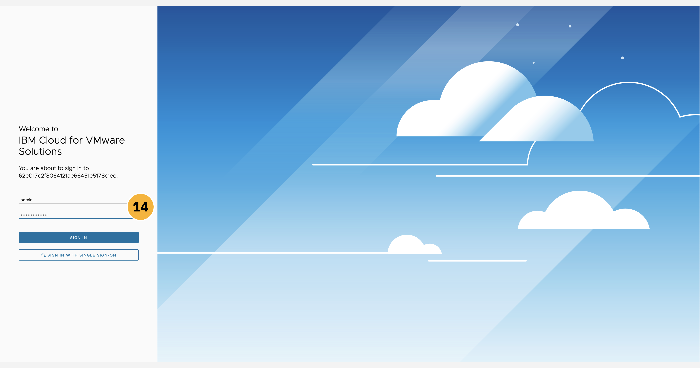

After successfully authenticating, your browser will redirect to the **vCloud Director console**. From this page, you are able to access many of the administrative functions for the VMware Shared environment. Some restrictions in place to ensure the safety and stability of the deployment. By default, the console loads to the **Data Centers** tab. Here you can inspect details on the virtual data center supporting your environment. A summary of the VDC's vCPU, memory, and storage utilization is provided at the bottom of the page.

15. Drill down into the ```se-l3-shared``` VDC that was resized earlier by clicking the tile in the dashboard.

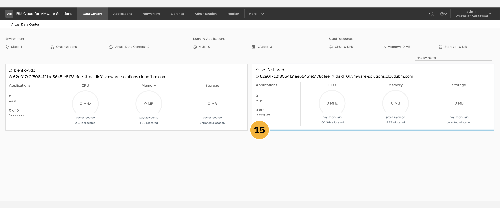

From this management screen, you can access information on the VMware Shared plan's available ```Networks```, ```Edge Gateways```, ```Data Center Groups```, and ```Security Tags```.

16. The first task is to define **Networking** parameters for the VDC. Click the **Networks** subdirectory from the list of tabs along the left side of the interface.

17. Click **New** to create a new network configuration for the VDC.

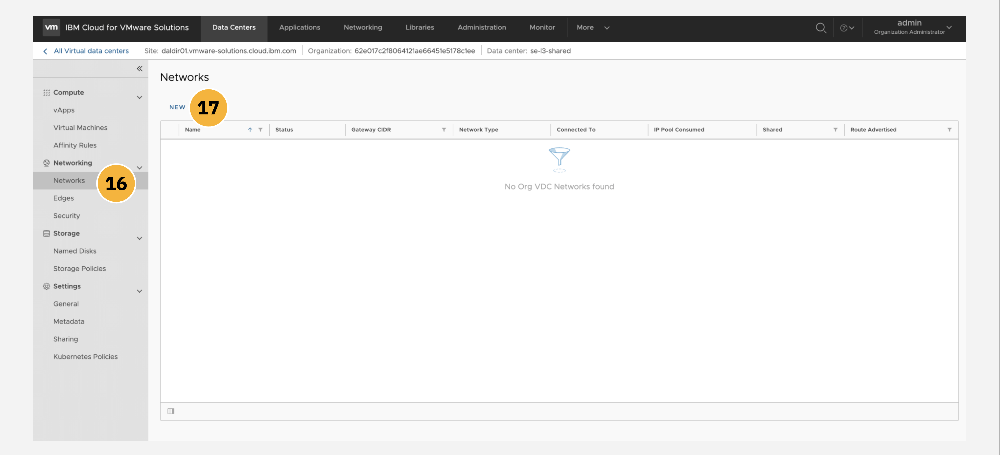

A new page loads to guide you through the process of defining an organization-wide virtual data center (VDC) network. The first element to be defined is the overall **Scope** of the network.

18. The **Scope** of the network can be constrained to either an *organization-wide VDC* (providing connectivity only across the virtual machines belonging to that particular VDC), or across a *data center group* (connectivity across all VDCs belonging to that group, inclusive of all VMs belonging to those VDCs). Select the **Current Organization Virtual Data Center** option to keep networking connectivity restricted to only this singular VDC (```se-l3-shared```).

19. When satisfied, click **Next** to continue.

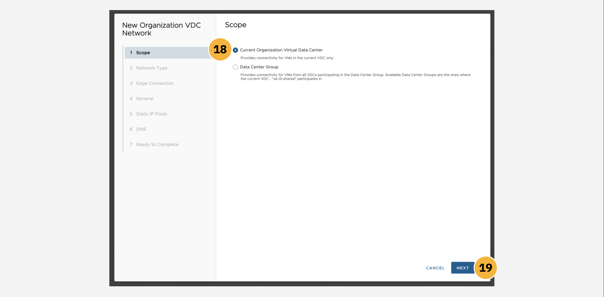

Now decide the **Network Type** appropriate for this deployment. Two options are available:

- *Routed*: A network type that uses an edge gateway to enable controlled access to networks and systems external to (outside of) the VDC.

- *Isolated*: A network type that is only accessible by a specific VDC (or associated VDC Groups), thereby providing a fully isolated environment.

20. Select the **Routed** Network Type.

21. When satisfied, click **Next** to continue.

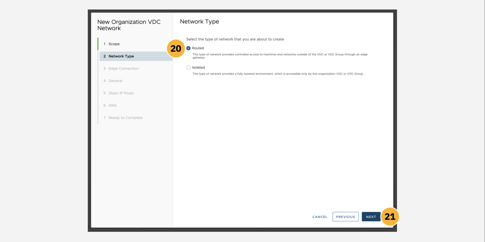

22. Having selected the **Routed** network type earlier, now define an **Edge Connection** for the organization VDC. The configuration tool automatically designates an edge connection (```edge-dal12-d625b1f2``` for the ```Dallas Director 01``` data center) with ```2``` External Networks and ```0``` Org VDC Networks.

Next, you must choose the type of Edge Connection to be applied. There are three options:

- *Internal*: For connecting to one of the edge gateway's internal interfaces. The maximum number of supported network connections is ```9```.

- *Distributed*: For connecting with fast and efficient *East-West* routing. The network is connected to an internal interface of a distributed router that is exclusively associated with this gateway. The maximum number of supported network connections is ```400```.

- *Subinterface*: For connecting to the edge gateway's internal trunk interface. The maximum number of supported network connections is ```200```.

23. Select the **Internal** Edge Connection type. When satisfied, click **Next** to continue.

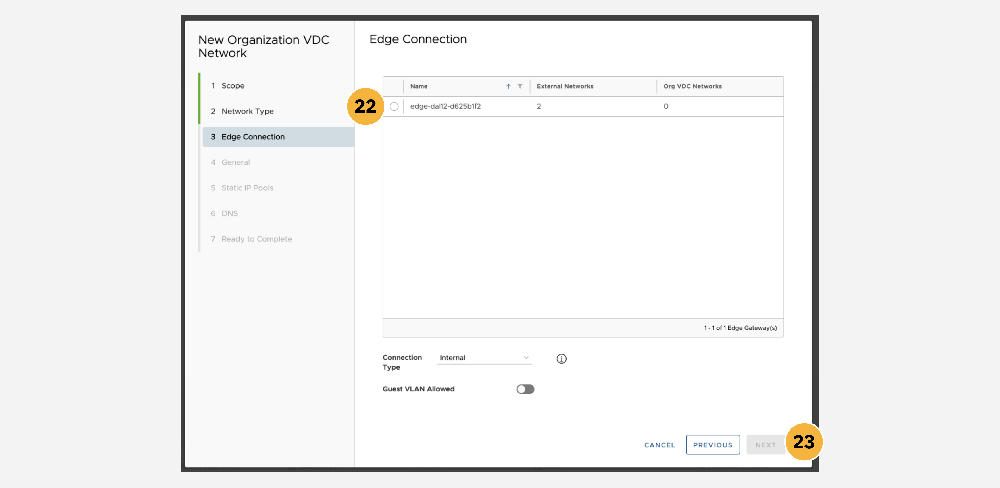

24. Provide a unique **Name** for the organization VDC network (```se-l3-network```) and optionally a basic **Description** to its purpose.

A **Gateway CIDR** must be assigned, which includes the IP address of the gateway. This value cannot be changed once assigned.

25. Assign a CIDR of ```192.168.1.1/24``` and leave the **Dual-Stack Mode** option disabled. In this deployment, the network is not to be **Shared**: therefore, leave this option disabled.

26. When satisfied, click **Next** to continue.


**Static IP Pools** must now be assigned to the Gateway CIDR assigned earlier in **Step 25**. Verify that the CIDR displayed on this panel matches the one that you designated previously. No additional modifications are required.

27. When satisfied, click **Next** to continue.

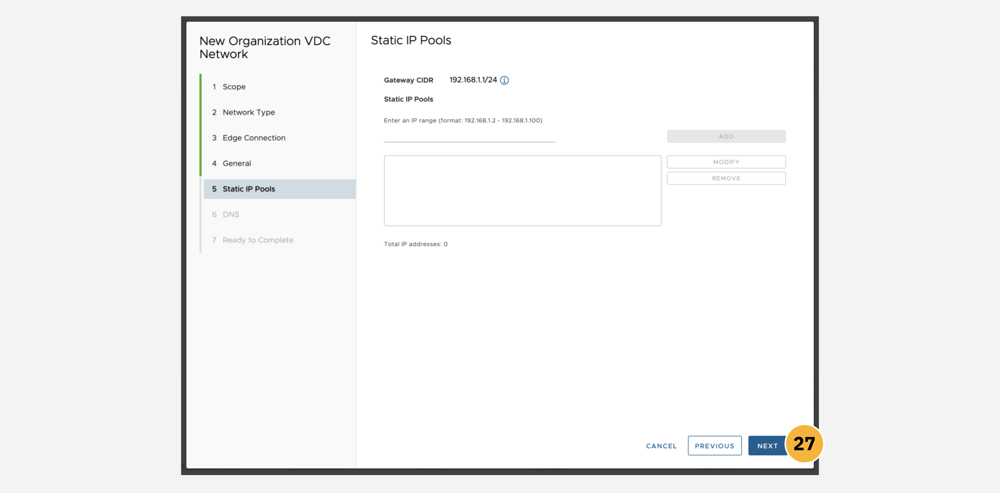

**DNS**, or the Domain Name System, provides the mapping between IP addresses (such as the ones specified earlier) and the "name" address that you typically enter in a web browser (```www.google.com```, for example). A DNS relay can be enabled for the edge gateway previously configured; however, the DNS relay must be set before deployment and cannot be modified after the fact.

28. **Enable** the **Use Edge DNS** slider. *Note:* this step is not shown as part of the Click-thru demonstration.

The remaining fields below can remain blank. When satisfied, click **Next** to continue.

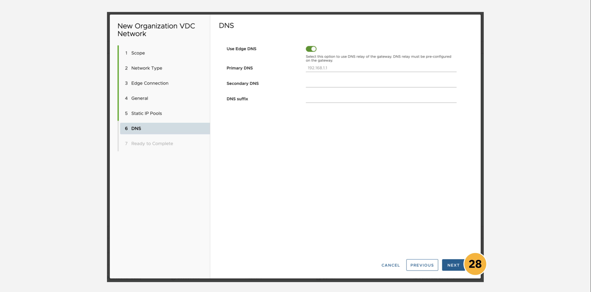

The **Ready to Complete** panel provides a full summary of your organization VDC network configurations. Review the details of the network before choosing to commit to a deployment, or discard the network configuration completely.

29. Click the **Finish** button to create the network.

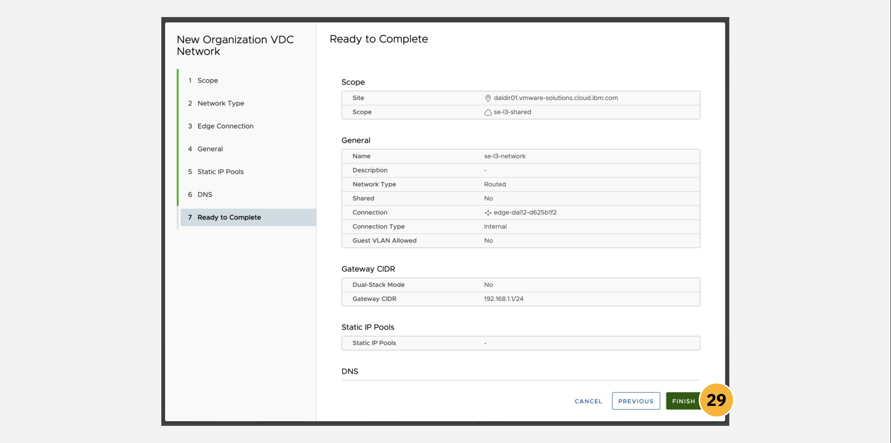

Your browser will automatically redirect to the **Networking** tab of the vCloud Director console. From the list of Networks, see the ```se-l3-network``` deploy and eventually update its status to ```Ready``` when fully initialized.

30. Click the **Virtual Machines** subdirectory from the list of tabs along the left side of the interface.


The console's **Applications** dashboard allows for the centralized management and deployment of all applications— which are categorized as either *virtual machines* or *virtual applications* —within the VMware Shared environment. A virtualized application, or *vApp*, consists of one or more virtual machines (VMs). The vApp communicates over the Shared plan's network, making use of the Shared plan's resources, or starting services that the Shared plan supports. A single vApp can consist of one, or multiple VMs.

31.  Try creating a new virtual machine from scratch. Click **New VM** in the menu at the bottom of the page.

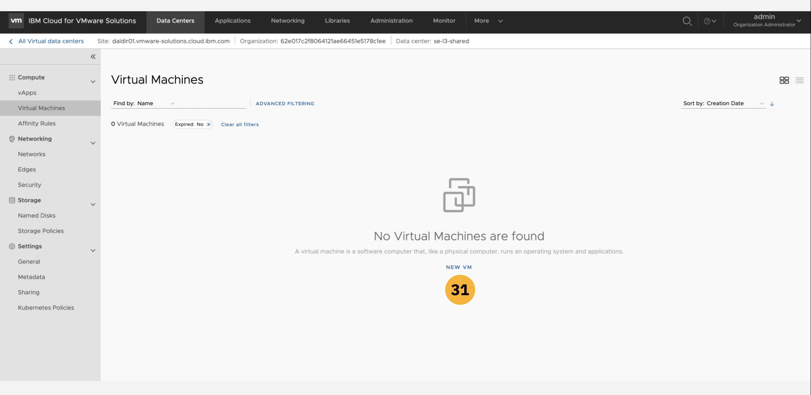

32. A new configuration window opens. Provide a **Name** (```se-l3-TestVM```) and **Computer Name** (```se-l3-testvm```), and an optional **Description**, for the new VM.

33. The VM can either be crafted from scratch (**New**) or from a pre-designed template (**From Template**). One of the advantages of the VMware Shared plan on IBM Cloud is the wealth of templates available out of the box with the offering. Select the **From Template** option.

34. **Disable** the **Power Off** toggle, as we do not want to initialize the VM until making other configuration changes in a later step.

35. We recommend selecting the ```vm-centos8``` template, which corresponds to the CentOS 8 (64-Bit) official release, for the purposes of this demonstration — although you are free to choose any of your liking. Continue scrolling down the page to reveal more configuration options.

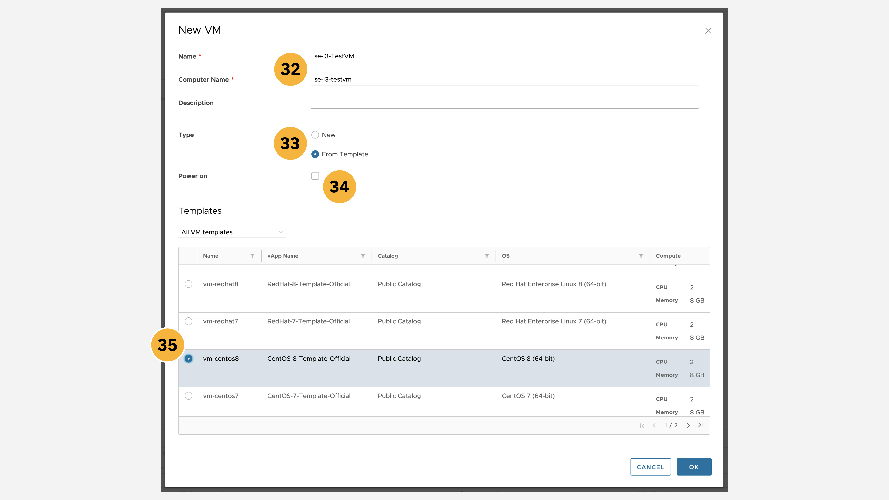

**Storage** for the VM is our next consideration. As described earlier in the Provisioning module, there are a variety of storage options available for virtual machines and virtual applications deployed within the VMware Shared environment. Each storage tier provides different levels of throughput (IOPs) and levels of isolation (multi-tenant versus single-tenant), with differing levels of billable rates and charges associated with each tier. For our purposes, we recommend the ```Standard (VDC Default)``` tier of **Storage Policy**.

**Compute** is dictated by the VDC sizing configuration that was set during the Provisioning module. The resources available to the VM we are defining here are restricted by the hardware configurations assigned to the VDC when it was deployed earlier.

**NICs**, or Network Interface Cards, provide the network interface needed by the virtual machine for communication with the public internet, IBM Cloud, and on-premises resources.

36. The *Primary NIC* will have been configured by default, but additional modifications are needed before we can continue. Ensure the **Connected** field is toggled ```ON```

37. Set the **Network** field to the network configuration deployed earlier: ```se-l3-network```

38. Set the **IP Mode** to ```DHCP```

39. When satisfied, click the **OK** button at the bottom of the panel to deploy the VM (which will remain powered off for now) and return to the **Virtual Machines** overview dashboard.

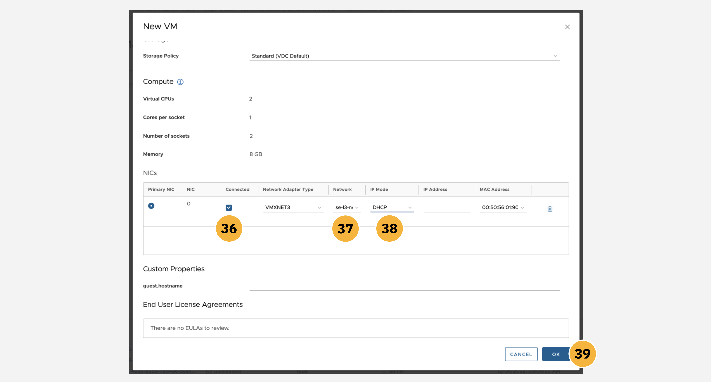

40. Locate the newly-minted VM tile on the page and click the **Details** button to inspect it further.

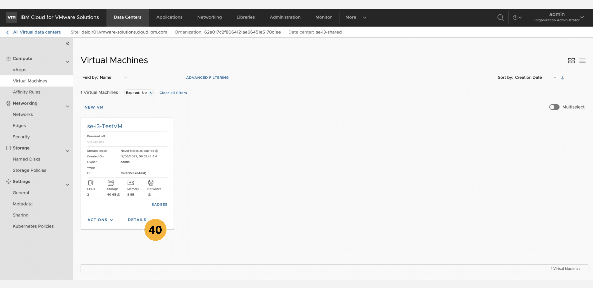

41. Let's reconfigure the guest operating system (OS) associated with the VM. Once inside the Details panel, click the **Guest OS Customization** subdirectory from the interface on the left side of the panel.

42. Locate the **Edit** button, as shown in the screenshot below, and click the URL to open a new pop-up configuration window.

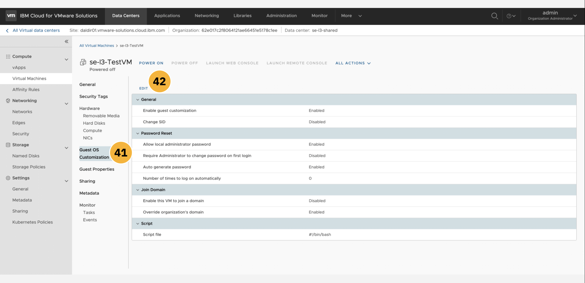

43. You will want to set your own password for the guest OS. Therefore, **DISABLE** the **Auto Generate Password** toggle.

44. **ENABLE** the **Require Administrator to change password on first login** option — this will prompt you to create a new password for the guest OS upon first connecting to the VM (once powered on).

45. When satisfied, click **Save** to confirm the selections and return to the VM summary panel.

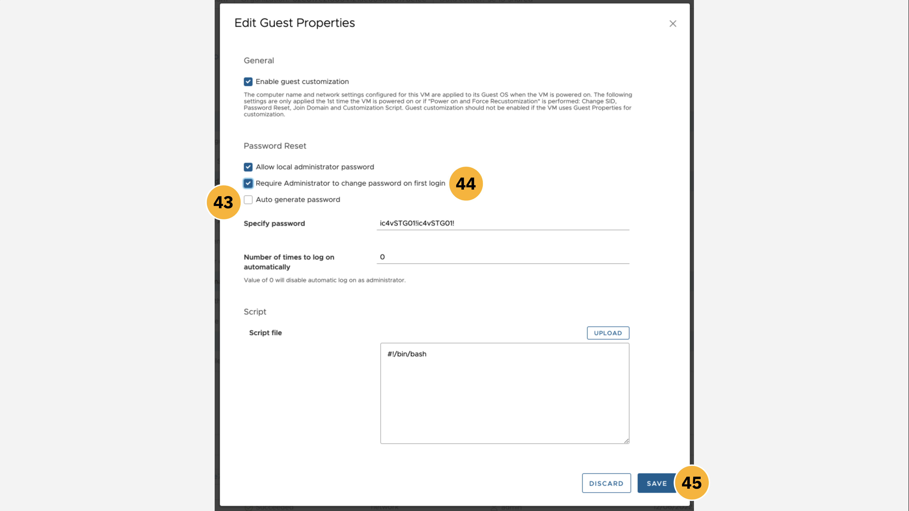

46. From the interface along the top of the panel, select the **All Actions** drop-down.

47. Drill down into **Power** and select the **Power On, Force Customization** option to initialize the newly-configured VM.

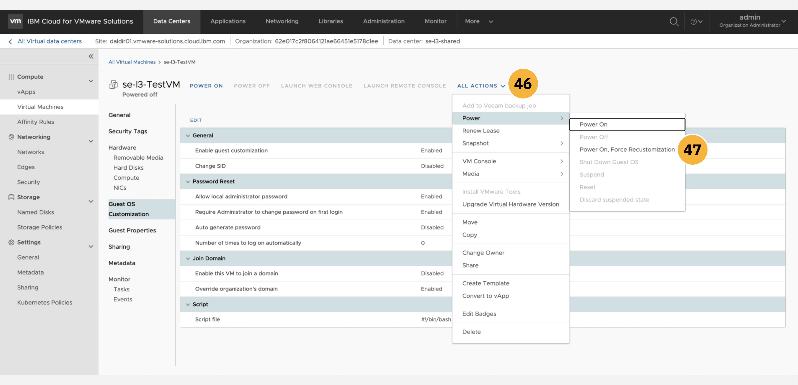

48. The VM will take a moment to initialize and power on. Once ready, click the **Launch Web Console** button from the top of the panel.

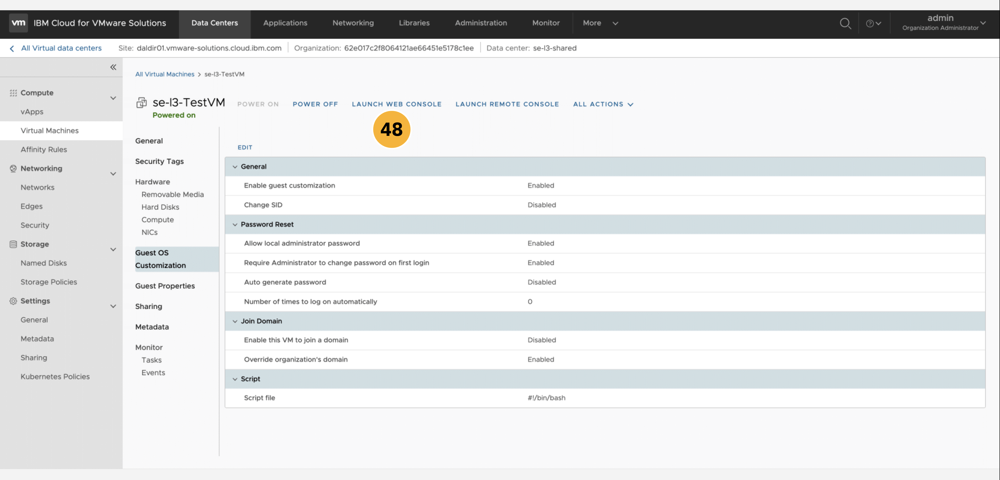

49. An SSH console will appear in a pop-up window. Enter ```root``` as your login ID and then enter any password. You will initially receive a warning that the password provided is *incorrect*, and then subsequently will be asked to create a new password for the login. This is a result of the configuration options set in **Step 44**. Enter a new password of your choosing (confirming the password a second time when asked to do so) and continue logging in to the VM console.

50. After successfully connecting to the console, safely **close** the pop-up window and return to the vCloud Director web interface.

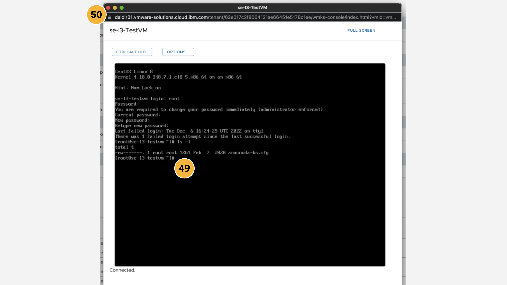

51. Once again, select the **All Actions** drop-down from the top of the panel's interface.

52. Drill down into **Power** and click the the **Power Off** button to disable the VM.

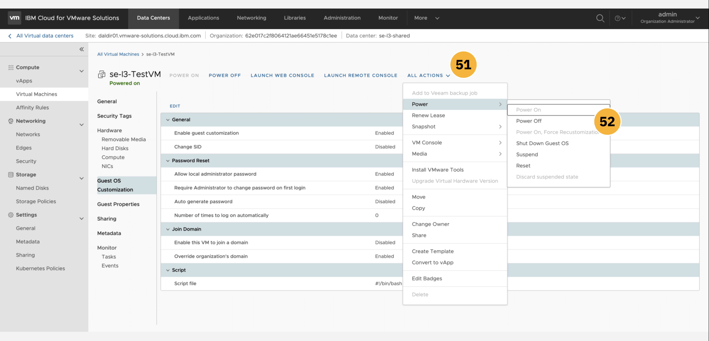

53. Take note that the **Power On** and **Power Off** buttons have updated to reflect the VM status. For a third time, select the **All Actions** drop-down from the panel's interface.

54. Click the **Delete** button to tear down the VM instance. Confirm the selection when prompted to do so.

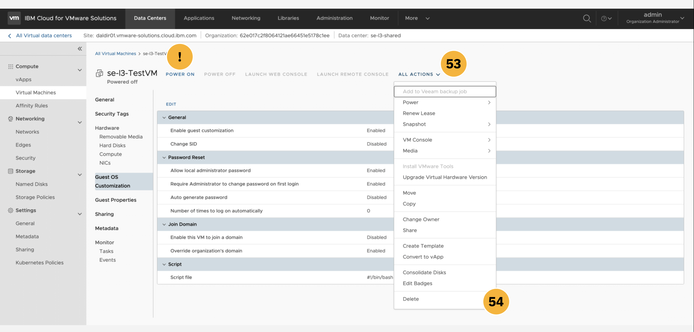

55. Close the vCloud Director web dashboard and return to the IBM Cloud dashboard. From the drop-down in the upper right corner of the interface (as shown in the screenshot below), click the **Actions** button. *Note:* this step, and **Step 56** and **Step 57**, is not shown as part of the Click-thru demonstration.

56. Select the **Monitoring** button to open the IBM Cloud monitoring dashboard for the VMware Shared instance.

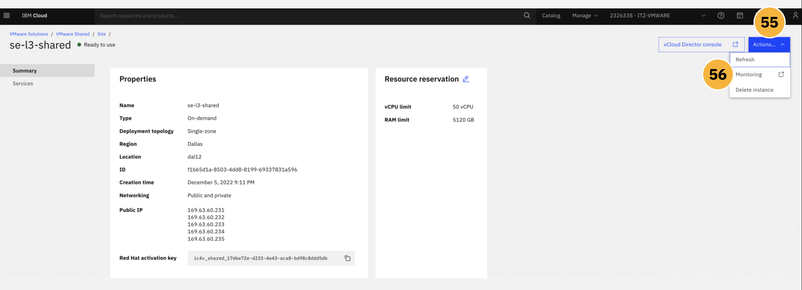

57. From the **Monitoring** tab it is possible for administrative users to inspect running *Tasks* and *Events* across the instance. Explore the interface and use the filters along the bottom of the page to look across activity for the environment across different ranges of time.

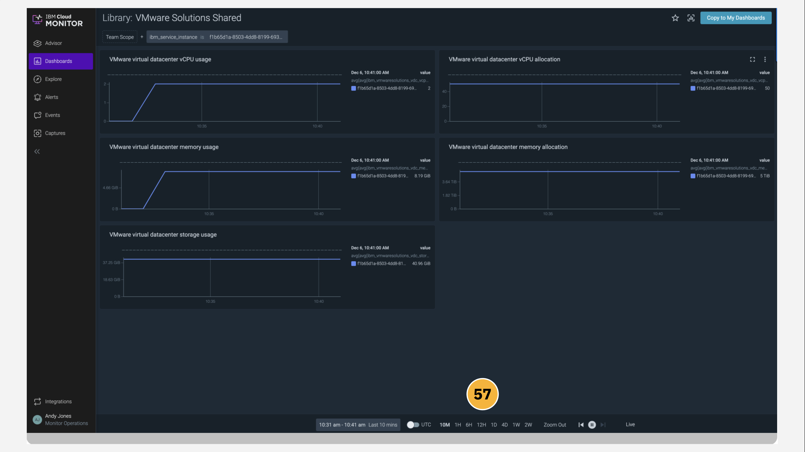

At this point in time, you have successfully explored the myriad of features and management tools available from within the **VMware Shared** dashboard on IBM Cloud. You should now have greater familiarity and fluency with the various elements of the management panels and tooling, including: how to manage data centers, building applications and virtual machines through the guided web interface, establishing networking rules, and the wealth of tooling available for managing the environment once in production.

In the following chapter, you will investigate **IBM Cloud for VMware Solutions Dedicated**.
