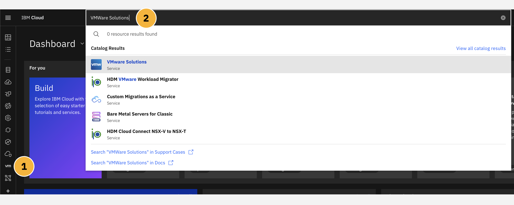
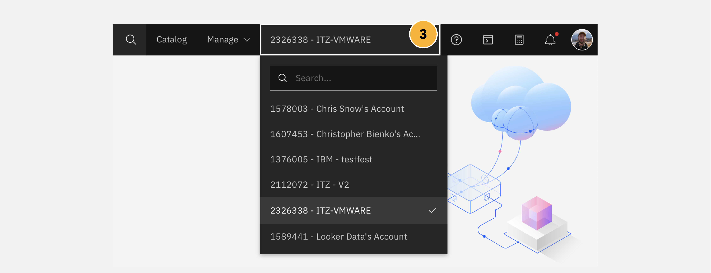
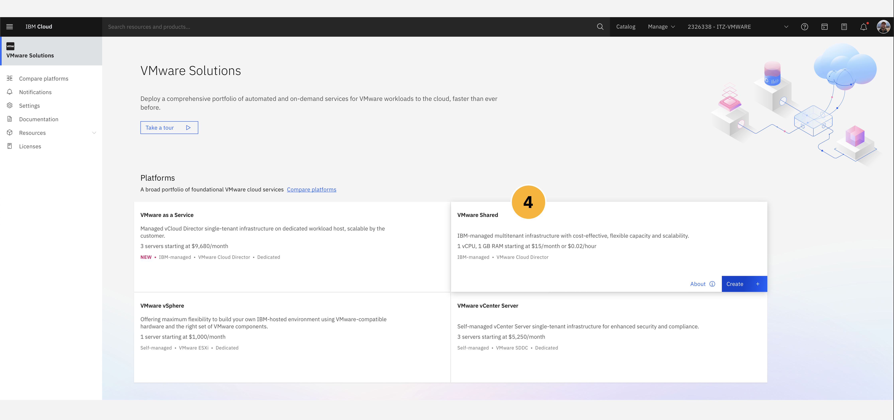
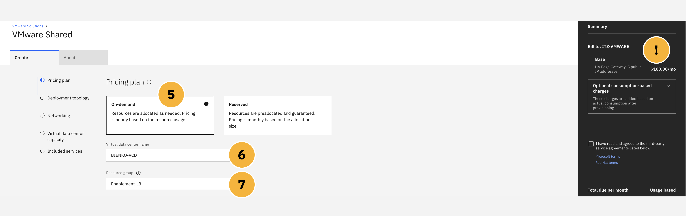
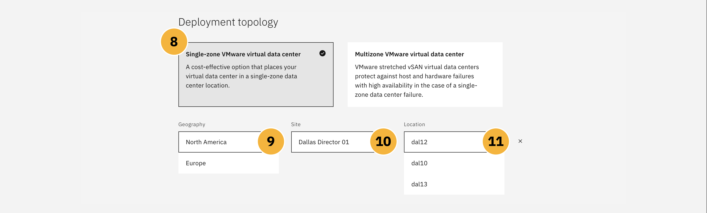
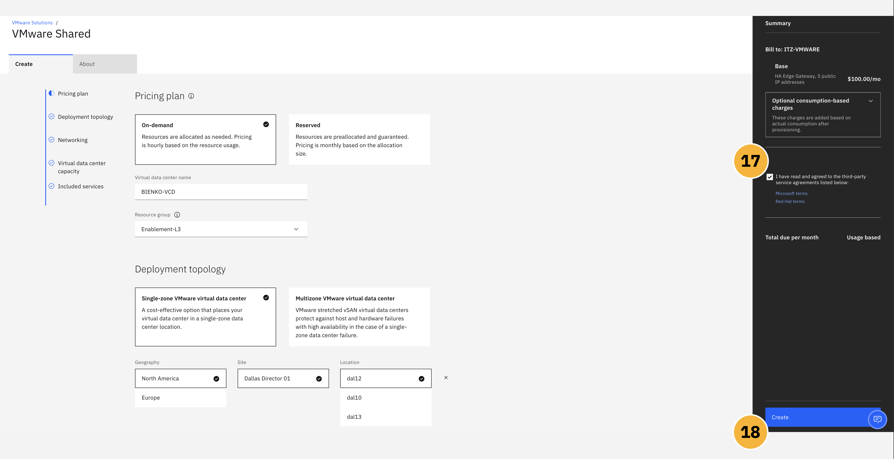
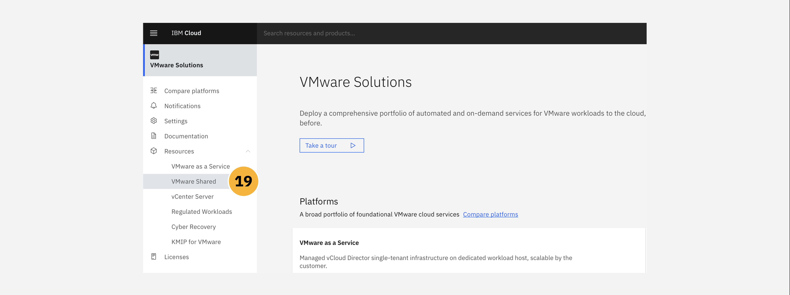

The following module will guide business partners and IBM sellers through the process of provisioning a **VMware Shared** plan via the IBM Cloud. Along the way, additional context around sizing and configuration of the offering will be provided, illustrating the value of these features to end-users, and pointers supplied to additional resources for those looking to dig deeper.

#
# Click-Thru Demonstration
-----------------------------

**Click-thru demo:** <a href="https://ibm.github.io/SalesEnablement-VMware-L3/includes/Shared-Provisioning/index.html" target ="_blank">Provision an instance of IBM Cloud VMware Solutions Shared</a>.

We begin by simulating how to provision a VMware Shared instance. Use the click-thru demonstration linked above to practice the provisioning process. The fields that require a text entry (e.g. service name) are pre-populated in the click-thru demonstration. Open the link and then click the play button  to begin the demonstration.

!!! note "NAVIGATION"
    Not sure where to click or what to do next? Simply click anywhere on the screen within the click-thru demo page and the spot to interact with next will be highlighted. Step-by-step instructions on how to navigate the demo, and repeat the demonstration again in front of clients, are provided in the write-up below.

#
# Step-By-Step Instructions
----------------------

VMWare Solutions, including the **Shared** plan and other tiers, are accessible through the <a href="https://cloud.ibm.com/vmware" target="_blank">VMware portal on IBM Cloud</a>. Be aware that if you provision a live VMware Shared instance using your *personal* IBM Cloud account, then your account (and credit card associated with that personal account) will be billed for the deployment.

1. From the IBM Cloud dashboard, click the **VMware** tab on the left hand navigation menu, or alternatively

2. Search for ```VMware Solutions``` in the search bar at the top of the page.



3. Switch to your personal IBM Cloud account, or an account that you have permission to charge billable expenses to, by clicking the drop-down selector in the top right corner of the IBM Cloud interface. *Note:* this step is not shown as part of the Click-thru demonstration.



With your account properly set, you can proceed with configuration and setup of a VMware Shared plan. There are four flavors currently provided for VMware on IBM Cloud: ```VMware Shared```, ```VMware as a Service```, ```VMware vSphere```, and ```VMware vCenter Server```. For the purposes of this module, you will be provisioning and configuring a ```VMware Shared``` instance.

4. As shown in the screenshot below, select the **VMware Shared** tile and click **Create** to continue to the configuration page.



The web browser will redirect to a new page, where you will be asked to provide detailed configuration options for various elements of the VMware Shared instance that IBM Cloud is to deploy.

#
# Pricing Plans
----------------------

!!! tip "ON-DEMAND VS. RESERVED"
    Two tiers of pricing plan are available for any VMware Shared virtual data center

    environment: ```on-demand``` or ```reserved```.

**On-demand** allocates virtual data center virtual CPU (vCPU) and RAM as needed. The amount of time that the allocation requires will depend upon the global demand (usage) of the virtual data center vCPU and RAM for the region in which the Shared plan is deployed. Allocations of vCPU and RAM, therefore, are scalable and can be adjusted over time. The price is calculated hourly and it is based on the resource usage in the virtual data center.

**Reserved** pre-allocates the vCPU and RAM virtual data center reservations at deployment time and their availability afterwards is guaranteed; this contrasts sharply with on-demand deployments, where availability is a best-effort guarantee (but not at a certainty — as demand across the infrastructure region in which it is deployed may ebb and flow over time). The price is calculated monthly for the full duration of the reservation and it is based on the allocation size of the virtual data center.

5. Select the **On-Demand** pricing plan.



!!! warning "ADJUSTING COSTS"
    Take note that the **Summary** panel at the far-right side of the IBM Cloud dashboard dynamically updates as you adjust configuration options on this page. Try out various options along the way to preview how these features impact the cost of a VMware Shared deployment. You can also read more about pricing within the **About** tab.

6. Supply a unique and memorable **Virtual data center name** for your environment, such as ```se-l3-shared```.

7. Set the **Resource Group** to ```Enablement-L3```. This determines how resources are organized within your IBM Cloud account. Resource Groups cannot be changed for a service instance once it has been deployed. You will **not** be able to set this value in the ITZ environment. If you are replicating these steps using your personal IBM Cloud account, you will likely see different Resource Groups available than the ones shown here.

#
# Deployment Topology
----------------------

!!! tip "SINGLE VS. MULTI-ZONE"
    For every deployment of VMware Shared, there are two Topologies that a client may select

    from: ```single``` or ```multi-zone```.

A **single zone** VMware virtual data center deployment will provision the environment within a single availability center (easier to manage, but vulnerable to a single point of failure).

A **multi-zone** VMware virtual data center deployment will deploy across two availability zones in an IBM Cloud multi-zone region, providing failover in the event that a single-zone data center failure occurs.

8. Select the ```Single-zone VMware virtual data center``` topology.

9. **Geography** should be set to the region located closest to your local area. *Note:* this step is not shown as part of the Click-thru demonstration.

10. Use the default value selected for **Site**.

11. Use the default value selected for **Location**. *Note:* for the Click-thru demonstration, you will be asked to inspect the **Location** options before cancelling back out to the main configuration page.



#
# Networking Types
----------------------

!!! tip "NETWORK CONFIGURATIONS"
    VMware Shared on IBM Cloud supports two networking

    configurations: ```Public and Private``` or ```Private Only```.

The **public network** endpoints that are provisioned by default are the five public IP addresses that are displayed in the VMware Shared virtual data center details page. After the demonstration environment has provisioned, you will be able to go and inspect those for yourself.

A **private network** endpoint allows a customer's IBM Cloud account devices or resources to connect to their virtual data centers by using the IBM Cloud private network. The private network endpoint service is available and ready to use in all virtual data centers provisioned through the IBM Cloud.

12. Click the **Networking** tab from the sidebar. To give the environment the widest range of options, select the ```Public and Private``` **Networking** option from the configuration panel.


!!! tip "ADVANCED EDGE GATEWAY"
    By default, every virtual data center comes configured with one advanced edge gateway, with five public IP addresses and one private service IP address. The advanced edge gateway is configurable by a customer and can be tailored to their specific needs.

Connections to private network endpoints do not require public internet access. A private network endpoint provides a unique IP address that is accessible to customers without the need for a VPN connection. Private network endpoints support one-way traffic from IBM Cloud account resources to the virtual machines in a customer's virtual data center.

There are several considerations to take into account creating a private network for VMware Shared, or any private network connection on IBM Cloud in general. They are:

- If you have an IBM Cloud Direct Link on your account, you must establish a tunnel between the cross-connect router and the customer edge to have access to the virtual data center.

- You can order only one private network endpoint per single-zone virtual data centers.

- For multi-zone virtual data centers, two private network endpoints must be ordered to correspond with each NSX Edge Service Gateway.

- If you want to change the device type of your private network endpoint, you must first delete the existing private network endpoint. Then, create a new private network endpoint with the new device type.

- You can simultaneously make resource updates to your virtual data center while you create or delete a private network endpoint.

!!! tip "ADDITIONAL RESOURCES"
    Dig deeper into how to define and manage private networks within IBM Cloud's online documentation:

    - Viewing a private network endpoint for a virtual data center: <a href="https://cloud.ibm.com/docs/vmwaresolutions?topic=vmwaresolutions-shared_viewing-endpoints" target="_blank">https://cloud.ibm.com/docs/vmwaresolutions?topic=vmwaresolutions-shared_viewing-endpoints</a>

    - Modifying a private network endpoint for a virtual data center: <a href="https://cloud.ibm.com/docs/vmwaresolutions?topic=vmwaresolutions-shared_modifying-endpoints" target="_blank">https://cloud.ibm.com/docs/vmwaresolutions?topic=vmwaresolutions-shared_modifying-endpoints</a>

    - Deleting a private network endpoint from a virtual data center: <a href="https://cloud.ibm.com/docs/vmwaresolutions?topic=vmwaresolutions-shared_deleting-endpoints" target="_blank">https://cloud.ibm.com/docs/vmwaresolutions?topic=vmwaresolutions-shared_deleting-endpoints</a>

    - Creating a private network endpoint: <a href="https://cloud.ibm.com/docs/vmwaresolutions?topic=vmwaresolutions-shared_creating-endpoints" target="_blank">https://cloud.ibm.com/docs/vmwaresolutions?topic=vmwaresolutions-shared_creating-endpoints</a>


#
# Virtual Data Center Capacity
----------------------

These values essentially determine the compute processing capacity that is allocated to your virtual data center. It is measured in vCPU increments. Each vCPU increment represents a single 2.0 GHz core. Compute memory, or "RAM limit" as it is described on the IBM Cloud portal, is allocated in one gigabyte (GB) increments. RAM limits identify the maximum amount of random access memory available to each virtual data center.

The limit placed on the maximum vCPU values determines the total number of processing units available for each virtual data center. Similarly, the RAM limit sets the maximum amount of memory available. You can adjust either of these values after you provision the virtual data center — giving customers the ability to scale and grow (or scale down) their virtual date center over time.

13. Set the value of **vCPU Limit** to ```100```.

14. Set the value of **RAM Limit** to ```10240```.


The *least* amount of vCPU that can be provisioned for any data center is 1 vCPU; RAM is likewise limited to a minimum of 1 GB. Obviously, in the case of a real-world demonstration environment (or a production environment), you will want to size these appropriately to the anticipated workloads that the virtual server will be subject to.


#
# Storage
----------------------

When creating or deploying vApps / VMs, customers can select either an unencrypted or encrypted storage policy. Each option has six different tiers of storage available, depending on the storage performance required, with each option carrying a maximum throughput of IOPS (input-output operations per second) per gigabyte.

15. How you are billed for storage, and the types of storage policies used, only come into effect after you have started deploying vApps or VMs within your VMware Shared plan. As we are not deploying code as part of this hands-on material, it is not necessary for us to worry about storage configurations at this time.


!!! tip "WHERE'S MY STORAGE?"
    Storage policy availability can vary by region and deployment topology. To inspect further details on the storage options available for any VMware Shared configuration, click the **About** tab at the top of the IBM Cloud catalog page.

Encryption-enabled storage policies are available to all virtual data centers. Encryption protects not only the VMs but also VM disks and other files. Administrators can encrypt VMs and disks by associating the VM or disk with a storage policy that has enabled VM-encryption capabilities. For more information about the VM encryption limitations for VMware Cloud Director 10.3, see <a href="https://docs.vmware.com/en/VMware-Cloud-Director/10.3/VMware-Cloud-Director-Service-Provider-Admin-Portal-Guide/GUID-80F58C1D-A97E-43FE-8E41-E9242A1D2332.html" target="_blank">Enabling VM encryption on storage policies of an Organization virtual data center</a>.


#
# Pre-Installed Services
----------------------

There are three services pre-installed with every deployment of VMware Shared on IBM Cloud. While they are ready for activation at any time, they are not free to use — if a client wishes to make use of these services, they must agree to the terms of use license and incur the costs associated with that add-on service. If the pre-installed service is never activated or used, no additional charges will be leveed against the VMware Shared client.

16. These services, as described, are pre-installed with every VMware Shared deployment on IBM Cloud. We will not be making use of these services for the purposes of this hands-on lab and as such they can be ignored for now.


The pre-installed services include:

- **Veeam Availability Suite**: Veeam enables secure backups to VMware Shared workloads. It also packages capabilities for meeting recovery objectives, cloud-based disaster recovery backups, as well as monitoring and reporting capabilities.

- **Veeam Cloud Connect Replication**: Extends on-premises Veeam environments to IBM Cloud, providing a secure and resilient disaster recovery environment.

- **Zerto**: Replicates VMs between data centers in the public cloud, or between public cloud and on-premises data centers.


#
# After Placing An Order
----------------------

When satisfied with the configuration options, inspect the far-right side of the IBM Cloud interface to confirm your costs and agree to the terms of service. As mentioned before, **be aware that provisioning a VMware Shared plan on IBM Cloud will result in billing to your personal account** (and associated credit card personal credit card).

17. Verify that you have read and agree to the terms of service.

18. Click **Create** to initiate the deployment of the VMware Shared service on IBM Cloud.



Once you click **Confirm**, the deployment of the resources starts automatically and a message will be displayed on the IBM Cloud interface explaining that the order is being processed. You can check the deployment status, including any issues that might require your attention, by viewing the **Resources** tab from the <a href="https://cloud.ibm.com/vmware" target="_blank">VMware Solutions dashboard</a>.

19. Return to the <a href="https://cloud.ibm.com/vmware" target="_blank">VMware Solutions dashboard</a> and drill down into **Resources** > **VMware Shared** to monitor the progress of your deployment. *Note:* this step is not shown as part of the Click-thru demonstration.



Once the resources have been successfully deployed, the components that are described within the <a href="https://cloud.ibm.com/docs/vmwaresolutions?topic=vmwaresolutions-shared_overview#shared_overview-specs" target="_blank">technical specifications documentation for VMware Shared</a> will be installed within your VMware virtual instance.

When the resources are ready to use, the status will be changed to **Ready**. When ready, proceed to the <a href="https://ibm.github.io/SalesEnablement-VMware-L3/Shared/Managing/" target="_blank">Managing</a> module of this hands-on documentation.
