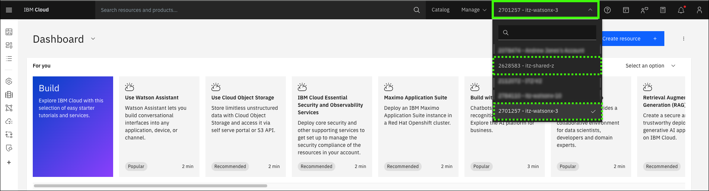

# IBM Technology Zone environment
To enable sellers to learn how to deliver client pilots of {{offering.name}}, three environments are available in IBM Technology Zone (ITZ). The environments are part of the watsonx Assistant for Z Velocity lab collection and can be found in the <a href="{{itz.collectionURL}}" target="_blank">{{itz.collectionName}}</a> collection.

- **Watsonx Assistant for Z lab – watsonx Orchestrate**: provides a dedicated environment on IBM Cloud where you can create and configure the assistant, set up conversational search, import skills, and configure actions.

- **Ansible Automation Platform (AAP) & z/OS**: provides a pre-configured instance of AAP and Wazi z/OS. This environment includes Ansible playbooks, which you can import as skills within watsonx Orchestrate and connect to your assistant. Preinstalled templates for various use cases are also available (covered in later sections). Learn more about AAP <a href="https://www.redhat.com/en/technologies/management/ansible" target="_blank">here</a>. Learn more about Wazi, <a href="https://www.ibm.com/cloud/wazi-as-a-service" target="_blank">here</a>.

- **Single Node OpenShift with NFS storage**: provisions a single-node Red Hat OpenShift cluster (SNO) on IBM Cloud. This cluster installs a dedicated instance of [OpenSearch](https://opensearch.org/) for Watson Assistant for Z, enabling ingestion of client-supplied documents.- 

!!! Warning "All activities in this lab guide are required."

    To earn the IBM Watsonx Assistant for Z Technical Sales Advanced badge and complete the Level 4 learning plan, you must provision all three ITZ environments and finish every section in the lab guide. Disregard any statements in the ITZ collection that suggest optional environments or tasks.

Follow the instructions to create new reservation requests, extend the reservations, and access the ITZ demonstration environments. Provisioning the SNO environment in ITZ can take several hours, while the other two environments typically provisioning in under 30 minutes.

## Create a reservation request
1. Click each of the links that follow to open a browser to the reservation pages of the **{{itz.collectionName}}** ITZ environments.

    !!! Warning "You may be asked to authenticate to IBM Technology Zone."

        The steps to authenticate to ITZ are not detailed here as they may vary between users.

    <a href="{{itz.orchestrateEnv}}" target="_blank">Watsonx Assistant for Z lab – watsonx Orchestrate - reservation page</a>
    
    <a href="{{itz.aapEnv}}" target="_blank">Ansible Automation Platform (AAP) & z/OS - reservation page</a>
    
    <a href="{{itz.snoEnv}}" target="_blank">Single Node OpenShift with NFS storage - reservation page</a>

!!! Important "The next two steps are for one of the three environments. Repeat for all three environments."

    **Follow the steps to create a reservation in ITZ for all three environments.**

2. Select **Reserve now**.

    The **Reserve now** option creates a reservation for immediate use. Optionally, schedule the reservation for a later date, for example, when you are at your client's office to start a pilot.

    

3. Complete the reservation request form and then click **Submit**.

    The first two reservations are similar to the first image and have fields **a**-**e** that need to be completed.

    **a**. Name: specify a name for the reservation (optional).

    **b**. Purpose: select the **Education** purpose tile.

    !!! Tip "For client pilots..."
        For client pilots, set the **Purpose** field in the reservation to **Pilot** and provide an opportunity number to receive a longer reservation.

    **c**. Purpose description: enter a description, for example: Level 4 education.

    **d**. Preferred geography: select the region nearest to your physical location for improved performance and reduced network latency.

    **e**. End date and time: the initial maximum will be set to two days after the current date and time. Instructions follow to extend the reservation end date.

    **f**. Accept the IBM Technology Zone's terms and conditions and security policies.

    **g**. Click **Submit**.

    

    In addition to the preceding fields, the reservation for the **Single Node OpenShift with NFS storage** has these additional fields:

    **h**. OCP/Kubernetes cluster network: leave the default setting of **10.128.0.0/14**.

    **i**. Enable FIPS security: leave the default setting of **No**. Learn more about the Federal Information Processing Standards (FIPS) <a href="https://en.wikipedia.org/wiki/Federal_Information_Processing_Standards#:~:text=The%20Federal%20Information%20Processing%20Standards,States%20government%20agencies%20and%20contractors." target="_blank">here</a>.

    **j**. Master single node flavor: select **16 vCPU x 64 GB - 300 GB ephemeral storage**.

    **k**. OpenShift version: select **4.14**.

    **l**. OCP/Kubernetes service network: leave the default setting of **172.30.0.0/16**.
    
    **m**. Accept the IBM Technology Zone's terms and conditions and security policies.

    **n**. Click **Submit**.

    

During the provisioning process, multiple emails are sent to you from ITZ as the provisioning process runs. One email states the reservation is provisioning and the other email states that the environment is **Ready**.

In rare cases, the provisioning process can fail. If you receive an email stating the reservation failed, try again by repeating Steps 1-3 for the environment that failed to provision. In addition, review the [Troubleshooting](#troubleshooting) section that follows. If issues continue, open an ITZ support ticket by using the methods that are mentioned in the [Support](index.md#support) section.

## Extend the reservation
When the reservations are in the **Ready** state, you can extend each reservation beyond its original end date. The duration of the extension will vary by reservation. 

1. In the IBM Technology Zone portal, expand **My TechZone** and select **My Reservations**.

    

2. Click the **overflow icon** () on the reservation tile and select **Extend**.

    

3. Click the **Select a date** option, (a) specify the date to extend to, and then (b) click **Extend**.

    

If you anticipate needing more time, repeat Steps 5-6 to extend the reservation to the maximum allowed. Repeat these steps for the other two reservations.

## Join the ITZ IBM Cloud account
Both the **watsonx Assistant for Z lab – watsonx Orchestrate** and the **Ansible Automation Platform (AAP) & z/OS** environments add you to an IBM Cloud account while your reservation is active. During the provisioning process of these ITZ environments, you receive two emails from IBM Cloud. 

You only need to accept the invitation to the **watsonx Assistant for Z lab – watsonx Orchestrate** environment.

1. Open the email from **IBM Cloud** and click the **Join now** links.

    

2. In the **Join IBM Cloud** browser window that opens, select the **I accept the product Terms and Conditions** of the registration form, and then click **Join Account**.

    

After joining the account, verify that the account appears in your available account list in the IBM Cloud portal.

3. Click the following link to open a browser to the IBM Cloud portal.

    <a href="cloud.ibm.com" target="_blank">**IBM Cloud portal**</a>

4. Follow the directions to complete the authentication to IBM Cloud using the same email address you used to login to ITZ. The login steps vary depending on any two-factor authentication methods enabled. 

    

5. Click the **account** menu and verify access to the IBM Cloud account listed in your ITZ reservation.

    !!! Important "The account may be different."

        The account name should align with the account named in the invitation email you received. 

    

    ??? Tip "Does your IBM Cloud portal view look different?"

        If your IBM Cloud portal looks different from the images above, it could be because the IBM Cloud portal has gone through a design change, or your browser window is set to smaller size. Instead of the current selected account appearing in the top menu, you may see this **change account** icon: . Click this icon to view the list of accounts you can access.

        

## Accessing the environments
Each reservation provides access to its respective environment. Details for accessing each environment are provided in the **Pilot setup** sections that follow in the lab guide.

After all three reservations are in the **Ready** state and you accept the invitations to the IBM Cloud accounts, proceed to the next section to complete the pilot setup.

## Troubleshooting
??? Failure "If your reservation for the Single Node OpenShift environment fails..."

    If your reservation for the Single Node OpenShift environment fails, try selecting one of the **eu-gb region** options as the **Preferred Geography**. 