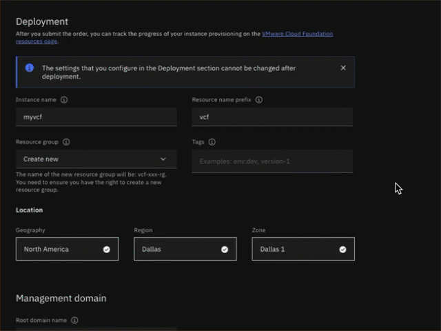
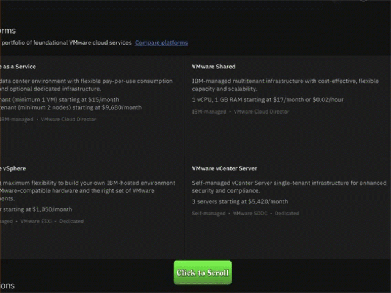
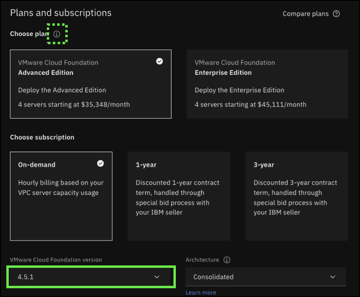
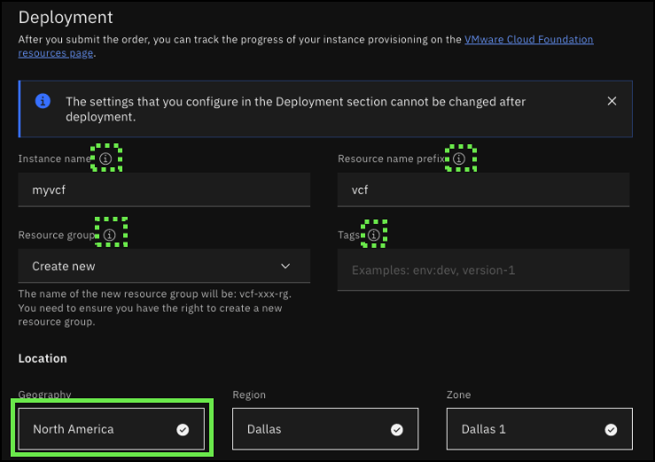
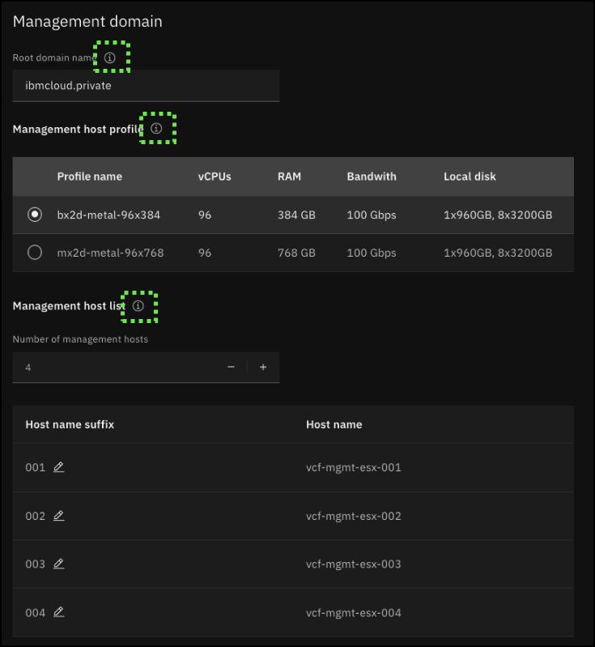
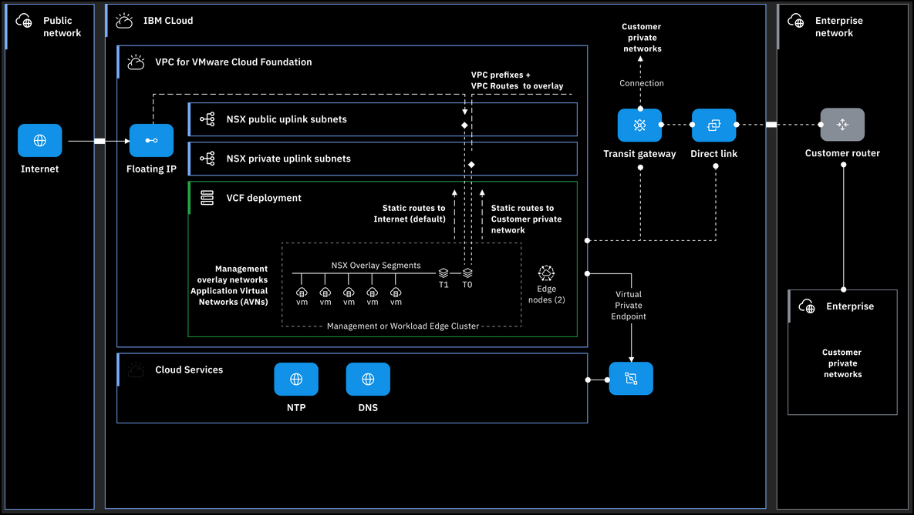
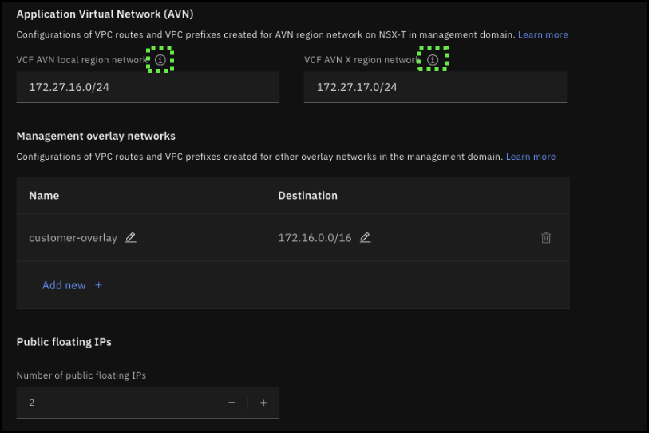
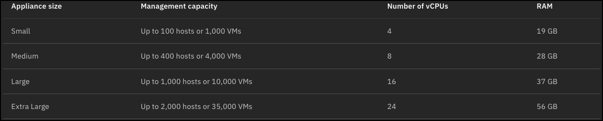
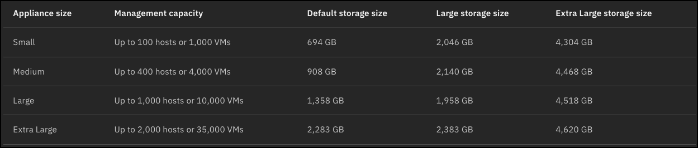
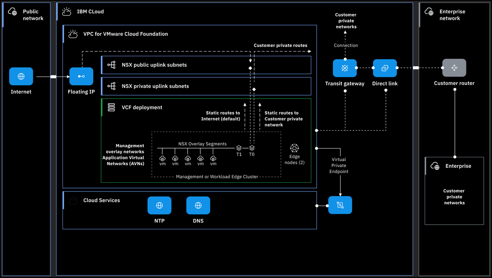

Now, it is time to provision a VMware Cloud Foundation (VCF) instance. Use the click-thru demonstration to practice provisioning a VCF instance.

!!! tip
    
    Due to the number of inputs required for provisioning a VCF cluster, a few additional features have been added to this click thru-demonstration. In the IBM Cloud portal, notice there are quite a few information icons  for various fields. If they appear above the next click position , they can be clicked to learn more about that particular field. 

    
    
    Scrolling in the user interface (UI) is required. A **Click to Scroll** icon will appear when the UI needs to scroll. This was added so ample time is available to read all the various fields in the UI. 

    
        
    If you are ever not sure where to click or what to do next? Simply click anywhere on the screen and the spot to click next will be highlighted.

1. Open the link and click play  to begin the demonstration.

**Click-thru demo:** <a href="https://ibm.github.io/SalesEnablement-VMware-L3/includes/vcf-provisioning/index.html" target ="_blank">Provision an instance of IBM Cloud for VMware Cloud Foundation</a>

2. Click the **VMware**  icon in the left menu bar.

3. Click **Click to Scroll**. 

4. Click the **VMware Cloud Foundation** tile in the **Featured services** section.

5. Click the **About** tab.

The **About** tab provides a short description of the VCF offering, including benefits, high-level pricing information, and a description of the two supported VMware Cloud Editions: Advanced Edition and Enterprise Edition.

6. Click **Click to Scroll**.
7. Click **Click to Scroll**.
8. Click the **Create** tab.
9. Click the **Compare plans** help link.

IBM Cloud for VCF supports deployment of either the **Advanced Edition** or **Enterprise Edition** of VMware Editions. Review the components of each and how the two editions differ. 

!!! important "Important"

    It is important to understand the footnote on this screen. The components denoted with the asterisk are **not** installed by the IBM Cloud automation. The client is responsible for manually installing these after the initial VCF provisioning process completes and the instance is in a ready state.

10. Click the **x** at the upper right to close the **VMware Cloud Foundations plans** window.

Before proceeding, recall the earlier tip about the information icons . The next click action is to click the pull-down menu for the **VMware Cloud Foundation version**. The image below shows illustrates that the information icon for the **Choose plan** section is active as it appears before the next click spot.

There are important tiles and fields before the next click spot.

First, notice that the user can specify which VMware Edition to deploy by selecting either the **Advanced Edition** or the **Enterprise Edition** tile.

The user must also select from the available subscription pricing plans: **on-demand**, **1-year**, or **3-year**. Note, for the 1-year and 3-year offerings, the client must contact an IBM seller for pricing and discounts.

11. Click the **VMware Cloud Foundation version** pull-down menu.

At the time this demonstration was created, only version 4.5.1 of the VCF offering was available. Expect future versions in the future. Expect to see IBM Cloud support the current and at least one prior version in the future.

12. Click the **4.5.1** option.
13. Click the **Architecture** pull-down menu.

IBM Cloud for VCF supports two deployment architectures: **Consolidated** and **Standard**. 

In the **Consolidated** architecture, the management and client workloads are running on a shared management domain. The environment is managed from a single VMware vCenter Server. VMware vSphere resource pools provide isolation between management and client workloads. Resource pools must be properly configured as the compute capacity is shared between the management and compute workloads.

With the standard architecture model, the management workloads are running on a dedicated management domain and the client workloads are deployed in separate virtual infrastructure (VI) workload domains. Each VI workload domain is managed by a separate vCenter Server instance, which provides for scalability and allows for autonomous licensing and lifecycle management. In IBM Cloud, the VI workload domains can run only on the same IBM Cloud VPC availability zone in the same IBM Cloud multizone region.

Learn more about the VCF architectures <a href="https://cloud.ibm.com/docs/vmwaresolutions?topic=vmwaresolutions-vpc-vcf-architectures" target="_blank">here</a>.

14. Click the **Standard** architecture option.
15. Click **Click to Scroll**.

Before specifying the location for the deployment, be sure and explore each of the Deployment input fields.

16. Click the **Geography** pull-down.

When this demonstration was created, VCF was available in the following locations:

- North America
  - Dallas
    - Dallas 1 
    - Dallas 2
    - Dallas 3
  - Washington, DC
    - WDC 1
    - WDC 2
  - Toronto
    - Toronto 2
    - Toronto 3
- Europe
  - Frankfurt
    - Frankfurt 1
    - Frankfurt 2
  - Madrid
    - Madrid 1
    - Madrid 3

Find the most current list of support locations <a href="https://cloud.ibm.com/docs/vmwaresolutions?topic=vmwaresolutions-vpc-vcf-ordering" target="_blank">here</a>.

17. Click **Europe**.
18. Click **Frankfurt**.
19. Click **Frankfurt 1**.
20. Click **Click to Scroll**.

Before proceeding, click the information icon  for each field in the **Management domain** input section.  

21. Click **Click to Scroll**.
    
Application Virtual Networks (AVNs) and Management overlay networks define the prefixes to use on the NSX overlay on the management cluster using the management Tier 0 gateway. Workload overlay networks define the prefixes that are used on the NSX overlay on the workload cluster on the standard architecture by using workload Tier 0 gateways. The automation creates the necessary Virtual Private Cloud (VPC) prefixes and VPC routes to enable routed connectivity from the VCF VPC and other connected networks through IBM Cloud interconnectivity services (Direct Link and Transit Gateway). 

Before proceeding, click the information icon  for each field in the **Application Virtual Network (AVN)** input section.

The **Management overlay networks** are subnets that are allocated in the NSX overlay on the management domain. VPC custom routes are created for these subnets pointing to the Tier 0 gateway of the management domain. Clients must verify that they do not conflict with other overlay networks.

Clients can order Public Floating IPs to be used in the overlay for network address translation (NAT) or for VPN endpoints.

22. Click the **Optional management domain settings** section.
23. Click the **Management vCenter VM size** pull-down menu.

The following capacities are available for the vCenter management VM:

24. Click the **Medium** option.
25. Click the **Management vCenter storage size** pull-down menu.

The following storage sizes are available for the vCenter management VM:

Note: if the VMware Aria Suite is going to be used, clients must select either the **Large** or **Extra Large** appliance size.

26. Click **Default**.
27. Click the **Management NSX-T size** pull-down menu.

A highly available NSX Global Manager instance is deployed in the VMware Cloud Foundation location instance. Select an NSX Global Manager appliance size according to the number of anticipated objects that are required to run the management components of the private cloud. 

Additional information on the topic is available in the VMware documentation <a href="https://docs.vmware.com/en/VMware-Cloud-Foundation/4.5/vcf-management-domain-design/GUID-3345887C-649D-4269-8DDA-9BD6F12505EE.html" target="_blank">here</a>.

28. Click **Medium**.
29. Click **Click to Scroll**.

Recall earlier, for this instance, the **Standard** architecture was selected. Like for the **management cluster**, specifications for the **workload cluster** need to be defined.

Two bare metal server profiles are supported for VCF currently.

- **bx2d-metal-96x384 **
  This server uses a "balanced" profile and has 96 vCPUs, 384 GiB RAM, 960 GB, and 25.6 TB secondary storage (8x3200GB) with 100 Gbps bandwidth.

- **mx2d-metal-96x768**
  This server uses a "Memory" profile and has 96 vCPUs, 768 GiB RAM, 960 GB, and 25.6 TB secondary storage (8x3200GB) with 100 Gbps bandwidth.

30.  Click the **mx2d-metal-96x768** profile radio button.

Note the option to increase and decrease the number of hosts in the workload cluster. A minimum of 3 hosts are required.

The maximum number of hosts is controlled by VMware and IBM VPC limitations. While the number of hosts per cluster supported by VMware is 32, there is a limit of 25 bare metal servers per VPC per IBM Cloud account. Both need to be considered when designing the VCF deployment. Note, it is possible to increase the VPC quotas by submitting a support ticker. For more information on VPC limits, go <a href="https://cloud.ibm.com/docs/vpc?topic=vpc-quotas" target="_blank">here</a>.

31. Click **Click to Scroll**.
    
Note the ability to edit and add **workload overlay networks**. Workload overlay networks are subnets that are allocated in the NSX overlay on the workload domain. IBM Cloud VPC custom routes are created for these subnets pointing to the Tier 0 gateway of the workload domain. 

32. Click the **Number of public floating IPs** field to increase the number to 1.

The number of public floating IP addresses that you want to reserve for the workload domain. After the floating IP addresses are ordered, they are associated with the first Bare Metal Server.

33. Click **Optional workload domain settings** to expand the section.

Similar to the settings for the management cluster, resources need to be specified for the workload cluster's vCenter instance and NSX-T instance. The appliance sizes are the same for both the management and workload clusters.

34. Click **Click to Scroll**.
    
Other DNS records to be created in your IBM Cloud VPC for VMware components or the virtual machine (VM) that you want to deploy on VMware Cloud Foundation instance. For more information, see <a href="https://cloud.ibm.com/docs/dns-svcs?topic=dns-svcs-managing-dns-records&interface=ui" target="_blank">Managing DNS records</a>.

An address prefix that is assigned to the VMware components that are deployed in your selected IBM Cloud VPC zone. This prefix helps organize and manage the IP address space for the VMware components within the IBM Cloud VPC zone. It is recommended to use a /22 prefix for approximately 120 hosts or a /23 prefix for approximately 60 hosts. The value is preset to 10.100.0.0/22.

The NSX-T uplink address prefix for your selected IBM Cloud VPC zone. The value is preset to 192.168.10.0/24.

The identifier used to define the name of the newly created IBM Cloud VPC. The IBM Cloud VPC name has the format <resource name prefix>-<3-character random string>-<vpc name>. The default value is **vpc**. 

Private routes include those located on-premises, in other VPCs, and advertised through IBM Cloud Transit Gateway. Automation creates static routes on NSX Tier 0 gateway to these prefixes by using the private uplink. In the consolidated architecture, the routes are created on management Tier 0 gateway. In the standard architecture, the routes are created on management and workload Tier 0 gateways.

35. Click **Click to Scroll**.
36. Click **Network interface optional settings** to expand the section.

Public routes define the prefixes that are routed to the internet and typically the default route (0.0.0.0/0) is used, but this can be customized if needed. In the consolidated architecture, the routes are created on the management Tier 0 gateway. In the standard architecture, the routes are created on the management and workload Tier 0 gateways.

1.  Click **Click to Scroll**.
2.  Click the **Jump server** toggle button.

A Windows VM can be created in the IBM Cloud VPC. This Windows Server is configured with a public floating IP address to access the IBM Cloud VPC internal network. For security considerations, the Windows VM is not created by default.

An IBM Cloud Access Group in IBM Cloud Identity and Access Management (IAM) can be created with a policy for granting access to the resources deployed in the resource group specified earlier. For more information about IBM Cloud Access Group, see <a href="https://cloud.ibm.com/docs/account?topic=account-access-getstarted" target="_blank">Assigning access to resources by using access groups</a>.

39. Click the **Observability** toggle button.

For VMware Cloud Foundation deployment, a new IBM Log Analysis instance with a 7-day pricing plan for viewing the logs of VMware Cloud Foundation deployment can be deployed. Alternatively, an existing instance might be used by adding the instance ingestion key. By default, the IBM Log Analysis service is not ordered. For more information about IBM Log Analysis and its pricing plans, see <a href="https://cloud.ibm.com/docs/log-analysis?topic=log-analysis-getting-started" target="_blank">Getting started with IBM Log Analysis</a> and <a href="https://cloud.ibm.com/docs/log-analysis?topic=log-analysis-service_plans" target="_blank">Service plans</a>.

40. Click the **license agreement** checkbox.
41. Click **Create**.

That concludes the process for provisioning a new VCF instance on IBM Cloud VPC. The automation runs, all the IBM Cloud VPC resources are deployed, and the VCF software is installed. 

Proceed to the next module of this demonstration script to learn how to manage a VCF instance by using the IBM Cloud Portal. 

