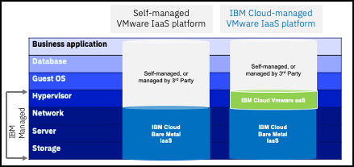

IBM Cloud for VMware as a Service (VMaaS) provides the VMware Cloud Director platform as a managed service. IBM does the configuration, hosting, operations, and lifecycle management of the VMware software so clients can quickly deploy their VMware-based cloud computing environments, simplify management, and reduce costs.

Today, compute resources are available as single-tenant, dedicated hosts, on IBM Cloud bare metal servers, with multiple host configurations available to address various workload requirements. Both Network File Storage (NFS) and VMware vSAN storage options are available, along with a broad ecosystem of enterprise-grade add-on services for backup, migration, and disaster recovery.

All sellers, especially technical sellers, should read the VMWaaS overview documentation found <a href="https://cloud.ibm.com/docs/vmwaresolutions?topic=vmwaresolutions-vmware-aas-overview" target="_blank">here</a>. Additionally, while most of the underlying VMware products that are utilized in the offering are hidden from the end client, some clients may ask about the versions utilized. This information is available in the VMware as a Service release notes found <a href="https://cloud.ibm.com/docs/vmwaresolutions?topic=vmwaresolutions-vmware-service-relnotes" target="_blank">here</a>.

VMWaaS utilizes a shared responsibility modelthat includes IBM-managed infrastructure and IBM managed VMware components and services up to the hypervisor. The high-level architecture diagram illustrates the management responsibilities of VMWaaS versus a client-managed VMware infrastructure as a service (IaaS) offering. 

#
# Next Steps

In the following modules, you will:

- Explore the process of provisioning a **VMWaaS** instance with the IBM Cloud portal.

- Delve deeper into various elements of the offering's management console, including: data centers, applications, virtual machines, networking, libraries, administration, and system monitoring.