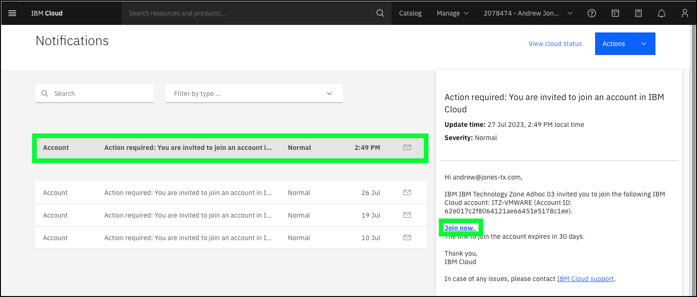
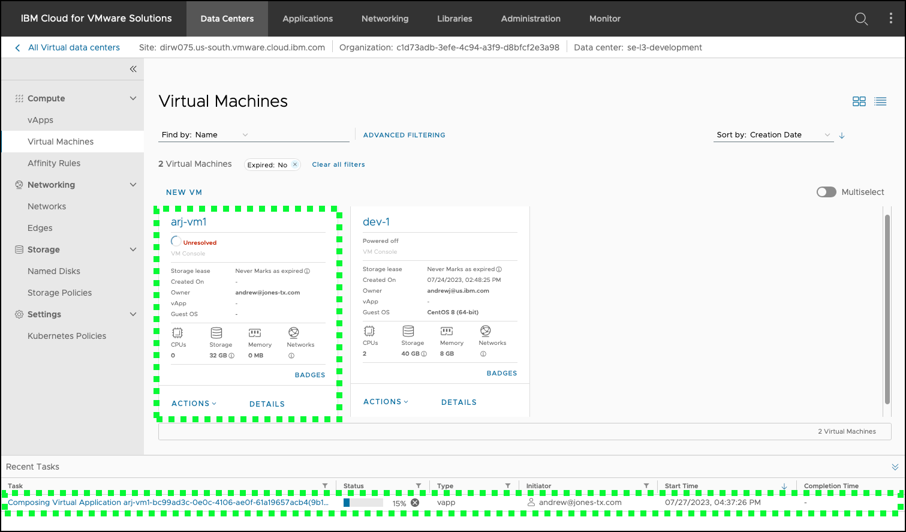
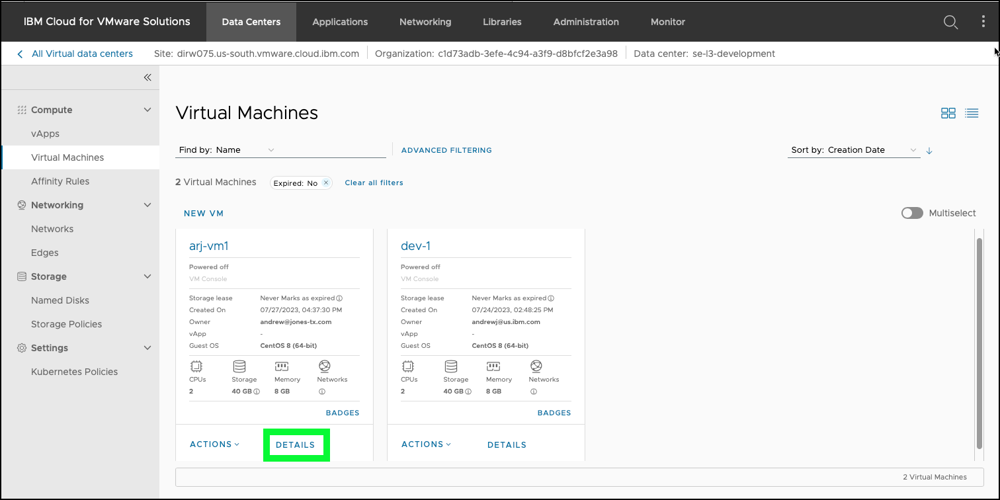
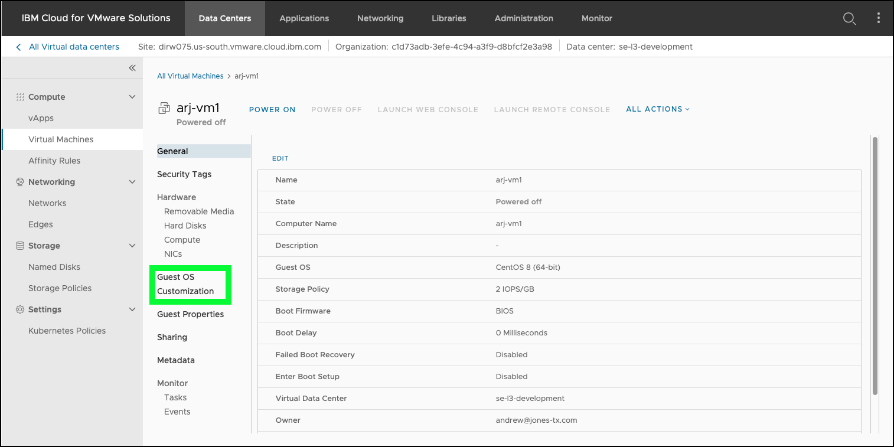
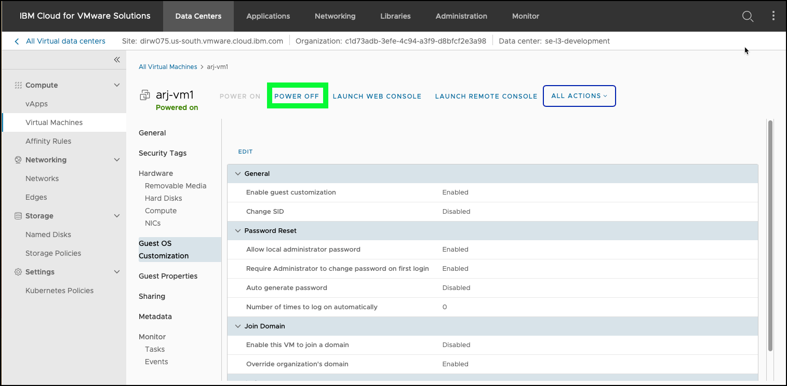
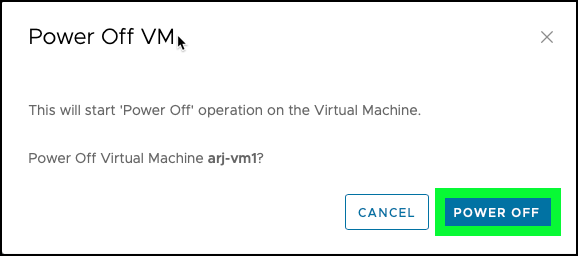

One of the many reasons clients consider VMware as a Service (VMwaaS) on IBM Cloud is for the ease of rapidly deploying virtual machines (VMs) to run their business workloads. Step-by-step instructions are provided on how to use VMware Cloud Director (vCD) to create and access VMs running in the VMwaaS virtual data centers (VDCs). 

Thus far, the experience that was provided in this learning plan was through videos and click-thru demonstrations. A hands-on environment of the **VMwaaS** instance that was built during the earlier modules is available through an IBM Technology Zone (ITZ) environment that you can reserve <a href="https://techzone.ibm.com/collection/ibm-cloud-for-vmware-level-3/journey-complete-learning-activity-for-ibm-cloud-for-vmware-level-3-sales-enablement" target="_blank">here</a>.

!!! Warning "LIMITED ACCESS"
    The user access provided to the instance in ITZ is restricted by IBM Cloud's Identity and Access Management (IAM) controls. Users can view the VMwaaS instances that are already provisioned in the account and deploy a VM and vApp with VMware Cloud Director (vCD). Users cannot provision or modify VMwaaS instances, sites, or virtual data centers. However, even with these restrictions, the environment can be used in performing demonstrations with a "baking-show" demonstration approach as an alternative to using the click-thru demos. To learn more about the "baking-show" method, check out this <a href="https://cruxcollaborative.com/insights/your-software-demo-should-be-more-like-a-cooking-show" target="_blank">article</a>.

    Note: other ITZ environments are available for IBM Cloud for VMware Solutions that may provide additional access.  Use "VMware on IBM Cloud" in the ITZ search tool.

??? info "See all the VMware Shared specific IAM access provided in the ITZ environment"

    

#
# Step-by-step Instructions
----------------------

##
## Create a reservation for the demonstration environment in ITZ

1. Open a web browser to the **IBM Cloud for VMware Solutions - Level 3** environment reservation page.

<a href="https://techzone.ibm.com/my/reservations/create/638a1f6a308f5500188808a7" target="_blank">Create a reservation</a>.

Note: you may need to accept the latest ITZ terms and conditions before proceeding.

2. Click the **Reserve now** radio button.
3. Click the **Practice / Self Education** tile.
4. Enter **Level 3 training** in the **Purpose description** field.
5. Click the **Preferred Geography** pull-down and select **AMERICAS - us-south region -dal10 datacenter**.

The **End date and time** is set for 3 days. You can shorten that direction here. After the reservation is ready, you can also extend the reservation up to a maximum of 6 days.

6. Click the **I agree to IBM Technology Zone's T&Cs** checkbox.
7. Click **Submit**.

It takes approximately 20 minutes for the reservation to be processed. You can monitor the progress of the reservation <a href="https://techzone.ibm.com/my/reservations" target="_blank">here</a>.

When the status of the reservation is **Ready**, continue to the next steps.

1. Open a web browser to the **IBM Cloud Portal**.

<a href="https://cloud.ibm.com" target="_blank">Create a reservation</a>.

When the page loads, authenticate with your IBM Cloud ID and password. The authentication process varies depending on the primary account that your ID is associated with and any multi-factor authentication or other security controls in place for the account.

2. Click the **Notifications** () icon.


3. Click the **Join now** link on the **Action required: You are invited to join an account in IBM Cloud** notification.



Note: if you do not see a notification like this, then, in most cases, your ITZ reservation is not in the **Ready** state. Wait for the reservation to become **Ready**. You will also receive an email with the **Join now** link.

4. Click the **I accept the product...** checkbox.
5. Click **Join Account**.


6. Click the **account selection** drop-down menu and select the **{{itz.account}}** account.


Note, if the browser window is narrow, you might see an **account selection** icon like this:  instead of the full account name.

##
## Create, modify, access, and delete a VM

7. Click the VMware () icon in navigation menu.


8. Click **VMware as a Service** in the navigation menu.


On the VMwaaS page, observe the resources that are pre-provisioned in the shared ITZ account. These are the resources that were provisioned when the click-thru demos were created and should look familiar. Feel free to explore the resources that use the IBM Cloud portal. Remember, you will not have permission to add, modify, or remove these resources.

9. Click either of the **Go to VMware console** links.


10. Click **SIGN IN WITH SINGLE SIGN-ON**.


Once signed in to the VMware Cloud Director (vCD) web console, feel free to explore all the capabilities provided. Again, your user ID has the ability to create, modify, and delete virtual machines (VMs), but you will not be able to add, modify, or remove networks or other network components.

11. Click either of the virtual data center (VDC) tiles.


!!! Warning "The images below might differ from what you see in vCD"

    Remember, this is a shared account and other IBMers and Business Partners may be accessing the same environment at the same time. You may see VMs created by other users. Please be respectful and do not remove other user's VMs.

12. Click **NEW VM**.


13. Enter a unique **Name**.

When naming your VMs, preface the name with your initials for easy identification. You are asked to remove any resources you create before your ITZ reservation expires.


14. Uncheck **Power on**.


15. Select one of the operating system images from the table.


It is recommended to select one of the Linux based images (for example CentOS, Red Hat, and so on) as these can be easily accessed using the web-based console tools that are provided in vCD. If you opt to create a Microsoft Windows based VM, you need to download the **Remote Desktop** tool from vCD. Instructions for doing this are not detailed here, but they are straight forward.

16. Select a **Storage Policy**.


Recall from the click-thru demos, two storage pools were created: 0.25 input/output operations per second per gigabyte (IOPS/GB) and 2 IOPS/GB.

17. Select the **{{itz.VMwaaS.network}}** in the network interface card (NICs) table.


Only one network is defined.

18. Click **OK**.


After a few seconds, a tile for your VM appears. Take notice of the **Recent Tasks** table that shows the progress and status of the VM.



Continue when the **Status** changes to **Succeeded**.

19. Click the **DETAILS** link on the tile for the VM you created.



20. Click **Guest OS Customization**.



21. Click **EDIT**.


22. Check **Require Administrator to change password on first login**, uncheck **Auto generate password**, and enter a strong **password**.


Be sure to remember the password!

23. Click **SAVE**.
24. Click **POWER ON**.


Watch the **Recent Tasks** table as the VM is powered on. When the VM shows **Powered on** continue.

25. Click **LAUNCH WEB CONSOLE**.


The web console opens in a new browser window.


!!! Warning "Web console might not work with all browsers"

    Issues were encountered opening the web console using the Safari browser on Mac OS. No issues were encountered when using Firefox on Mac OS. If you encounters, please try another browser.

When the **login** prompt appears, use the root ID, and the password you specified earlier. Note, you are required to change the password the first time you log in. You now have full access to the VM. If you are new to Linux, try a few commands like:

```ls -l```

```ps -ef```

The next steps walk you through deleting the VM that was created. Note, you do not have to do this right now, but remove all VMs you create before your ITZ reservation expires.

26. In the vCD web console, click **POWER OFF** for the VM you created earlier.



27. Click **POWER OFF** in the **Power Off VM** dialog.



Observe the progress of the request to power off the VM. Continue when the VM is in the **Powered off** state.

28. Click the **All Actions** drop-down menu and click **Delete**.


You should now feel comfortable creating, modifying, and deleting VMs using vCD. Now, feel free to explore the other capabilities in vCD. Keep in mind, the permissions your IBM Cloud ID has are limited. For example, recall in the network setup demonstration a new Data Center Group and Network was created. In those screens in vCD, notice the **NEW** option is not available to you. This is because your IAM access controls in this account do not include the **VMwaaS Director Network Admin** access. This limitation was put in place to allow many users to share the environment and limit exposure of resources to attacks from the Internet.

A few things that you might want to try:

- Create and use a **Named Disk**
- Explore **Virtual Applications**
- Explore the various **Networking** options
  
Remember, the focus of this demonstration guide is the **on the IBM Cloud** aspect of the VMwaaS offering and not the capabilities of VMware Cloud Director or the other underlying VMware technologies. 

Next, see how everything learned here can be used to deliver an effective client demonstration using the ITZ environment for VMwaaS.
