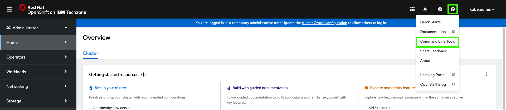
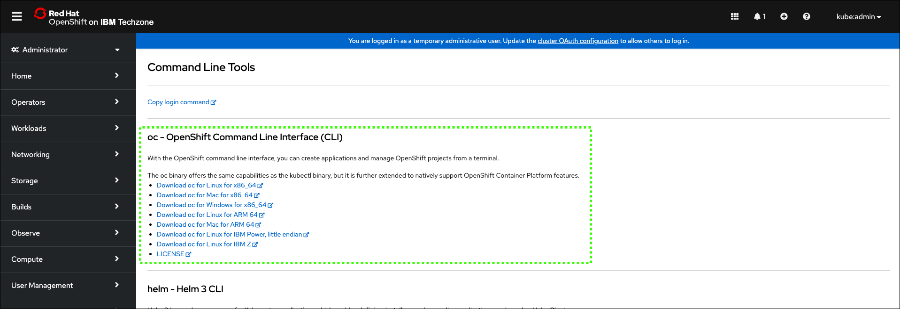
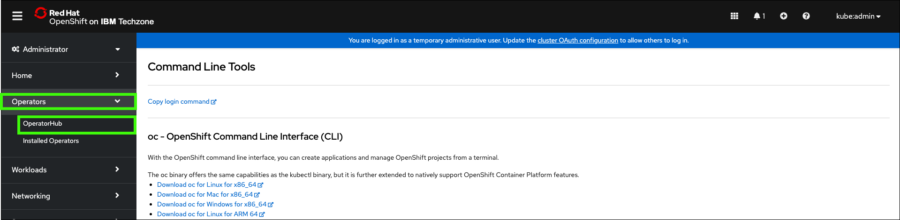
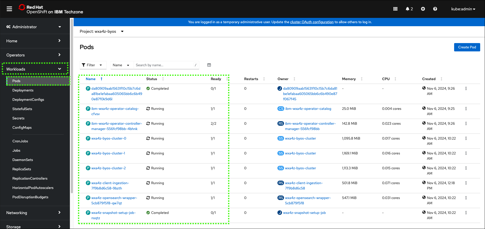

# Creating a stand-alone OpenSearch instance for document ingestion
Now that you created and deployed your own assistant with conversational search capabilities, your client can understand how watsonx Assistant for Z provides its content-grounded responses to any Z-related questions. In the previous section, you configured your assistant to use a pre-configured Z RAG that has over 220 knowledge sources, and uses this knowledge to provide AI-generated responses. 

Next, learn to enable clients to personalize the assistant with an internal knowledge base that contains documentation they add to the Retrieval Augmented Generation (RAG). This helps provide a level of context-awareness for their own environment when environment-specific questions are asked to the assistant.

Now, install and configure a “Z RAG” on Red Hat OpenShift enabling the bring-your-own-search (BYOS) and bring-your-own-documentation (BYOD) capability to ingest other documentation. In doing so, you deploy a dedicated [OpenSearch](https://opensearch.org/) instance (BYOS). Then, connect your assistant to the new RAG database to provide responses based on the ingested documentation (BYOD). 

Below is a high-level, logical architecture of the environment deployed in this section.


Earlier, you provisioned three IBM Technology Zone (ITZ) environments. One of which was a single-node Red Hat OpenShift (SNO) cluster. If you have not reserved this environment, or it is not in the **Ready** state, return to the 
[IBM Technology Zone environment](../TechZoneEnvironment.md) section to complete the reservation.

## Install the Red Hat OpenShift command line interface utility 
The Red Hat OpenShift command line interface (CLI) utility, which is known as **oc**, must be installed on your local workstation. If you already installed the **oc** utility, you can proceed to [log in to the SNO cluster](#Login2OpenShift).

1. Click the following link to open a browser window to your ITZ reservations.

    <a href="https://techzone.ibm.com/my/reservations" target="_blank">ITZ My reservations</a>

2. Click the **Single Node OpenShift** tile.

    

3. Scroll down and record the **Cluster Admin Username** and **Cluster Admin Password**.

    

4. Click the **OCP Console** link.

    **Note**: OCP stands for OpenShift Container Platform.

    

5. Enter the **Cluster Admin Username** and **Cluster Admin Password** values from step 3 and click **Log in**.

    

6. Click **Help** () and then click **Command Line Tools**.

    

7. Click the link under **oc - OpenShift Command Line Interface (CLI)** for the operating system of your local machine.

    

    Clicking the preceding link automatically downloads either a **.zip** or **.tar** file specific to your operating system. Extract the file's content. Place the **oc** binary for your operating system (OS) in a directory that is in your default PATH, or set the PATH environment variable to include the location of the **oc** binary.

8. Verify the installation by running the **oc** command on your local workstation.

    ```
    oc --help
    ```
    Sample output:
    

    ??? Tip "Mac/OS users may need to adjust security settings."

        The **oc** binary may cause a security exception. Adjust the security settings by opening the **System Settings** utility and clicking **Privacy & Security**. Under **Security** locate the message about the **oc** binary and click **Allow Anyway**. Return to the terminal window and try the ```oc --help``` command again and click **Allow Anyway** when prompted.

## Prepare to ingest documents
Before ingesting documents, complete the following setup steps.

<a name="Login2OpenShift"></a>

### Log in to the OpenShift cluster from your local terminal
**Note**: If you just installed the **oc** utility, skip the next 5 steps.

1. Click the following link to open a browser window to your ITZ reservations.

    <a href="https://techzone.ibm.com/my/reservations" target="_blank">ITZ My reservations</a>

2. Click the **Single Node OpenShift** tile.

    

3. Scroll to the bottom of the reservation page and record the **Cluster Admin Username** and **Cluster Admin Password**.

    

4. Click the **OCP Console** link.

    

5. Enter the **Cluster Admin Username** and **Cluster Admin Password** values from step 3 and click **Log in**.

    

6. Click the **kube:admin** profile drop-down and click **Copy login command**.

     

7. Click **Display Token**.

    

8. Select and copy the **Log in with this token** string.

    For most operating systems, double-click the value, then right-click and select **Copy**.

    

9. Open a command prompt or terminal window on your local workstation.

10. Paste the login command and press **enter**.

    

### Create a working directory
1. Create a directory to store the configuration files that you will create in the next steps.

    !!! Warning "Instructions vary by your local workstation's operating system."
    
        The directions that follow may vary depending on your operating system. The examples provided are based upon MacOS.

    ```
    mkdir watsonxAssistant
    ```

2.  Change to the new directory.

    ```
    cd watsonxAssistant
    ```

    

### Install IBM Certificate Manager on Red Hat OpenShift
1. In a text editor, create a file that is named `catalogCertManager.yaml` and paste the following text in the file.

    !!! Important "Formatting of the yaml file is critical!"

        The content of the YAML file must be formatted exactly as shown. Use the **Copy** icon to prevent typographical errors.

    File name: 
    ```
    catalogCertManager.yaml
    ```

    File contents:
    ```yaml
    apiVersion: operators.coreos.com/v1alpha1 
    kind: CatalogSource 
    metadata: 
      name: ibm-cert-manager-catalog 
      namespace: openshift-marketplace 
    spec: 
      displayName: ibm-cert-manager-4.2.7 
      grpcPodConfig: 
        securityContextConfig: restricted 
      image: icr.io/cpopen/ibm-cert-manager-operator-catalog@sha256:4dcf4ace4b5f166f83b31063f7e6404dbf78d8e98a9d4fcf52fedf576a55ca6c 
      publisher: IBM 
      sourceType: grpc 
      updateStrategy: 
        registryPoll: 
          interval: 30m0s
    ```

2.  Install the IBM Certificate Manager operator in the Red Hat OpenShift cluster.

    ```
    oc apply -f catalogCertManager.yaml
    ```

    The preceding command returns a message that states the **ibm-cert-manager-catalog** was created.

3.  In the OpenShift web console, click **Operators** and then select **OperatorHub**.

    

4.  Click the **Project** to pull-down menu and click the **Show default projects** toggle.

    

5.  Scroll down and select **openshift-marketplace**.

    

6.  Enter **IBM Cert Manager** in the search field and then click the **IBM Cert Manager** tile.

    !!! tip "Be patient."

        It may take a minute or two for the **IBM Cert Manager** tile to appear. 

    **Note**: The current version of the operator may differ than shown in the image below. Select the most current version.

    

7.  Click **Install**.

    

8.  Keep the default settings and click **Install**.

    

    !!! Warning "Do not continue until..."
    
        The installation process takes a few minutes. Do not continue until you see the following message: **Installed operator: ready for use**.

        

### Install the watsonx Assistant for Z Operator (for OpenSearch)
1. In your command prompt or terminal window, create a new namespace called `wxa4z-byos` in the Red Hat OpenShift cluster.

    ```
    oc create namespace wxa4z-byos 
    ```

2.  Create or obtain your IBM Container Software production entitlement key.

    A production entitlement key is required to pull the container images that get deployed by the operator.

    To create or retrieve your existing entitlement key, follow the instructions <a href="https://myibm.ibm.com/products-services/containerlibrary" target="_blank">here</a>.

    If extra assistance is needed, refer to this <a href="https://github.ibm.com/alchemy-registry/image-iam/blob/master/obtaining_entitlement.md" target="_blank">site</a>. 

    Locate your existing key or create a new one and continue to the next step.

3.  Click **copy** and record your entitlement key for future use in a secure location.

    

4.  In your command prompt or terminal window, set an environment variable with your production entitlement key.

    Substitute your production entitlement key copied in the last step for `<entitlement key>`.

    Mac OS:
    ```
    export IBM_CS_ENT_KEY=<entitlement key>
    ```

    Microsoft Windows:
    ```
    set IBM_CS_ENT_KEY=<entitlement key>
    ```

5.  Enter the following command to create a pull secret for the **Container Registry**.

    Mac OS:
    ```
    oc -n wxa4z-byos create secret docker-registry icr-pull-secret --docker-server=cp.icr.io --docker-username=cp --docker-password=$IBM_CS_ENT_KEY
    ```

    Microsoft Windows:
    ```
    oc -n wxa4z-byos create secret docker-registry icr-pull-secret --docker-server=cp.icr.io --docker-username=cp --docker-password=%IBM_CS_ENT_KEY%
    ```

    

6.  In a text editor, create a file that is named `catalogSource.yaml` and paste the following text in the file.

    !!! Important "Formatting of the yaml file is critical!"

        The content of YAML files must be formatted exactly as shown. Use the copy icon to prevent typographical errors.

    File name: 
    ```
    catalogSource.yaml
    ```

    File contents:
    ```yaml
    apiVersion: operators.coreos.com/v1alpha1 
    kind: CatalogSource 
    metadata: 
      name: ibm-wxa4z-operator-catalog 
      namespace: wxa4z-byos 
    spec: 
      displayName: "IBM watsonx Assistant for Z Operator Catalog" 
      image: icr.io/cpopen/ibm-wxa4z-catalog:v2.1.0@sha256:a085d360b6aa0e40cf86a632eb5cd190a0407d1c54ec1b2d1d2fb5507f39a524
      publisher: 'IBM' 
      sourceType: grpc 
      secrets: 
      - icr-pull-secret
    ```

7.  Create your document catalog in the Red Hat OpenShift operator.

    ```
    oc apply -f catalogSource.yaml
    ```

    

8.  In the Red Hat OpenShift web console, click **OperatorHub** and select the **wxa4z-byos** project.

    

9.  Enter **ibm watsonx** in the search field and the click the **IBM watsonx Assistant for Z Operator Catalog** tile.

    !!! tip "Be patient."

        It may take a minute or two for the **IBM watsonx Assistant for Z Operator Catalog** tile to appear. 

    **Note**: The current version of the operator may differ than that shown in the image below.

    

10. Click **Install**.

    **Note**: The current version of the operator may differ than the one shown in the image after this. Select the most current version.

    

11. Select **A specific namespace on the cluster** (**a**) under **Installation mode** and **wxa4z-byos** (**b**) for the **Installed Namespace**, then click **Install** (**c**).

    

    !!! Warning "Do not continue until..."
    
        The installation process takes a few minutes. Do not continue until you see the following message: **Installed operator: ready for use**.

        

12. In your command prompt or terminal window, run the following commands to add the Container Registry credential to the operator's service account.

    Mac OS and Microsoft Windows:
    ```
    oc project wxa4z-byos
    ```

    Mac OS:
    ```
    oc patch serviceaccount ibm-wxa4z-operator-controller-manager --type merge -p '{"imagePullSecrets": [{"name": "icr-pull-secret"}]}'
    ```

    Microsoft Windows:
    ```
    oc patch serviceaccount ibm-wxa4z-operator-controller-manager --type merge -p "{\"imagePullSecrets\":[{\"name\":\"icr-pull-secret\"}]}"
    ```

    

13. In the Red Hat OpenShift web console, under **Workloads**, click **Pods**.

    

14. Verify the two pods that start with **ibm-wxa4z-operator** have a status of **Running** and that all pods are **Ready**.

    

15. Run the following command to set the administrative policy for the workspace.

    ```
    oc -n wxa4z-byos adm policy add-scc-to-user privileged -z byos
    ```

    

### Deploy required secrets and the custom bring-your-own-search (BYOSearch) resources

1. In a text editor, create a file that is named `os-secret.yaml` and paste the following text in the file.

    File name: 
    ```
    os-secret.yaml
    ```

    Substitute a secure password of your choosing for the string `<OPENSEARCH_PASSWORD>`.
    
    File contents:
    ```yaml
    apiVersion: v1 
    stringData: 
      password: <OPENSEARCH_PASSWORD> 
    kind: Secret 
    metadata: 
      name: opensearch-creds 
      namespace: wxa4z-byos 
    type: Opaque
    ```

2.  Create the secret by running the following command.

    ```
    oc apply -f os-secret.yaml
    ```

<a name="AuthKey"></a>

3.  In a text editor, create a file that is named `client-ingestion-secret.yaml` and paste the following text in the file.

    File name: 
    ```
    client-ingestion-secret.yaml
    ```

    Substitute a secure authentication key of your choosing for the string `<CLIENT_INGESTION_AUTHKEY>`. The authentication key can be a random password.
    
    File contents:
    ```yaml
    apiVersion: v1 
    stringData: 
      authkey: <CLIENT_INGESTION_AUTHKEY> 
    kind: Secret 
    metadata: 
      name: client-ingestion-authkey 
      namespace: wxa4z-byos 
    type: Opaque
    ```

4.  Create the secret by running the following command.

    ```
    oc apply -f client-ingestion-secret.yaml
    ```

5. In a text editor, create a file that is named `wrapper-creds.yaml` and paste the following text in the file.

    File name: 
    ```
    wrapper-creds.yaml
    ```

    Substitute a secure password credential of your choosing for the string `<WRAPPER_PASSWORD>`. The password can be a random password. Use this password in the following steps when you configure your BYOS connection in your assistant to connect to the network route.
    
    File contents:
    ```yaml
    apiVersion: v1
    stringData:
      username: admin
      password: <WRAPPER_PASSWORD>
    kind: Secret
    metadata:
      name: wrapper-creds
      namespace: wxa4z-byos
    type: Opaque
    ```

6. Create the secret by running the following command.

    ```
    oc apply -f wrapper-creds.yaml
    ```

7.  Obtain and record your cluster domain that is used for routes by running the following command.

    ```
    oc -n openshift-ingress-operator get ingresscontroller default -o jsonpath="{.status.domain}"
    ```

    !!! Warning "The output from the command does not include a newline."

        The value returned for the cluster domain does not include a newline. When copying the value do not include the character or characters used for your command line prompt. Do not include the your prompt in the next step!

    **Note**: The output of the command will be a string similar to: **apps.672b79320c7a71b728e523b4.ocp.techzone.ibm.com**

8.  In a text editor, create a file that is named `byos.yaml` and paste the following text in the file.

    File name: 
    ```
    byos.yaml
    ```

    Substitute the domain name recorded in the previous step for the string `<YOUR_CLUSTER_DOMAIN>`.

    File contents:
    ```yaml
    apiVersion: wxa4z.watsonx.ibm.com/v1
    kind: BYOSearch
    metadata:
      name: byosearch
      namespace: wxa4z-byos
    spec:
      imagePullSecrets:
      - name : icr-pull-secret
      namespace: wxa4z-byos
      clusterName: wxa4z-byos-cluster
      clusterDomain: <YOUR_CLUSTER_DOMAIN>

      opensearch:
        secretName: opensearch-creds

        persistence:
          enabled: true
          storageClass: "managed-nfs-storage"
          accessModes:
            - ReadWriteOnce
          size: 24Gi

      wrapper:
        createRoute: true
        resources:
          requests:
            cpu: 2
            memory: "500Mi"
        limits:
            cpu: 2
            memory: "1Gi"
  
      clientIngestion:
        secretName: client-ingestion-authkey

        resources:
          limits:
            cpu: "500m"
            memory: 2Gi
            nvidia.com/gpu: "0"
          requests:
            cpu: "500m"
            memory: 1Gi
            nvidia.com/gpu: "0"
        pvc:
          storageClass: "managed-nfs-storage"
          enabled: true
          size: 24Gi
    ```

9.  Run the following command to deploy BYOS on your cluster.

    ```
    oc apply -f byos.yaml
    ```

### Verify all the required pods are running and get the network route to your BYOS instance
1. In the OCP console, verify that all pods have the status of **Running** or **Completed**.

    !!! Warning "Do not continue until..."
    
        The BYOS deployment can take 20 minutes or more to complete. Do not continue until all the pods have a status of “Running” or "Completed". The next step is to retrieve your BYOS endpoint URL.

        

2.  Under **Networking**, click **Routes**.

    

3.  Copy and record the location for the **wxa4z-opensearch-wrapper** route.

    

### Update your assistant with the new BYOS instance route
<a name="BYOS-url"></a>
You are now ready to configure your assistant with the route to your BYOS instance.

1. Using the network route for your BYOS instance, append the string **/v1/query** to complete the URL endpoint. 

    The URL should look similar to:

    `https://wxa4z-opensearch-wrapper-wxa4z-byos.apps.672b79320c7a71b728e523b4.ocp.techzone.ibm.com/v1/query`

    **Important**: The above URL will not work for you. Use the value of your specific OpenSearch instance that is recorded in the previous step.

2. Update your assistant's custom search integration URL.
   
    Next, you need to return to your assistant in the watsonx Orchestrate AI assistant builder and update the custom search integration URL. Use the URL form the network route (with **/v1/query**) appended. Use **admin** for the **Username** and the **Password** will be the password that you specified in the ```wrapper-creds.yaml``` file. 
    
    !!! tip "Don't recall how to set the customer search URL?"

        Refer back to [Creating an assistant and configuring conversational search](../Setup/creatingAssistant-configuringConvoSearch.md#configure-conversational-search) if you don't remember how to specify the customer search URL.

3. Test your assistant and verify that it is still answering questions that are related to IBM Z.

    Experiment with different prompts and validate that the answers provided are reasonable, and that you can view the documentation that was sourced. If responses are not received as expected, verify that the URL is formatted correctly and you specified the ```wrapper-creds.yaml`` password as the **admin** password.

## Troubleshooting
The following are issues that you may encounter. If the provided resolutions do not work, contact support by using the methods that are mentioned in the [Support](../index.md#support) section.

??? Failure "Pods have a status of **ErrImagePull** or **ImagePullBackoff**"

    If the pods starting with **ibm-wxa4z-operator** have a status of “ErrImagePull” or “ImagePullBackoff”, you can delete the pod and it will automatically restart and pull the image successfully. Wait until the pod is re-created successfully.

??? Failure "The **wxa4z-client-ingestion** pod does not start"

    Did you include the **%** character in the **clusterDomain** name when creating the **byos.yaml**? To resolve, edit the **byos.yaml** file and run the following command again. The current pod will be terminated and a new one started. This will take about 20 minutes to start.

    ```
    oc apply -f byos.yaml
    ```