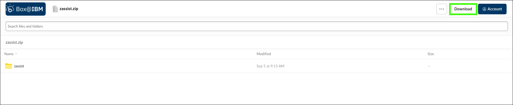

# Installing and using zassist to ingest client documents
With bring-your-own-search (BYOS) installed and configured in your assistant, you can now prepare for document ingestion (bring-your-own-documents (BYOD)). BYOD demonstrates how clients can augment their assistant’s conversational search by creating an internal knowledge base with their documentation. Using the client's documentation allows the assistant to provide valuable responses to a range of questions not possible with the default documentation available. 

As an example, a client mentioned that their developers often need reference material on company-specific legacy code or company-specific syntax. The users must search through volumes of documentation to find it or look at old code. Also, a need for their operational support group to quickly determine how to resolve technical issues using runbooks exists. 

You can show your client how watsonx Assistant for Z can assist developers and operational support personnel in finding answers about internal processes for code development and deployment. 

Currently, only PDF, HTML, and DOCX file formats are supported for ingestion.

A high-level, logical architecture of the environment is illustrated in the following diagram.


To prepare for document ingestion, you can also reference the setup instructions that are located <a href="https://ibmdocs-test.dcs.ibm.com/docs/en/watsonx/waz/2.0?topic=install-zassist-ingest-data" target="_blank">here</a>.

## Install the zassist utility
The **zassist** utility is an executable program that automates the ingestion of client documentation into the RAG for watsonx Assistant for Z. A version of zassist is available for download for IBMers and Business Partners for conducting pilots. Follow the steps to download and install **zassist**.

!!! Info "How do clients get the zassist utility?"

    The utility is available to clients through <a href="https://www.ibm.com/software/passportadvantage/pao_customer.html" target="_blank">IBM Passport Advantage</a>.

1. Click the following link and download the **zassist.zip** file.
   
    <a href="https://ibm.box.com/s/j3nt5iw4fqd5w2jgcqwxnjlsu8bpvl77" target="_blank">https://ibm.box.com/s/j3nt5iw4fqd5w2jgcqwxnjlsu8bpvl77</a>

    

2. Extract the **zassist.zip** file.
3. Locate the appropriate file for your local workstation's operating system.

    

4. Either copy the appropriate **zassist** file to a directory in your PATH, or add the appropriate directory to your PATH environment variable.

    Additional information for running the preceding tasks can be found <a href="https://www.ibm.com/docs/en/watsonx/waz/2.x?topic=data-installing-zassist#tasktask_w13_lhf_4bc__steps__1" target="_blank">here</a>.

5. Run the **zassist** command to verify that it is working.

    ```
    zassist
    ```

    

    ??? Tip "Mac/OS users may need to adjust security settings."

        The **zassist** binary may cause a security exception. Adjust the security settings by opening the **System Settings** utility and clicking **Privacy & Security**. Under **Security** locate the message about the **zassist** binary and click **Allow Anyway**. Return to the terminal window and try running teh command again.

## Ingest client documentation using zassist
With the **zassist** command installed, you are now able to begin ingesting data. 

Step-by-step guidance for ingesting documents using **zassist** is provided in the IBM watsonx Assistant for Z documentation.

1. Download the ```BYOD.zip``` file.

    <a href="https://github.com/IBM/SalesEnablement-L4-watsonx-AssistantForZ/raw/refs/heads/main/docs/Setup/_sampleDocs/BYOD.zip" target="_blank">BYOD.zip</a>

    !!! Example "What is in the sample client documentation?"

        Three sample documents are included:

        - Mainframe_COBOL_Error_Codes.pdf
        
            This is a document containing company-specific mainframe COBOL error codes for their application. Developers within the organization typically review this document to quickly diagnose issues based on the application error codes returned.

        - Mainframe_Operational_Incidents_Log.pdf
        
            This document is leveraged by the organization’s operational support team and contains historical records of production-level incidents that occurred. For each incident, there’s a record of what the incident was, the date, how it was resolved and who was involved in resolving the incident. 
        
        - COBOL-CICS-to-Java-Internal-Framework.pdf
  
            This document is leveraged by the development team and contains details about the organization’s internal framework for developing applications consisting of legacy COBOL CICS interoperating with new Java code. Within the document contains company-specific coding practices and code syntax that the developers frequently reference.

2. Extract the ```BYOD.zip``` file.
3. Change to the ```BYOD``` directory.
4. Set the `TLS_VERIFY` environment variable to `false`.

    Mac OS:
    ```
    export TLS_VERIFY=false
    ```

    Windows OS:
    ```
    set TLS_VERIFY=false
    ```

5. Initialize the `zassist` environment.

    ```
    zassist init
    ```

6. Retrieve the server URL for the client ingestion server.

    ```
    echo https://$(oc -n wxa4z-byos get route wxa4z-client-ingestion -o jsonpath="{.spec.host}")
    ```
    The output of this command is your unique URL for your client ingestion server. 

    ??? Failure "If the command doesn’t work for you..."
    
        You can retrieve the URL in your OCP Web console by navigating to Networking Routes and then copy the URL for the wxa4z-client-ingestion route.

7. Retrieve the `client-ingestion-authkey`.

    ```
    oc -n wxa4z-byos get secret client-ingestion-authkey -o jsonpath="{.data.authkey}" | base64 -d
    ```

    The output of this command is your unique auth-key that you had previously set. You will need the output of both previous commands in the next step. 
    
    
    ??? Failure "If the command doesn’t work for you..."
        
        You can find your `authkey` value by viewing the `client-ingestion-secret.yaml` file you created and copying the value set for the `authkey` parameter. 

8. Login to your server. Replace `<server url>` with the value from step 6.

    ```
    zassist login <server url>
    ```

9. When prompted, enter the password from step 7. Verify that a **Success** message is received.

10. Verify `zassist` is ready to ingest documents by checking the status.

    ```
    zassist status
    ```

    

11. Ingest the documentation using the commands.
 
    For the next steps, you must be in the root directory called BYOD.

    ```
    zassist ingest dev
    ```

    ```
    zassist ingest ops
    ```

12. Upload the ingested documents.

    ```
    zassist load dev
    ```

    ```
    zassist load ops
    ```

13. Verify that all documents were successfully ingested and loaded.

    ```
    zassist status
    ```

    

## Verify that the assistant is using the ingested documents
Use the watsonx Orchestrate AI assistant builder to verify your document ingestion.

1. Enter the following prompt in your assistant and **record the response** (cut and paste into a text file on your local machine).

    ```
    The customer application is failing with ERR-CBL-001, what does this internal error mean?
    ```

    

2. Click the **Down arrow** to view the citations for the response.

    

3. Click **View source** for the **Mainframe_COBOL_Error_Codes-...** citation.

    

    !!! Note "Take note of the order of the response citations!"

4.  Accept the security risk to view the source document for any ingested document cited.

    The steps to accept the security risk for the document are not shown as it varies by the browser you are using. The risk occurs because the certificate for the connection to the SNO instance is not secure. Notice that the URL contains the path to your SNO instance route.

    

5. Repeat the preceding steps for the following prompts in your assistant and **record the responses** (cut and paste into a text file on your local machine).

    ```
    Are there any production incidents that were resolved in relation to Data corruption in the production database. If yes who can I collaborate with to resolve a similar issue today and what are their names?
    ```

    ```
    What specific syntax changes do I need to make in COBOL to call Java using the internal framework? Please provide a detailed explanation. 
    ```

    ```
    What is the internal git lab link to execute the Java on z/OS pipeline?
    ```

## Adjusting the search behavior
Do you recall the **Metadata** field when you configured your assistant?


The Metadata field provides a way to adjust your assistant’s behavior during conversational search for your OpenSearch instance. Now that you have your own docs that are ingested for conversational search, you can set the metadata field for your assistant to use those documents in its content-grounded search. If you leave the metadata field empty, then it defaults to settings found to perform well but may not use the ingested documents as part of the search results.

If you leave the Metadata field empty, OpenSearch relies on the default settings, which means OpenSearch searches all the default IBM-provided documentation and all of the ingested customer documentation using the following value:

```
{"ibm_indices":"*_ibm_docs_slate,*_ibm_redbooks_slate",
“customer_indices”:“customer_*”}
```

Replacing the wildcard string with an explicit list of indices allows for personalization. The metadata setting is where you can input specific indices (pointing to the underlying documentation) that you want your assistant to use for the content-grounded search. There are over 220 products and topics that the OpenSearch instance has IBM Documentation for. You can find those indices and products <a href="https://ibm.box.com/s/anioal2xuwbsck8v3l4r48juzh9tbcqn" target="_blank">here</a>.

You can input a subset of indices into the “Metadata” field in cases where you want your assistant to only gather context for specific IBM products or topics. The specific indices can be listed out in this format:

```
{“ibm_indices”:“<comma separated index values>”,“customer_indices”:“customer_*”}
```

For example, if you want your assistant to reference only documentation for “Db2 Analytics Accelerator for z/OS” and no ingested client documentation, you can enter the following into the metadata field:

```
{“ibm_indices”:“ss4lq8_ibm_docs_slate”}
```

If you have a mix of IBM Documentation and client documentation ingested, then there’s an optional search string that you can use to set the “weights” used for each. 

For example:

```
{"doc_weight":
{"product_docs":0.5,
"customer_docs":0.5},
"ibm_indices":"*_ibm_docs_slate,*_ibm_redbooks_slate",
"standardize":true,
"customer_indices":"customer_*"
}
```
In this case, “product_docs” is the weight that is assigned to “ibm_indices” and “customer_docs” is the weight that is assigned to “customer_indices”. For more information on customizing the metadata field for conversational search, refer to this supplemental video found <a href="https://ibm.ent.box.com/s/2quy4drqp3bolgd6flqm0l1c549fz64x/file/1661645917984" target="_blank">here</a>.


1. Set the (**a**) **Metadata** field for your BYOS custom search instance to the following value, click (**b**) **Save**, and then click (**c**) **Close**. Notice the weight for **customer_docs** is heavier than the weight for **product_docs**.

    ```
    {"doc_weight":
    {"product_docs":0.2,
    "customer_docs":0.8},
    "ibm_indices":"*_ibm_docs_slate,*_ibm_redbooks_slate",
    "standardize":true,
    "customer_indices":"customer_*"
    }
    ```

    

2. Hover over the **Home** () icon and click **Preview**.
3. Click the **Restart conversation** () icon.

    

4. Repeat the queries four queries run earlier and record the results and the order of the response citations.

Compare the two sets of results. Notice how the answers changed based on the weighting of the ingested documents versus the IBM product documentation. Were the ingested documents always the first document cited? If not, why do you think that is? 

Before proceeding, experiment with different metadata and other configuration settings for your custom service instance.

!!! Tip "For client pilots"

    If you or your client have other documents to ingest, you can do so by repeating the steps using **zassist**. The Velocity Pilot ITZ environment is limited in compute and storage capacity. The following limits should be adhered to:

    - Loading documents can take a long time, especially with > 100 MB of text.

    - It is recommended to run large loads late at night.

    - When loading, ensure your workstations does not sleep during the process.

    - If you receive a **batch time error**, set the batch size to a lower number for that command. For example:
  
        ```
        zassist ingest . -s 50
        ```
