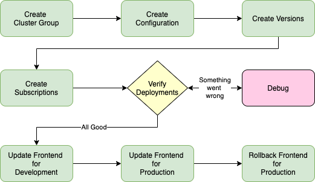

During this demonstration, you will perform the following tasks.

- View the **cluster groups** for development and production environments
- Open your Satellite **configuration** for the Food Delivery application
- Create **versions** to:
    - Deploy Kafka, Mongo, and Redis backends
    - Deploy backend microservices
    - Deploy 2 versions of the application front end
- Create **subscriptions** for the **cluster groups** and **versions**
- Verify deployment of the application components
- Change the application frontend to a new **version** for development environment
- Change the application frontend to a new **version** for production environment
- Rollback the production environment to the original application front end

Remember, the IBM Cloud Satellite Location in AWS has already been provisioned. In addition, two Red Hat OpenShift on IBM Cloud clusters have been provisioned: one in the Satellite Location and one in another IBM Cloud datacenter.

!!! info "Important"
    Both an IBM Cloud Satellite **configuration** and an OpenShift **project (also known as a namespace)** have been created for you. The name for each of these is based upon your IBMid. Your IBMid is **not** the same as your IBM login. If you do not know your IBMid, you can find it in the IBM Cloud portal by navigating to: <a href="https://cloud.ibm.com/iam/users" target="_blank">https://cloud.ibm.com/iam/users</a>, and then selecting your IBM Cloud user identity. You will see your IBMid in the URL for the page that is loaded or by clicking on the Details link at the right of your user page. The format of the IBMid will be similar to: "IBMid-#######ABC". The **configuration** and **namespace** will be based upon the last part of your IBMid with **-ns** appended (i.e. #######abc-ns in all lower case to conform to **namespace** naming rules).

    In this documentation, we will use **#######abc-ns** to refer to the **configuration** and **namespace**, but you will need to make sure you select the **configuration** and **namespace** based upon your IBMid value.

!!! tip
    How you orchestrate a demonstration for a client will depend on how much time you have for the demonstration, the audience, and your comfort level with the underlying technologies. For instance, if you have a very limited amount to time, you may create the **versions** before you start the demonstration to save time. If you have a more technical audience, you may want to describe the content of the YAML files that are used. As you walk through the steps in the next section, consider how you would customize the demonstration based upon time, audience, etc.
