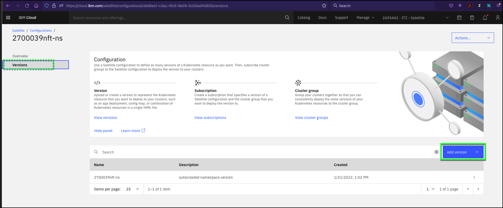
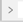
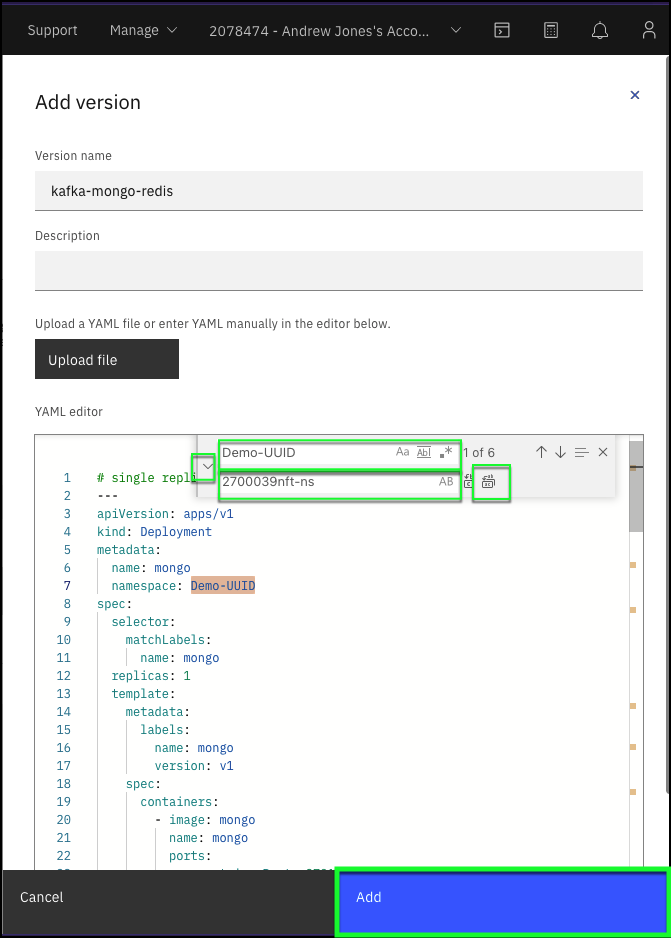

Now that the Configuration has been created, the next step is to create **versions** for each part of the Food Delivery application. In this example, the YAML files used will create OpenShift deployments and routes in the namespace that has been created for you in the respective OpenShift clusters. Four **deployment** versions will be created: two for the backend services of the application and two different frontends. These **deployments** will deploy the Kubernetes containers that include the container images and application code. **Versions** will also be created for the development (dev) and production (prod) environments that will define **routes**. Routes are used in OpenShift to define communication paths between the end user and the frontend of the application, as well as from the frontend to the backend, and backend to the various backend datastores.

!!! tip
    Don't be intimidated by the length this section. Most of it is code that you will cut and paste into the IBM Cloud portal.

1. If you closed the IBM Cloud portal after the previous step, open the IBM Cloud portal to the Satellite Configurations page: <a href="https://cloud.ibm.com/satellite/configuration" target="_blank">https://cloud.ibm.com/satellite/configuration</a>.

2. Click the **configuration** based on your **{{ tz_environment.uuid_label }}**.


3. Click the **Versions** link in left hand menu.

!!! warning
    Notice, one **Version** already exists in your configuration. This **Version** was used to create the OpenShift project where you will be deploying the application. Do **NOT** delete any existing versions or subscriptions! Deleting them will break your demonstration environment.


4. Click **Add version +**.



5. Create a **version** called **kafka-mongo-redis**.

!!! info "Important"
    Do NOT click the **Add** button until AFTER you complete step 6!!!

For the Version name, use:

```
kafka-mongo-redis
```
!!! tip
    To save time, use click the  icon in the sections below to copy the text to your clipboard and then paste the text into the IBM Cloud portal as directed.

Optionally, enter a description in the **Description** field.

Copy and paste the following YAML code into the **YAML editor**.

``` yaml title="kafka-mongo-redis.yaml"
# single replica - no persistence
---
apiVersion: apps/v1
kind: Deployment
metadata:
  name: mongo
  namespace: {{ tz_environment.uuid_label }}
spec:
  selector:
    matchLabels:
      name: mongo
  replicas: 1
  template:
    metadata:
      labels:
        name: mongo
        version: v1
    spec:
      containers:
        - image: mongo
          name: mongo
          ports:
            - containerPort: 27017
          volumeMounts:
            - mountPath: /data/db
              name: data
      volumes:
      - name: data
        emptyDir: {}
---
apiVersion: v1
kind: Service
metadata:
  name: mongo
  namespace: {{ tz_environment.uuid_label }}
spec:
  ports:
    - port: 27017
      targetPort: 27017
  selector:
    name: mongo
# no persistence
---
apiVersion: apps/v1
kind: Deployment
metadata:
  name: redis
  namespace: {{ tz_environment.uuid_label }}
spec:
  selector:
    matchLabels:
      name: redis
  replicas: 1
  template:
    metadata:
      labels:
        name: redis
        version: v1
    spec:
      containers:
        - image: redis
          name: redis
          ports:
            - containerPort: 6379
          volumeMounts:
            - mountPath: /data
              name: data
      volumes:
      - name: data
        emptyDir: {}
---
apiVersion: v1
kind: Service
metadata:
  name: redis
  namespace: {{ tz_environment.uuid_label }}
spec:
  ports:
    - port: 6379
      targetPort: 6379
  selector:
    name: redis
---
apiVersion: v1
kind: Service
metadata:
  name: kafka
  namespace: {{ tz_environment.uuid_label }}
spec:
  ports:
    - port: 9092
      protocol: TCP
      targetPort: 9092
  selector:
    name: kafka
---
apiVersion: apps/v1
kind: Deployment
metadata:
  name: kafka
  namespace: {{ tz_environment.uuid_label }}
spec:
  selector:
    matchLabels:
      name: kafka
  template:
    metadata:
      labels:
        name: kafka
    spec:
      containers:
      - image: bitnami/zookeeper:3.6.3
        name: zookeeper
        env:
        - name: ALLOW_ANONYMOUS_LOGIN
          value: 'yes'
        ports:
        - containerPort: 2181
          name: zookeeper
      - image: bitnami/kafka:2.8.0
        name: kafka
        env:
        - name: KAFKA_BROKER_ID
          value: '1'
        - name: KAFKA_CFG_LISTENERS
          value: 'PLAINTEXT://:9092'
        - name: KAFKA_CFG_ADVERTISED_LISTENERS
          value: 'PLAINTEXT://kafka:9092'
        - name: KAFKA_CFG_ZOOKEEPER_CONNECT
          value: 'localhost:2181'
        - name: ALLOW_PLAINTEXT_LISTENER
          value: 'yes'
        ports:
        - containerPort: 9092
          name: kafka
```


6. Search and replace all instances of **{{ tz_environment.uuid_label }}** with your unique **{{ tz_environment.uuid_label }}**.

The YAML editor in the IBM Cloud portal has a **search and replace** function. Type ++ctrl++**+f** or ++cmd++**+f** (this will vary depending on your computers operating system). Expand the dialog by clicking the  icon next to the entry field. In the first entry field, enter **{{ tz_environment.uuid_label }}**. In the second entry field, enter your unique **{{ tz_environment.uuid_label }}**. The dialog should update with a **"1 of 6"** message. Click the **replace all**  icon to make the changes.



7. Click **Add**.

??? failure "Is the **Add** button not enabled?"
    If the **Add** button isn't enabled, there is a problem with your YAML. YAML is very sensitive to formatting. Make sure you cut & paste the YAML instead of entering it manually.

8. Repeat the process and create a **version** called **food-delivery-backend**.

For the Version name, use:

```
food-delivery-backend
```

Optionally, enter a description in the **Description** field.

Copy and paste the following YAML code into the **YAML editor**.

``` yaml title="food-delivery-backend.yaml"
---
apiVersion: apps/v1
kind: Deployment
metadata:
  name: apiservice
  namespace: {{ tz_environment.uuid_label }}
  labels:
    razee/watch-resource: detail
spec:
  selector:
    matchLabels:
      name: apiservice
  replicas: 1
  template:
    metadata:
      labels:
        name: apiservice
    spec:
      containers:
        - image: anthonyamanse/apiservice:1.0.ddc
          name: apiservice
          imagePullPolicy: Always
          ports:
            - containerPort: 8080
          env:
            - name: STATUS_SERVICE
              value: 'http://status:8080'
            - name: BOOTSTRAP_SERVERS
              value: 'kafka:9092'
---
apiVersion: v1
kind: Service
metadata:
  name: apiservice
  namespace: {{ tz_environment.uuid_label }}
  labels:
    razee/watch-resource: detail
spec:
  ports:
    - port: 8080
      targetPort: 8080
  selector:
    name: apiservice
---
apiVersion: apps/v1
kind: Deployment
metadata:
  name: courier
  namespace: {{ tz_environment.uuid_label }}
  labels:
    razee/watch-resource: detail
spec:
  selector:
    matchLabels:
      name: courier
  replicas: 1
  template:
    metadata:
      labels:
        name: courier
    spec:
      containers:
        - image: anthonyamanse/courierconsumer:1.0.ddc
          imagePullPolicy: Always
          name: courier
          env:
            - name: MONGODB_REPLICA_HOSTNAMES
              value: 'mongo:27017'
            - name: BOOTSTRAP_SERVERS
              value: 'kafka:9092'
---
apiVersion: apps/v1
kind: Deployment
metadata:
  name: kitchen
  namespace: {{ tz_environment.uuid_label }}
  labels:
    razee/watch-resource: detail
spec:
  selector:
    matchLabels:
      name: kitchen
  replicas: 1
  template:
    metadata:
      labels:
        name: kitchen
    spec:
      containers:
        - image: anthonyamanse/kitchenconsumer:1.0.ddc
          imagePullPolicy: Always
          name: kitchen
          env:
            - name: MONGODB_REPLICA_HOSTNAMES
              value: 'mongo:27017'
            - name: BOOTSTRAP_SERVERS
              value: 'kafka:9092'
---
apiVersion: apps/v1
kind: Deployment
metadata:
  name: orders
  namespace: {{ tz_environment.uuid_label }}
  labels:
    razee/watch-resource: detail
spec:
  selector:
    matchLabels:
      name: orders
  replicas: 1
  template:
    metadata:
      labels:
        name: orders
    spec:
      containers:
        - image: anthonyamanse/orderconsumer:1.0.ddc
          imagePullPolicy: Always
          name: orders
          env:
            - name: MONGODB_REPLICA_HOSTNAMES
              value: 'mongo:27017'
            - name: BOOTSTRAP_SERVERS
              value: 'kafka:9092'
---
apiVersion: apps/v1
kind: Deployment
metadata:
  name: podconsumerdata
  namespace: {{ tz_environment.uuid_label }}
  labels:
    razee/watch-resource: detail
spec:
  selector:
    matchLabels:
      name: podconsumerdata
  replicas: 1
  template:
    metadata:
      labels:
        name: podconsumerdata
    spec:
      serviceAccountName: deployer
      containers:
        - image: anthonyamanse/poddata:1.0.ddc
          imagePullPolicy: Always
          ports:
            - containerPort: 8080
          name: podconsumerdata
          env:
            - name: POD_NAMESPACE
              valueFrom:
                fieldRef:
                  fieldPath: metadata.namespace
---
apiVersion: v1
kind: Service
metadata:
  name: podconsumerdata
  namespace: {{ tz_environment.uuid_label }}
  labels:
    razee/watch-resource: detail
spec:
  ports:
    - port: 8080
      targetPort: 8080
  selector:
    name: podconsumerdata
---
apiVersion: apps/v1
kind: Deployment
metadata:
  name: realtimedata
  namespace: {{ tz_environment.uuid_label }}
  labels:
    razee/watch-resource: detail
spec:
  selector:
    matchLabels:
      name: realtimedata
  replicas: 1
  template:
    metadata:
      labels:
        name: realtimedata
    spec:
      containers:
        - image: anthonyamanse/realtimedata:1.0.ddc
          imagePullPolicy: Always
          name: realtimedata
          ports:
            - containerPort: 8080
          env:
            - name: BOOTSTRAP_SERVERS
              value: 'kafka:9092'
---
apiVersion: v1
kind: Service
metadata:
  name: realtimedata
  namespace: {{ tz_environment.uuid_label }}
  labels:
    razee/watch-resource: detail
spec:
  ports:
    - port: 8080
      targetPort: 8080
  selector:
    name: realtimedata
---
apiVersion: apps/v1
kind: Deployment
metadata:
  name: status
  namespace: {{ tz_environment.uuid_label }}
  labels:
    razee/watch-resource: detail
spec:
  selector:
    matchLabels:
      name: status
  replicas: 1
  template:
    metadata:
      labels:
        name: status
    spec:
      containers:
        - image: anthonyamanse/statusservice:1.0.ddc
          imagePullPolicy: Always
          name: status
          ports:
            - containerPort: 8080
          env:
            - name: REDIS_URL
              value: 'redis'
            - name: REDIS_PORT
              value: '6379'
            - name: BOOTSTRAP_SERVERS
              value: 'kafka:9092'
---
apiVersion: v1
kind: Service
metadata:
  name: status
  namespace: {{ tz_environment.uuid_label }}
  labels:
    razee/watch-resource: detail
spec:
  ports:
    - port: 8080
      targetPort: 8080
  selector:
    name: status
```

9. Search and replace all instances of **{{ tz_environment.uuid_label }}** with your unique **{{ tz_environment.uuid_label }}**.

The YAML editor in the IBM Cloud portal has a **search and replace** function. Type ++ctrl++**+f** or ++cmd++**+f** (this will vary depending on your computers operating system). Expand the dialog by clicking the  icon next to the entry field. In the first entry field, enter **{{ tz_environment.uuid_label }}**. In the second entry field, enter your unique **{{ tz_environment.uuid_label }}**. The dialog should update with a **"1 of 11"** message. Click the **replace all**  icon to make the changes.

10. Click **Add**.

11. Repeat the process and create a **version** called **food-delivery-frontend-v1**.

For the Version name, use:

```
food-delivery-frontend-v1
```

Optionally, enter a description in the **Description** field.

Copy and paste the following YAML code into the **YAML editor**.

``` yaml title="food-delivery-frontend-v1.yaml"
---
apiVersion: apps/v1
kind: Deployment
metadata:
  name: example-food
  namespace: {{ tz_environment.uuid_label }}
  labels:
    razee/watch-resource: detail
spec:
  selector:
    matchLabels:
      name: example-food
  replicas: 1
  template:
    metadata:
      labels:
        name: example-food
    spec:
      containers:
        - image: anthonyamanse/example-food-frontend:1.0.ddc
          name: example-food
          imagePullPolicy: Always
          ports:
            - containerPort: 8090
---
apiVersion: v1
kind: Service
metadata:
  name: example-food
  namespace: {{ tz_environment.uuid_label }}
  labels:
    razee/watch-resource: detail
spec:
  ports:
    - port: 8090
      targetPort: 8090
  selector:
    name: example-food
```

12. Search and replace all instances of **{{ tz_environment.uuid_label }}** with your unique **{{ tz_environment.uuid_label }}**.

The YAML editor in the IBM Cloud portal has a **search and replace** function. Type ++ctrl++**+f** or ++cmd++**+f** (this will vary depending on your computers operating system). Expand the dialog by clicking the  icon next to the entry field. In the first entry field, enter **{{ tz_environment.uuid_label }}**. In the second entry field, enter your unique **{{ tz_environment.uuid_label }}**. The dialog should update with a **"1 of 2"** message. Click the **replace all**  icon to make the changes.

13. Click **Add**.

14. Repeat the process and create a **version** called **food-delivery-frontend-v2**.

For the Version name, use:

```
food-delivery-frontend-v2
```

Optionally, enter a description in the **Description** field.

Copy and paste the following YAML code into the **YAML editor**.

``` yaml title="food-delivery-frontend-v2.yaml"
---
apiVersion: apps/v1
kind: Deployment
metadata:
  name: example-food
  namespace: {{ tz_environment.uuid_label }}
  labels:
    razee/watch-resource: detail
spec:
  selector:
    matchLabels:
      name: example-food
  replicas: 1
  template:
    metadata:
      labels:
        name: example-food
    spec:
      containers:
        - image: anthonyamanse/example-food-frontend:2.0.ddc
          name: example-food
          imagePullPolicy: Always
          ports:
            - containerPort: 8090
---
apiVersion: v1
kind: Service
metadata:
  name: example-food
  namespace: {{ tz_environment.uuid_label }}
  labels:
    razee/watch-resource: detail
spec:
  ports:
    - port: 8090
      targetPort: 8090
  selector:
    name: example-food
```

15. Search and replace all instances of **{{ tz_environment.uuid_label }}** with your unique **{{ tz_environment.uuid_label }}**.

The YAML editor in the IBM Cloud portal has a **search and replace** function. Type ++ctrl++**+f** or ++cmd++**+f** (this will vary depending on your computers operating system). Expand the dialog by clicking the  icon next to the entry field. In the first entry field, enter **{{ tz_environment.uuid_label }}**. In the second entry field, enter your unique **{{ tz_environment.uuid_label }}**. The dialog should update with a **"1 of 2"** message. Click the **replace all**  icon to make the changes.

16. Click **Add**.

17. Repeat the process and create a **version** called **development-route**.

For the Version name, use:

```
development-route
```

Optionally, enter a description in the **Description** field.

Copy and paste the following YAML code into the **YAML editor**.

``` yaml title="development-route.yaml"
apiVersion: route.openshift.io/v1
kind: Route
metadata:
  name: example-food
  namespace: {{ tz_environment.uuid_label }}
spec:
  host: example-food-{{ tz_environment.uuid_label }}.{{ aws.ingress }}
  port:
    targetPort: 8090
  to:
    kind: Service
    name: example-food
---
apiVersion: route.openshift.io/v1
kind: Route
metadata:
  name: apiservice-path-creatorder
  namespace: {{ tz_environment.uuid_label }}
spec:
  host: example-food-{{ tz_environment.uuid_label }}.{{ aws.ingress }}
  path: "/createOrder"
  port:
    targetPort: 8080
  to:
    kind: Service
    name: apiservice
---
apiVersion: route.openshift.io/v1
kind: Route
metadata:
  name: apiservice-path-status
  namespace: {{ tz_environment.uuid_label }}
spec:
  host: example-food-{{ tz_environment.uuid_label }}.{{ aws.ingress }}
  path: "/status"
  port:
    targetPort: 8080
  to:
    kind: Service
    name: apiservice
---
apiVersion: route.openshift.io/v1
kind: Route
metadata:
  name: apiservice-path-restaurants
  namespace: {{ tz_environment.uuid_label }}
spec:
  host: example-food-{{ tz_environment.uuid_label }}.{{ aws.ingress }}
  path: "/restaurants"
  port:
    targetPort: 8080
  to:
    kind: Service
    name: apiservice
---
apiVersion: route.openshift.io/v1
kind: Route
metadata:
  name: apiservice-path-user
  namespace: {{ tz_environment.uuid_label }}
spec:
  host: example-food-{{ tz_environment.uuid_label }}.{{ aws.ingress }}
  path: "/user"
  port:
    targetPort: 8080
  to:
    kind: Service
    name: apiservice
---
apiVersion: route.openshift.io/v1
kind: Route
metadata:
  name: realtimedata-path-events
  namespace: {{ tz_environment.uuid_label }}
spec:
  host: example-food-{{ tz_environment.uuid_label }}.{{ aws.ingress }}
  path: "/events"
  port:
    targetPort: 8080
  to:
    kind: Service
    name: realtimedata
---
apiVersion: route.openshift.io/v1
kind: Route
metadata:
  name: podconsumerdata-path-consumers
  namespace: {{ tz_environment.uuid_label }}
spec:
  host: example-food-{{ tz_environment.uuid_label }}.{{ aws.ingress }}
  path: "/consumers"
  port:
    targetPort: 8080
  to:
    kind: Service
    name: podconsumerdata
---
apiVersion: route.openshift.io/v1
kind: Route
metadata:
  name: favorites-path
  namespace: {{ tz_environment.uuid_label }}
spec:
  host: example-food-{{ tz_environment.uuid_label }}.{{ aws.ingress }}
  path: "/favorites"
  port:
    targetPort: 8080
  to:
    kind: Service
    name: ksql-controller
---
```

18. Search and replace all instances of **{{ tz_environment.uuid_label }}** with your unique **{{ tz_environment.uuid_label }}**.

The YAML editor in the IBM Cloud portal has a **search and replace** function. Type ++ctrl++**+f** or ++cmd++**+f** (this will vary depending on your computers operating system). Expand the dialog by clicking the  icon next to the entry field. In the first entry field, enter **{{ tz_environment.uuid_label }}**. In the second entry field, enter your unique **{{ tz_environment.uuid_label }}**. The dialog should update with a **"1 of 16"** message. Click the **replace all**  icon to make the changes.

19. Click **Add**.

20. Repeat the process and create a **version** called **production-route**.

For the Version name, use:

```
production-route
```

Optionally, enter a description in the **Description** field.

Copy and paste the following YAML code into the **YAML editor**.


``` yaml title="production-route.yaml"
apiVersion: route.openshift.io/v1
kind: Route
metadata:
  name: example-food
  namespace: {{ tz_environment.uuid_label }}
spec:
  host: example-food-{{ tz_environment.uuid_label }}.{{ ibm.ingress }}
  port:
    targetPort: 8090
  to:
    kind: Service
    name: example-food
---
apiVersion: route.openshift.io/v1
kind: Route
metadata:
  name: apiservice-path-creatorder
  namespace: {{ tz_environment.uuid_label }}
spec:
  host: example-food-{{ tz_environment.uuid_label }}.{{ ibm.ingress }}
  path: "/createOrder"
  port:
    targetPort: 8080
  to:
    kind: Service
    name: apiservice
---
apiVersion: route.openshift.io/v1
kind: Route
metadata:
  name: apiservice-path-status
  namespace: {{ tz_environment.uuid_label }}
spec:
  host: example-food-{{ tz_environment.uuid_label }}.{{ ibm.ingress }}
  path: "/status"
  port:
    targetPort: 8080
  to:
    kind: Service
    name: apiservice
---
apiVersion: route.openshift.io/v1
kind: Route
metadata:
  name: apiservice-path-restaurants
  namespace: {{ tz_environment.uuid_label }}
spec:
  host: example-food-{{ tz_environment.uuid_label }}.{{ ibm.ingress }}
  path: "/restaurants"
  port:
    targetPort: 8080
  to:
    kind: Service
    name: apiservice
---
apiVersion: route.openshift.io/v1
kind: Route
metadata:
  name: apiservice-path-user
  namespace: {{ tz_environment.uuid_label }}
spec:
  host: example-food-{{ tz_environment.uuid_label }}.{{ ibm.ingress }}
  path: "/user"
  port:
    targetPort: 8080
  to:
    kind: Service
    name: apiservice
---
apiVersion: route.openshift.io/v1
kind: Route
metadata:
  name: realtimedata-path-events
  namespace: {{ tz_environment.uuid_label }}
spec:
  host: example-food-{{ tz_environment.uuid_label }}.{{ ibm.ingress }}
  path: "/events"
  port:
    targetPort: 8080
  to:
    kind: Service
    name: realtimedata
---
apiVersion: route.openshift.io/v1
kind: Route
metadata:
  name: podconsumerdata-path-consumers
  namespace: {{ tz_environment.uuid_label }}
spec:
  host: example-food-{{ tz_environment.uuid_label }}.{{ ibm.ingress }}
  path: "/consumers"
  port:
    targetPort: 8080
  to:
    kind: Service
    name: podconsumerdata
---
apiVersion: route.openshift.io/v1
kind: Route
metadata:
  name: favorites-path
  namespace: {{ tz_environment.uuid_label }}
spec:
  host: example-food-{{ tz_environment.uuid_label }}.{{ ibm.ingress }}
  path: "/favorites"
  port:
    targetPort: 8080
  to:
    kind: Service
    name: ksql-controller
---
```

21. Search and replace all instances of **{{ tz_environment.uuid_label }}** with your unique **{{ tz_environment.uuid_label }}**.

The YAML editor in the IBM Cloud portal has a **search and replace** function. Type ++ctrl++**+f** or ++cmd++**+f** (this will vary depending on your computers operating system). Expand the dialog by clicking the  icon next to the entry field. In the first entry field, enter **{{ tz_environment.uuid_label }}**. In the second entry field, enter your unique **{{ tz_environment.uuid_label }}**. The dialog should update with a **"1 of 16"** message. Click the **replace all**  icon to make the changes.

22. Click **Add**.

23. Verify the six (6) versions have been created.

You should see a total of seven versions. The six that you created:

   - kafka-mongo-redis
   - food-delivery-backend
   - food-Delivery-frontend-v1
   - food-delivery-frontend-v2
   - develoment-route
   - production-route

and the one, used to create your specific projects in the OpenShift clusters.


