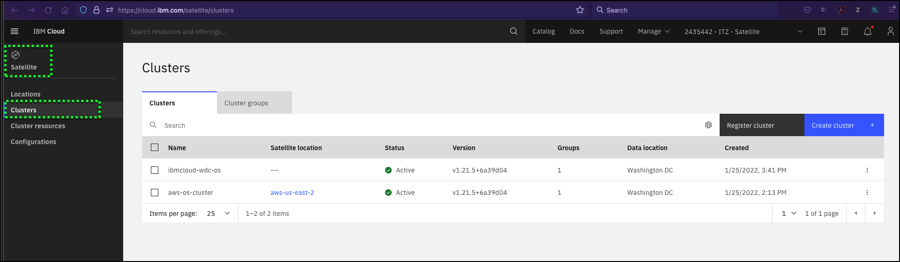
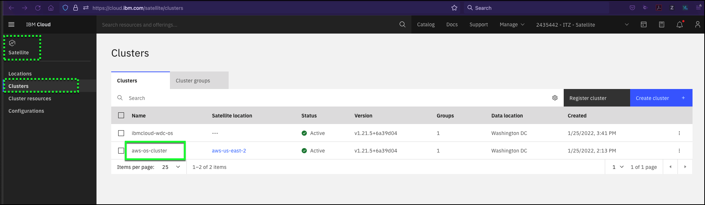
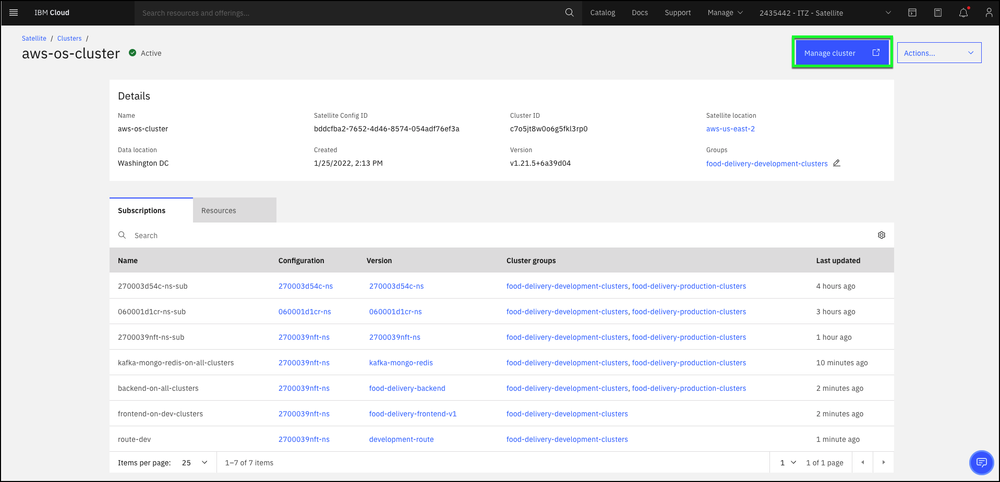
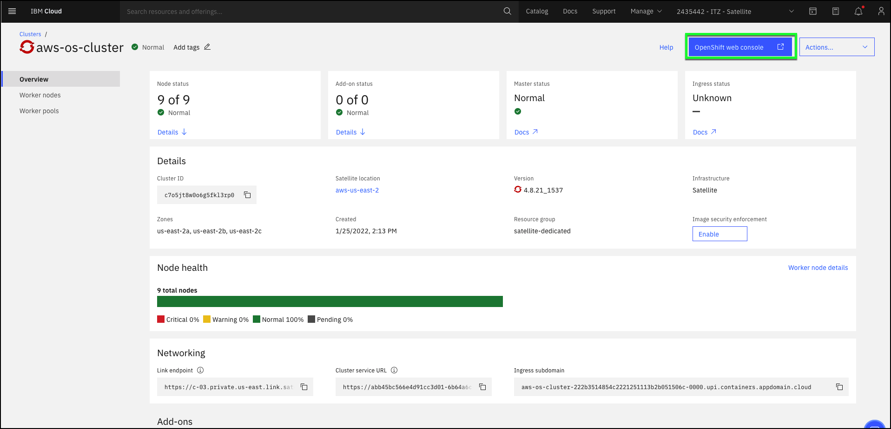
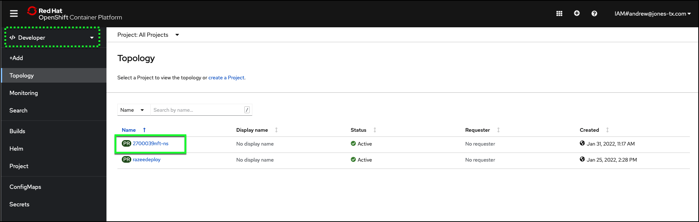
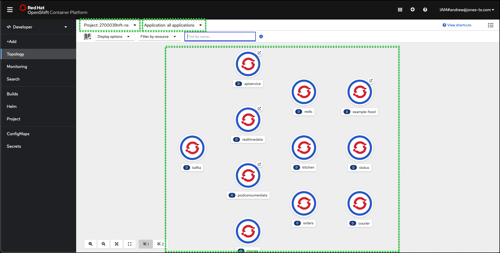
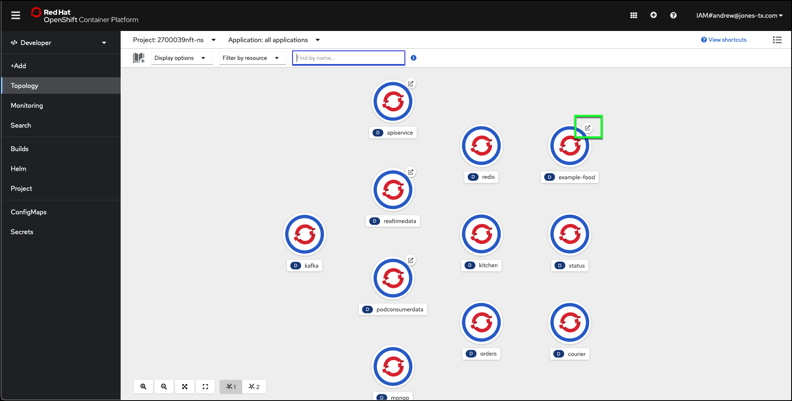
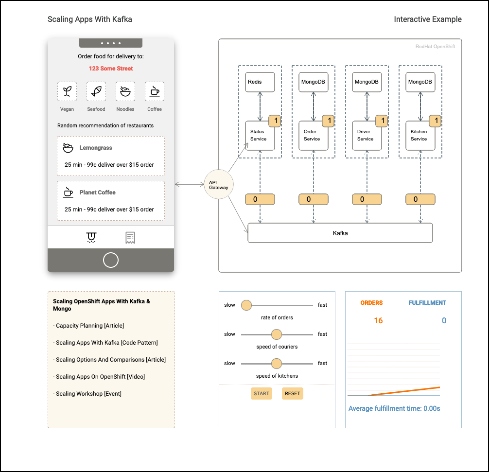
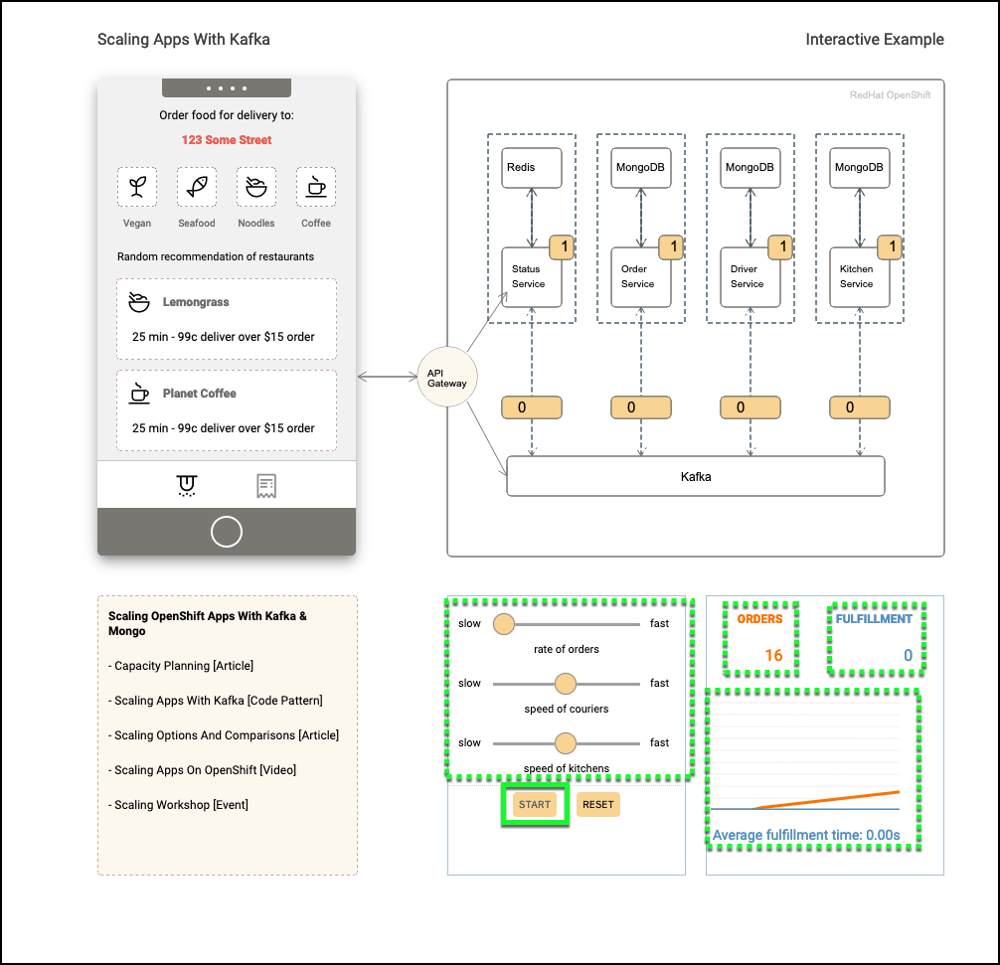
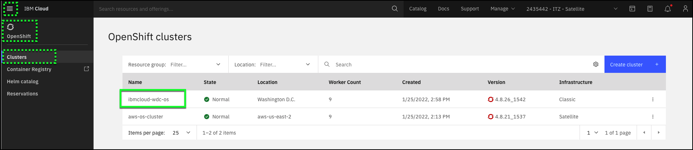

At this point, the application should be identically deployed to both the development (AWS) and production (IBM Cloud) clusters. This can be verified by looking at the OpenShift console for the development cluster running at the IBM Cloud Satellite Location in AWS and the cluster running in IBM Cloud.

1. If not already open, open the IBM Cloud portal to the Clusters: <a href="https://cloud.ibm.com/satellite/clusters" target="_blank">https://cloud.ibm.com/satellite/clusters</a>.

2. Click the **aws-os-cluster** label.

Be sure to click the correct label as illustrated in the image below.

3. Click the **Manage cluster** button.

This will open a new browser window or tab to the cluster's overview page in the IBM Cloud portal.

4. Click the **OpenShift web console** button.

This will open a new browser window or tab to the OpenShift web console for the cluster. You may need to close any pop-up dialogs regarding tutorials.

5. Click the **Topology** link in left hand navigation.

6. If not already selected, select the **project** based upon your **{{ tz_environment.uuid_label }}** from the **Topology** view.

!!! info
    The image capture below is different than what you will see. Be sure and select the project (namespace) created for you based upon your **{{ tz_environment.uuid_label }}**.

7. Verify all the **Deployments** for the Food Delivery application are present.

The image capture below may differ slightly from what you see. It is important to point out the **Deployments** represented here were created from the **Subscriptions** to the **Versions** you created for the **Configuration**. Notice that some of the **Deployments** have routes added to them. Routes are represented by the .

8. Verify the application frontend is running by clicking the route icon  for the **example-food** deployment.

A new browser window or tab should be opened to the Food Delivery application frontend.

9. Explore the Food Delivery application.

Start simulating orders into the system by clicking the **START** button. Notice the orders being received and fulfilled in the graph on lower right of the interface. These values represent orders moving through ordering to fulfillment. You can adjust the rate that orders are processed as well has the rate of kitchen time and delivery services. Orders should start being fulfilled after a minute or two.

!!! warning
    You may experience a delay in the application reporting orders being fulfilled.  This usually occurs when the demonstration environment is experiencing heavy usage or starting for the first time. You can increase the speed of couriers and speed of kitchens by adjusting the sliders. R

10. Repeat steps 2 through 9 for the production environment cluster: **{{ ibm.cluster_name }}**.

Use this link to open the IBM Cloud OpenShift clusters page: <a href="https://cloud.ibm.com/kubernetes/clusters?platformType=openshift" target="_blank">https://cloud.ibm.com/kubernetes/clusters?platformType=openshift</a>.

