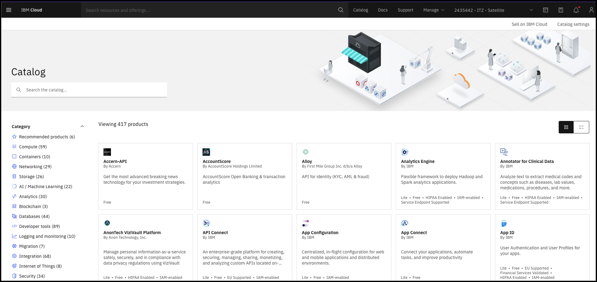
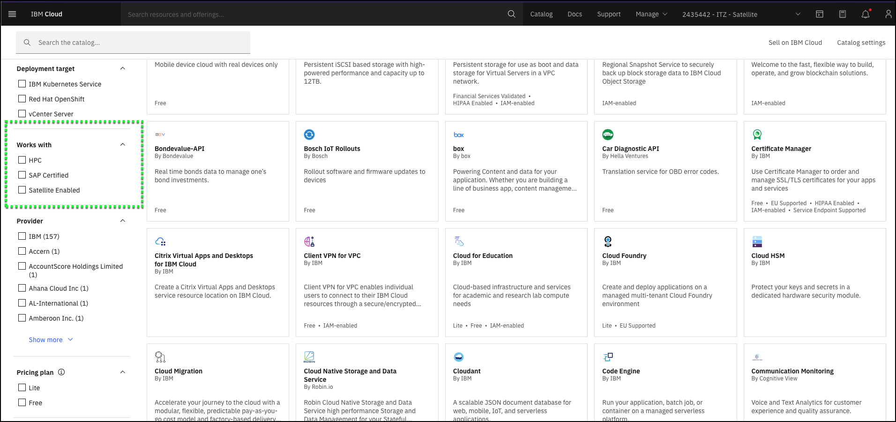
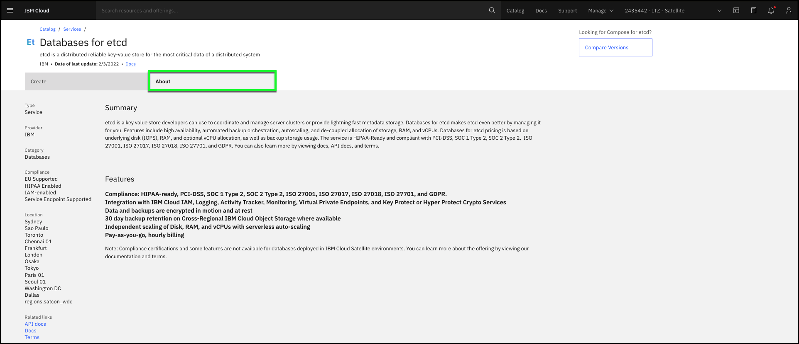

You can easily find all the IBM Cloud Satellite enabled services using the IBM Cloud portal.

!!! info "Important"
    In this demonstration environment, you will NOT have the permissions to provision new services. However, you can explore the IBM Cloud Satellite enabled services.

1. Open the IBM Cloud portal to the IBM Cloud Catalog page: <a href="https://cloud.ibm.com/catalog" target="_blank">https://cloud.ibm.com/catalog</a>

2. Change from your IBM Cloud account to the **{{ account }}** account.

!!! tip
    If your browser window is narrow, you may see this icon:  instead of the current account name as shown in the screen capture above.

3. Scroll down to the **Works with** section of the left-hand navigation bar.

4. Click the **Satellite Enabled** check box.

Your page is now filtered to view all the IBM Cloud Satellite enabled services. You can learn more about each of these by clicking on the respective tiles and then clicking on the **About** tab for the selected service. It is important to remember that the catalog of Satellite enabled services will continue to grow.

At this time, you should explore each of the services to learn more about them.

In the next section, see how Red Hat OpenShift on IBM Cloud was deployed to the demonstration environment.
