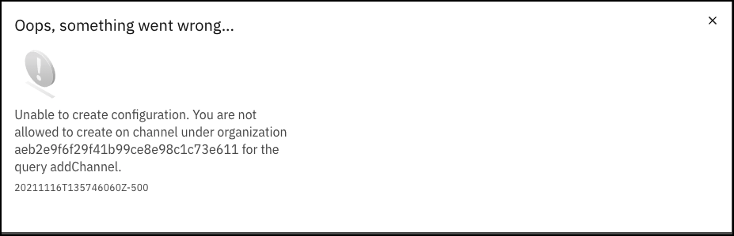
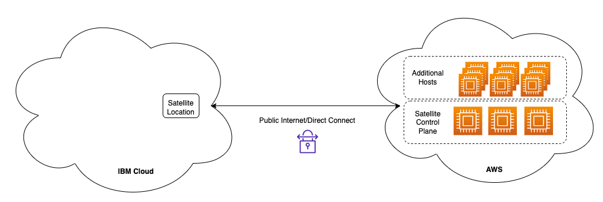

IBM Cloud Satellite is an extension of the IBM Cloud that can run inside a client's data center, at the edge, in public clouds, or any location of the client’s choice. The IBM Cloud Satellite managed distributed cloud solution delivers cloud services, APIs, access policies, security controls and compliance.

This IBM Technology Sales Enablement demonstration is part of the Your Learning Level 3 learning path for IBM Cloud Satellite found <a href="https://yourlearning.ibm.com/activity/PLAN-37F924EAF756" target="_blank">here</a>. The content here is **not** meant as a replacement for the Level 1 and 2 content that is part of that learning path. You should be familiar with IBM Cloud Satellite and should have completed the <a href="https://yourlearning.ibm.com/activity/PLAN-37F924EAF756" target="_blank"> Cloud Satellite Sales Foundation Badge</a>.

This demonstration environment has a dual purpose. First, it is meant to educate you on IBM Cloud Satellite and how to demonstrate some of the capabilities of IBM Cloud Satellite to clients. In addition, the environment can be used for actual client demonstrations. Once you are familiar with the content, get in front of a client, and show the power of IBM Cloud Satellite.

!!! important
    The focus of the demonstration is on the Infrastructure as a Service capability of IBM Cloud Satellite and not on the specific services deployed to a Satellite Location (for example: Red Hat OpenShift on IBM Cloud).

Provisioning a Satellite Location on a public cloud like AWS, is automated and typically takes 25-30 minutes depending on the cloud provider, configuration of the servers being used, and other factors. Deploying Red Hat OpenShift on IBM Cloud to the Satellite Location usually takes another 30-45 minutes. In addition, to easily access resources on those servers you would need to either create a Virtual Private Network or manually make some network configuration changes. This can be time consuming and error prone and will typically take longer than most clients are willing to sit through.

In this demonstration asset, an IBM Cloud Satellite environment has already been provisioned for you. Notice, in the table of contents of this guide, you will see:

   - chapters that define specific terms
   - chapters that contain videos of provisioning and configuration steps
   - chapters that step you through a demonstration you can perform **live** for your client using the environment provided here

In this demonstration environment, you will NOT have full access to the IBM Cloud Satellite capabilities. Your user ID will be restricted to specific capabilities. For example, you can:

   - view Satellite Locations, Clusters, Cluster Groups, and Configurations using the IBM Cloud portal and Command Line Interfaces (CLIs)
   - create new Versions and Subscriptions

You will **not** have permissions to:

   - create new Satellite Locations, Clusters, Cluster Groups, or Configurations
   - deploy new IBM Cloud Services (for example: IBM Cloud Databases, Key Protect, etc.)

!!! warning
    Attempting to perform an action that you do not have permissions for will result in an error message like the one below. This is not an issue with the IBM Cloud or IBM Cloud Satellite offering, rather just a restriction of the demo environment and the permissions assigned to users.

    

This IBM Cloud Satellite demonstration is built using the IBM TechZone collection: ***Setup an IBM Cloud Satellite Location in AWS***, which can be found <a href="https://techzone.ibm.com/collection/SetupIBMCloudSatelliteLocationInAWS" target ="_blank">here</a>. You may want to leverage this resource to build a custom environment or client Proof-of-Concept (POC). You can also use this collection to perform client demonstrations, but be aware of the time required to provision, configure, and apply configuration changes to have a working environment (minimum 1-2 hours).

In this part of the demonstration script, you will explore the provisioning of an IBM Cloud Satellite Location to a public cloud. In this case, AWS is the target public cloud. This initial deployment architecture is illustrated below.

In addition to the Satellite location, in this demonstration environment a Red Hat OpenShift on IBM Cloud instance has been deployed to the Satellite Location running in AWS. You will explore the deployment of OpenShift and other IBM Cloud Satellite enabled services in Part 2 of this demonstration script.
