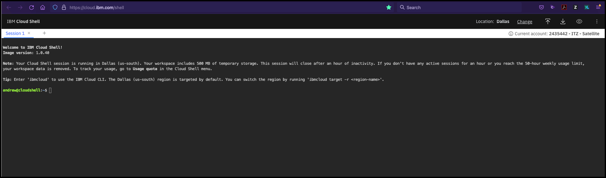

Command Line Interfaces (CLIs) are available for IBM Cloud Satellite. In this section, explore the CLI capabilities related to IBM Cloud Satellite Locations. You can learn more about all the IBM Cloud Satellite CLIs <a href="https://cloud.ibm.com/docs/satellite?topic=satellite-satellite-cli-reference" target="_blank">here</a>. When doing client demonstrations, it is important to understand who is in your audience. Performing demonstrations of CLIs to a Chief Technology Officer (CTO) or Chief Information Officer (CIO) may not be well received; however, this type of demonstration may resonate well with other audiences like members of the IT staff, line-of-business developers, and others. These audiences will want to know that CLIs exist to perform the IBM Cloud Satellite tasks as they will probably want to further automate them in their deployments.

In this part of the demonstration, you will use the IBM Cloud Shell. If you are not familiar with IBM Cloud Shell, you can learn about it <a href="https://cloud.ibm.com/docs/cloud-shell?topic=cloud-shell-getting-started" target="_blank">here</a>.

!!! tip
    Use the **copy** capability of the demonstration guide to copy and paste commands to the IBM Cloud Command Shell to avoid typing errors.

1. In the IBM Cloud Portal, with the demonstration account selected (**{{ account }}**), click the IBM Cloud Shell icon.


The IBM Cloud Shell will open in a new browser tab or window. It may take a few seconds for the shell to initialize.



2. Synchronize the Role-based access controls (RBAC) for the IBM Cloud Satellite Location's OpenShift cluster.

```
ibmcloud ks cluster config --cluster {{ aws.cluster_id }}
```

??? example "Example output"
    OK

    The configuration for {{ aws.cluster_id }} was downloaded successfully.

    Added context for {{ aws.cluster_id }} to the current kubeconfig file.
    You can now execute 'kubectl' commands against your cluster. For example, run 'kubectl get nodes'.
    If you are accessing the cluster for the first time, 'kubectl' commands might fail for a few seconds while RBAC synchronizes.

!!! info "Important"
    The above command forces the RBAC to be synchronized between IBM Cloud and the Red Hat OpenShift cluster running in the IBM Cloud Satellite Location. If this command is not run, issues may be encountered later in this demonstration.


3. List the IBM Cloud Satellite Locations.

```
ibmcloud sat locations
```

??? example "Example output"
    Retrieving locations...

    OK

    Name            ID                     Status   Ready   Created     Hosts (used/total)   Managed From

    aws-us-east-2   c7o2a02w03bj8394o9ng   normal   yes     1 day ago   12 / 12              wdc

4. Get the details for a specific IBM Cloud Satellite Location.

```
ibmcloud sat location get --location {{ aws.location }}
```

??? example "Example output"
    Retrieving location...

    OK

    Name:                           aws-us-east-2

    ID:                             c7o2a02w03bj8394o9ng

    Created:                        2022-01-25 16:27:44 +0000 (1 day ago)

    Managed From:                   wdc

    State:                          normal

    Ready for deployments:          yes

    Message:                        R0001: The Satellite location is ready for operations.

    Hosts Available:                0

    Hosts Total:                    12

    Host Zones:                     us-east-2a, us-east-2b, us-east-2c

    Public Service Endpoint URL:    https://c117.us-east.satellite.cloud.ibm.com:30051

    Private Service Endpoint URL:   -

    OpenVPN Server Port:            32196

    Ignition Server Port:           -

    Konnectivity Server Port:       -

5. Get a list of the hosts associated with a specific IBM Cloud Satellite Location.

```
 ibmcloud sat hosts --location {{ aws.location }}
```

??? example "Example output"
    Retrieving hosts...

    OK

    Name            ID                     State      Status   Zone         Cluster          Worker
    ID                                                Worker IP

    ip-10-0-1-114   b7f18e883cd88cace8d7   assigned   Ready    us-east-2a   aws-os-cluster   sat-ip1001114-df552aab5e6958f69e3e2004ff8de9e21e941cdf   10.0.1.114

    ip-10-0-1-250   e30ad9324972c7197d8b   assigned   Ready    us-east-2a   aws-os-cluster   sat-ip1001250-4a2ea8e29c0222974e39d954a4e20f26b7ee702a   10.0.1.250

    ip-10-0-1-51    31ce10f9188d8f39f498   assigned   Ready    us-east-2a   aws-os-cluster   sat-ip100151-7fe9c382d5b86bd3de7113f65189bcbf5c720ab3    10.0.1.51

    ip-10-0-1-80    d22325e1dc4741fd12f2   assigned   Ready    us-east-2a   infrastructure   sat-ip100180-9506c0d50c1faf25ebdee971cd8fb04b03a85f46    10.0.1.80

    ip-10-0-2-179   c092b543a00d50b93890   assigned   Ready    us-east-2b   aws-os-cluster   sat-ip1002179-f4a6bd55983e7e0a8d1071b073dd7bdc983d3f80   10.0.2.179

    ip-10-0-2-4     3839f171b846beb1c1e9   assigned   Ready    us-east-2b   aws-os-cluster   sat-ip10024-2dd947a2bfbbbc129e2c1b618c0e135481ac44b8     10.0.2.4

    ip-10-0-2-49    58a414bd88d303fca850   assigned   Ready    us-east-2b   aws-os-cluster   sat-ip100249-4394d34dc43811c985e6211df97abe31472a8a69    10.0.2.49

    ip-10-0-2-92    ba5337e855ee8b94477f   assigned   Ready    us-east-2b   infrastructure   sat-ip100292-92e16bb3dffb35810fd8fe8a5003abf1745adf81    10.0.2.92

    ip-10-0-3-101   a2650ddf093fbb8b70bc   assigned   Ready    us-east-2c   aws-os-cluster   sat-ip1003101-2584aa634011ba4d8a0f57986f4f6f087fa895cf   10.0.3.101

    ip-10-0-3-111   6dab45fb390d80f5c4d2   assigned   Ready    us-east-2c   aws-os-cluster   sat-ip1003111-5c9a519ad61010c17548c540a510d738f296d975   10.0.3.111

    ip-10-0-3-157   f00f81d01b6860e050df   assigned   Ready    us-east-2c   infrastructure   sat-ip1003157-62a198744fdd0577ea0640a816f8a2f35d2a2198   10.0.3.157

    ip-10-0-3-63    4a856f18f177ffc014eb   assigned   Ready    us-east-2c   aws-os-cluster   sat-ip100363-6bcb834add6d924ce2a0a0772835ae8794497162    10.0.3.63

??? failure "If this fails"
    Occasionally, the above command may time out with a "FAILED: Could not complete request" message.  Try running the command again.

6. Get the details for a specific host.

!!! tip
    You may need to replace the string **{{ aws.host_ip }}** with the name of one of the hosts from the previous command.

```copycommand
ibmcloud sat host get --location {{ aws.location }} --host {{ aws.host_ip }}
```

??? example "Example output"
    Retrieving host details...

    Name:     ip-10-0-1-114

    ID:       b7f18e883cd88cace8d7

    State:    assigned

    Status:   Ready

    Zone:     us-east-2a

    Labels

    cpu      4

    env      prod

    memory   15963200

    os       RHEL7

    zone     us-east-2a

    Assignment

    Cluster:       aws-os-cluster

    Worker Pool:   default

    Worker ID:     sat-ip1001114-df552aab5e6958f69e3e2004ff8de9e21e941cdf

    Worker IP:     10.0.1.114

    Date:          21 hours ago

    OK

All the commands executed above are commands that list or view the details of an IBM Cloud Satellite object. There are also commands to create, remove, and modify these objects. You will perform these types of actions in a later demonstration. In this demonstration environment, you do **not** have permissions to add, remove or change Locations or Hosts.

!!! info inline end "AWS CLI install steps"
    curl "https://awscli.amazonaws.com/awscli-exe-linux-x86_64.zip" -o "awscliv2.zip" -q

    mkdir awsinstall

    mkdir bin

    ./aws/install -i awsinstall -b bin

    aws configure

!!! note "Extra Credit"
    Did you know you can install the AWS command line utilities in your IBM Cloud Shell instance? It doesn't stay persistent, but it only takes a few seconds to install and configure. IBM Cloud Satellite clients may find this useful in managing their hybrid cloud environment.

    For this demonstration, we do not provide the credentials to complete the configuration.
