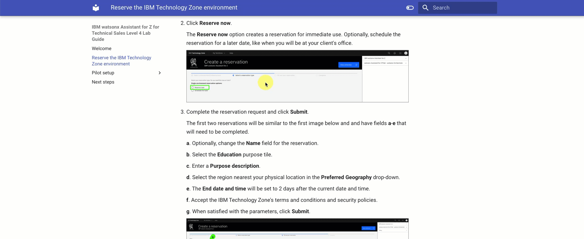

# Welcome
Welcome to the {{guide.name}} (lab guide). The lab guide is part of the {{learningplan.name}} learning plan for IBM and Business Partner Technical Sales and related badge. The learning plan is intended to teach technical sellers and Business Partners how to conduct a proof of experience (PoX) for a client. 

!!! Warning "In a fast-paced world, things change"

    The products and services may appear differently than what is shown in the lab guide. This can occur if the product or service is updated with a new version.

    Responses generated by IBM watsonx Assistant for Z are likely to change over time. The responses you see when you run the queries in this section may differ from the screen images captured in the lab guide. 

This lab guide covers the setup, configuration, and usage of watsonx Assistant for Z. This lab guide uses the <a href="{{itz.collectionURL}}" target="_blank">{{offering.name}} Velocity collection</a> and the three Velocity Pilot lab environments in IBM Technology Zone (ITZ). 

The lab guide also enables dedicated lab environments for customized client PoXs and demonstrations. If you are preparing for an actual pilot engagement, refer to the <a href="https://ibm.seismic.com/Link/Content/DCCRRWqjGBTVc87VBGCfC2F2VQVV" target="_blank">Pilot Scoping Guide for watsonx Assistant for Z</a> for additional information.

Using the lab guide, you will how to:

- Provision the lab environments
- Create an assistant and configuring conversational search
- Configure assistant settings
- Test conversational search
- Deploy a dedicated instance of OpenSearch for client document ingestion (Optional)
- Import skills for z/OS automations
- Connect apps to assistants
- Create assistant actions
- Create skill flows 
- Create custom-built actions
- Import pre-packaged z/OS skills
- Publish and deploy an assistant

!!! Note "Not all capabilities of the offering are covered in the lab guide."

    This lab guide covers many features and capabilities of IBM Watson Assistant for Z, but not all. Some uncovered capabilities may be available in ITZ environments, while others may not, such as using skills for OMEGAMON.

<div style="page-break-after: always;"></div>

<a id="support"></a>
## Support
Think something is down? Check the applicable status pages for any known issues such as a site or service not being available:

-  <a href="https://techzone.status.io/" target="_blank">IBM Technology Zone status</a>

For issues with provisioning the ITZ environment for this lab (for example, a failed reservation request due to insufficient quota capacity), open a ticket with ITZ support:

- Web:  <a href="https://ibmsf.force.com/ibminternalproducts/s/createrecord/NewCase?language=en_US" target="_blank">IBM Technology Zone ticket system</a>

- Email: <a href="mailto:techzone.help@ibm.com" target="_blank">techzone.help@ibm.com</a>

For issues related to specific steps found in the demonstration guide after the ITZ environment is provisioned, contact the authors:

- Slack: 

  - <a href="{{supportSlack.url}}" target="_blank">{{supportSlack.name}}</a> - IBM only
  
  - <a href="{{wxoSupportSlack.url}}" target="_blank">{{wxoSupportSlack.name}}</a> - IBM only - for questions that are related to the software as a service (SaaS) instance of watsonx Orchestrate

- Email: <a href="mailto:{{supportEmailMailTo}}" target="_blank">{{supportEmail}}</a>

Business Partners, use the IBM Training live Chat Support service or other support methods that are found on the IBM Training portal <a href="https://ibmcpsprod.service-now.com/its?id=sc_category&sys_id=6568bfafdb2f13008ea7d6fa4b961990" target="_blank">here</a>.

<div style="page-break-after: always;"></div>

## Using the demonstration guide
Use these helpful tips to take full advantage of the {{guide.name}}.

??? tip "Printing the demonstration guide"

    !!! Warning "Printed or saved copies can be out of date"

        The {{guide.name}} changes regularly to match the {{offering.name}} offering and associated ITZ environment. Printed or saved copies of the demonstration guide can become out-of-date quickly and result in failed steps. 

    A ready-to-print PDF version of the {{guide.name}} is <a href="{{guide.pdf}}" target="_blank">here</a>. 

<a id="cheatsheet"></a>
??? tip "Create a reference card for storing user IDs, passwords, and links for your ITZ environments."

    You will be creating and using multiple user IDs, passwords, links, and other content throughout the lab. To save time, it is strongly suggested you create a simple text file to store this data so it is readily available and you can easily cut and paste the data when needed.  Here is a template to get you started.

    ```
    watsonx Assistant for Z - Level 4 shortcuts:

    watsonx Orchestrate

        IBM Cloud account: 
        IBM Cloud resources: https://cloud.ibm.com/resources
        watsonx Orchestrate URL: 

        Assistant name: 
        Assistant description: 
        Assistant icon: https://ibm.github.io/SalesEnablement-L4-watsonx-AssistantForZ/Setup/_attachments/Zeeves75x75.png

    OpenShift

        Cluster Admin Username: kubeadmin
        Cluster Admin Password: 
        OCP Console: 

        IBM Cloud container entitlement key: 

        OS-secret password: 
        Client ingestion AuthKey: 
        Wrapper password: 
        Cluster domain for routes: 
        Ingestion route (append /v1/query): 

    Ansible

        Ansible Automation Platform URL: 
        AAP User Name: admin
        AAP password:

        Wazi User: IBMUSER
        Wazi Password:
        Wazi URL: 

    Live Embed

        inetegrationID:
        region:
        serviceInstanceID:
    ```

??? tip "Viewing images"

    Images in the demonstration guide can be enlarged by clicking on the image. Press the ++esc++ key or click the **X** to dismiss the enlarged image.
 
    

??? tip "Image highlighting"

    In some images, the following styles of highlighting are used:

    - **Solid highlight box**: This style of box highlights where to click, enter, or select an item.
    

    - **Dash highlight box**: This style of box highlights one of two things: the path to follow to get to a specific location in the user interface, or areas to explore on your own.
    

??? tip "Copying commands and prompts"

    <!-- - **Copy to the clipboard**: The text is copied to the clipboard. Click the copy icon (highlighted) and then use the operating system paste function. For example, entering ```Ctrl+v```, ```Cmd+v```, or right-click and select ```Paste```.
     -->

    Copying and pasting commands and prompts from this demonstration guide is easy and can eliminate typographical errors.

    Click the highlighted copy icon and then use your operating system's paste function. For example, ++ctrl+v++, or right-click and select ```Paste```.
    

??? tip "Acronyms and terminology"

    IBM employees and the tech industry in general, tend to use acronyms. In the demonstration guide, most acronyms will appear with a dashed underline. Hover over the acronym to learn its meaning. A question mark () icon will first appear and after a second the tool tip with the acronym's meaning is displayed. Try it here: LPAR. 

    

??? tip "The **Lab Guide** table of contents"

    This **Demonstration Guide** uses a responsive browser-based interface to ensure pages are usable on various devices with different screen sizes. The Demonstration Guide table of contents may be displayed as highlighted in the green dashed box in this image:

    

    However, if the browser window is sized smaller, the table of contents can be accessed by clicking the main menu icon ():

    

    Click the main menu icon () to expand the table of contents.

    <!--  -->

Continue to the [Reserve the IBM Technology Zone environments](TechZoneEnvironment.md) section to begin the journey to obtain the {{badge.name}} badge.