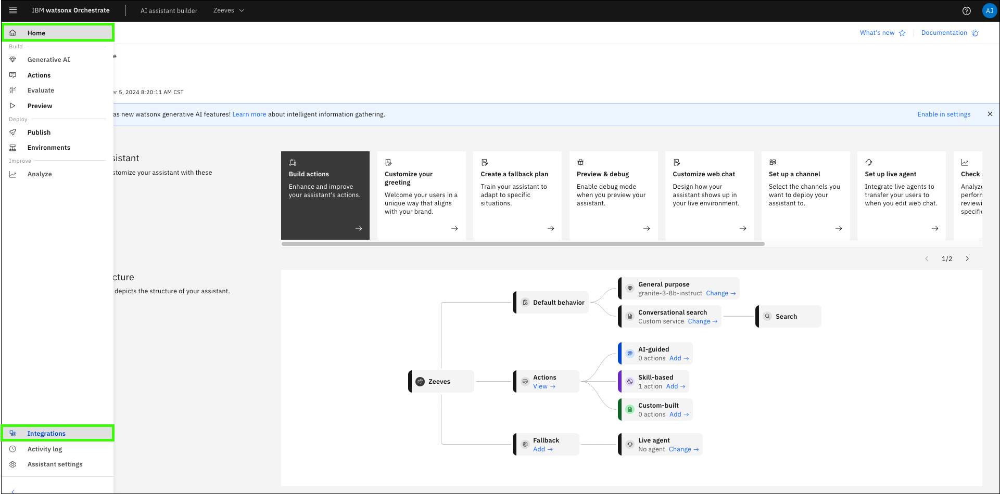
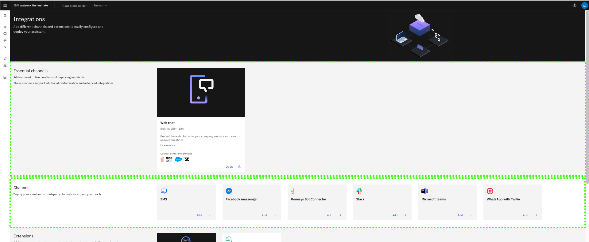
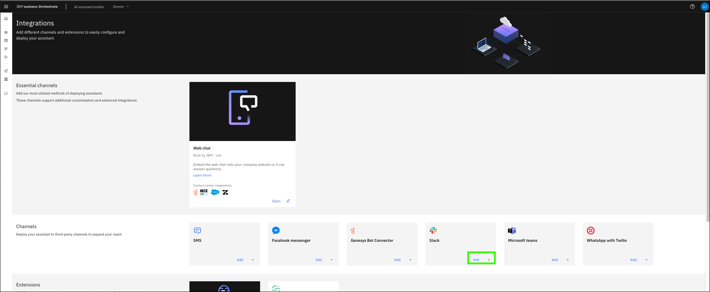
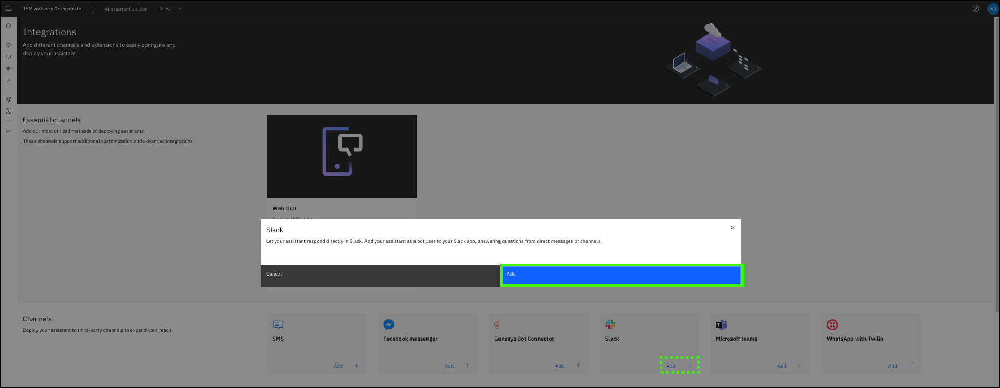

# Adding other integrations

{{offering.name}} can integrate with other delivery channels beyond a web page. Other channels include Slack, Microsoft teams, WhatsApp, and many others. Integrating with these and other channels are not covered in the lab guide. However, follow the steps to find the current channels that are supported and where to get more information.

1. Hover over the **Home** () and click **Integrations**.

    

2. Explore the **Essential channels** and **Channels** sections.

    

3. Click **Add** on the **Slack** tile.

    

4. Click **Add**.

    

5. Review the step-by-step instructions and additional information available for adding a Slack integration.

    **Note**: Most regular users do not have permissions to integrate with your enterprise slack deployment as doing so requires administrative rights.

    

Take time to further explore the next steps for adding a Slack integration channel and the other supported integration channels.

Learn more about adding integrations <a href="https://cloud.ibm.com/docs/watson-assistant?topic=watson-assistant-deploy-integration-add" target="_blank">here</a>.

