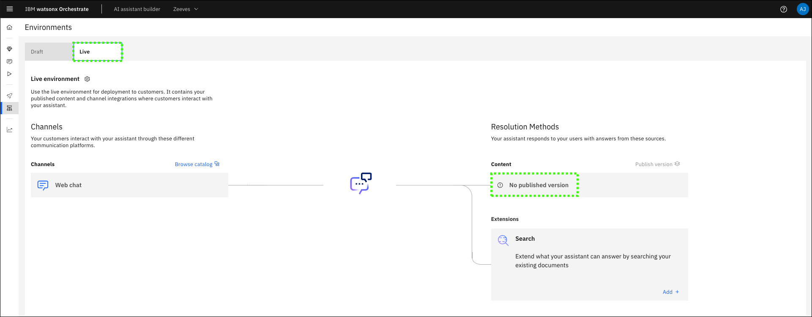
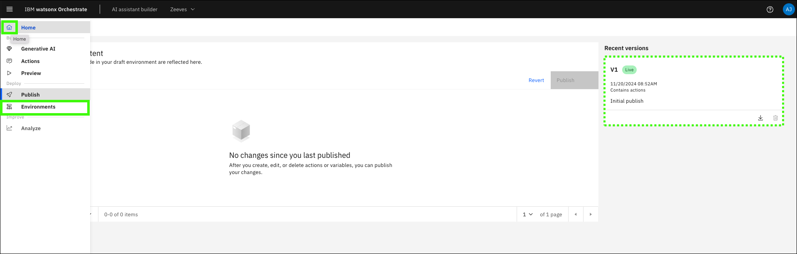
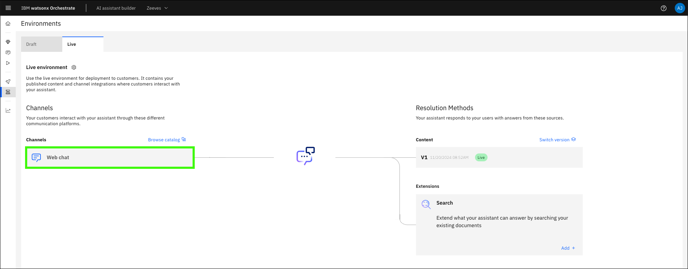
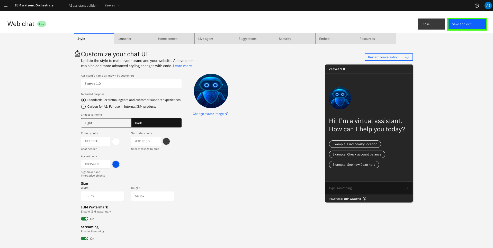
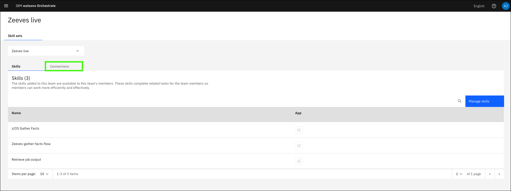
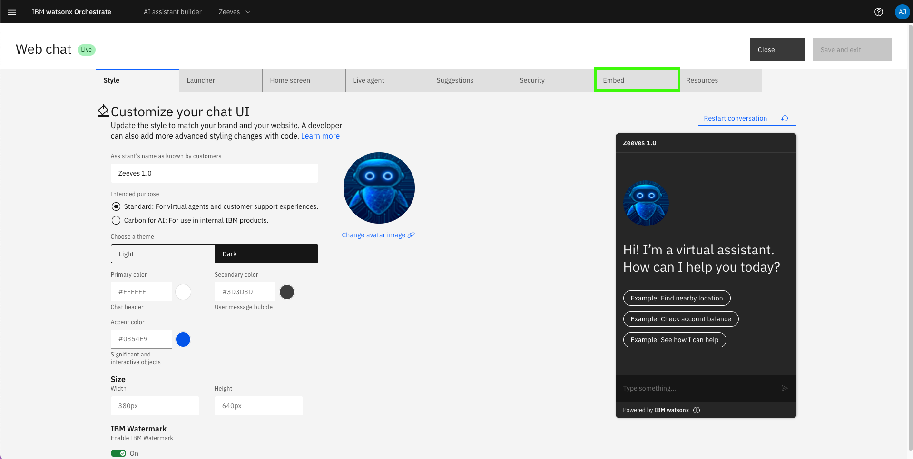
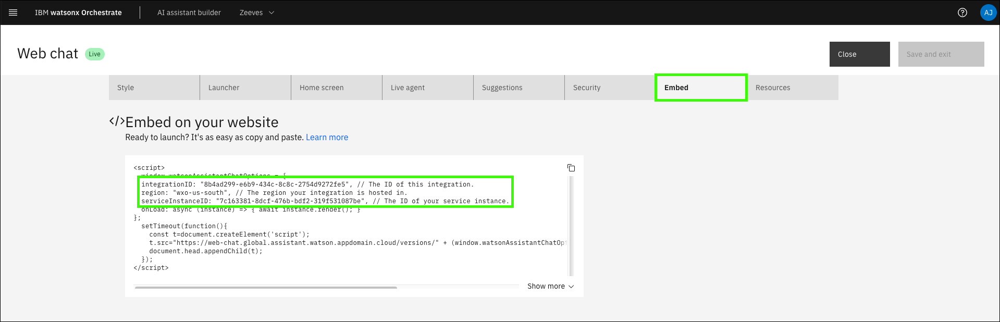
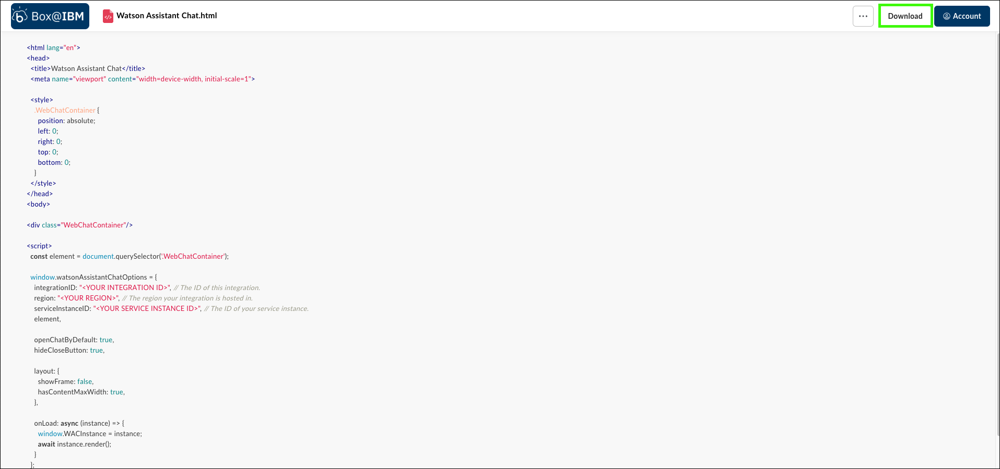
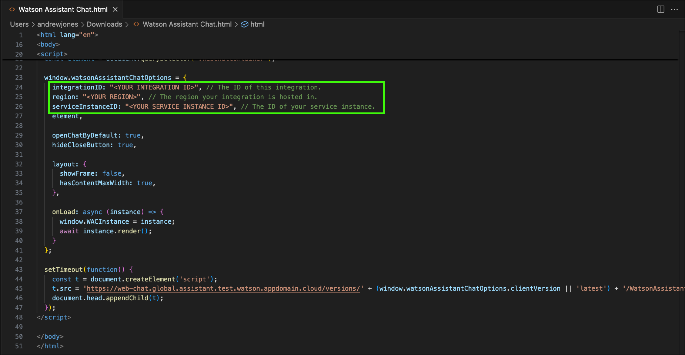

# Publishing and deploying your assistant

To this point, acting as an Assistant Builder, you have built out the assistant, configured conversational search, and added skills and automations. While doing so, you have been testing your assistant using the **preview** capability of AI Assistant Builder. The **preview** capability is a closed environment for experimenting with prompts.

After your assistant is finalized, you can publish it to make it available to end-users. Each assistant you create comes with two **environments**:
*draft* and *live*. You have been configuring your assistant in the draft environment. Each environment has its own set of IDs, URLs, and service credentials that can be referenced by external services.

The **Environments** page in the AI assistant builder has tabs for managing both the **Draft environment** and the **Live environment**:




The **Draft environment** contains all your in-progress work in the Actions, Preview, and Publish pages. Use the **Draft environment** tab to build out your assistant and use for internal testing before deployment. Any integrations you use (i.e. channels) for the **Draft environment** are unique to that environment, and changes to draft integrations don’t affect the **Live environment**.

## Publish the assistant
Each time that you publish, you’re creating a new version of the assistant, for example *V1*. When you publish your content, you’re creating a snapshot of the draft content, resulting in a version.

!!! Warning "Versions do not contain integration configurations or environment settings"

    Published versions contain all of the content from actions, including settings and variables. **However, versions do not contain integration configurations or environment settings.** Integration configurations and environment settings must be configured manually in each environment.

For managing quality-control and versioning, the Live environment is the version of the assistant you should be giving access to the end-user.

Follow these steps to publish the first version of your assistant using Assistant Builder:

1. Hover over the **Home** icon () and click **Publish**.

    

2. Click **Publish**.

    

3. Enter a description of the changes (**a**), set the environment to **Live** (**b**), and then click **Publish** (**c**).

    

## Configure the live environment

**Important**: When the live environment is created, the environment settings from the draft environment are not carried over (for example the configuration of the OpenSearch instance used for conversational search).

1. Hover over the **Home** icon () and click **Environments**.

    

2. Click **Live**.

    

3. Click **Web chat**.

    

4. Customize the live assistant as you see fit.

    On the **Style** tab, you’re able to set the Assistant name which will be displayed at the top of the chat window when end-users are interacting with the assistant. For pilots or demos, you may want to personalize this name for the client. Also in the **Style** tab, you have the ability set the themes and display settings of the chat windows, including the ability to enable the IBM Watermark and enable streaming (recommended).

    On the **Home** tab, you enable and customize a default greeting message from the assistant when the user accesses the assistant chat. You’re also able to set Conversation starters that will be displayed in the chat window. When selected by the end-user, the text of these conversation starters are sent as prompts, so it is important that your assistant is trained and tested to answer appropriately. It is highly recommended to remove these default conversation starters and to consider creating your own as long as they’re able to be executed as actions and provide value to the end-user. At the bottom of the Home screen tab, you will also see the ability to add a Background style for the assistant chat window.
    
    Explore all the other tabs.

    !!! Important "Customize your live environment."
    
        For this lab, toggle **Streaming** on and turn **Suggestions** off on the **Suggestions** tab. You may also want to change the theme to **Dark** to differentiate your draft and live environments. 

    

5. Click **Save and exit**.

    

6. Click **Add** in the **Search** tile.

    

7.  Click **Custom service**.

    

8.  Enter the URL for your bring-your-own-search (BYOS) engine (**a**), select **Basic authentication** for the **authentication type** (**b**), enter **admin** for the **Username** (**c**), enter the password you specified in the `wrapper-creds.yaml` file for the **Password** (**d**), and then click **Next** (**e**).

    !!! Warning "Use the correct URL and authentication type!"

        Use the URL and credentials for your BYOS OpenSearch engine created earlier [here](documentIngestion.md/#BYOS-url).

    

9.  Verify **conversational search** is enabled and click **Save**.

    

10. Update the **Custom service** settings (**a-f**), click **Save** (**g**), and then click **Close** (**h**).

    !!! Tip "Feel free to customize the settings."

        This is your assistant. Feel free to customize the settings. The settings shown below reflect the changes made earlier in the lab guide to the draft version of the assistant. This includes the **Metadata** field to weigh ingested client documents higher using: 

        ```
        {"doc_weight":
        {"product_docs":0.2,
        "customer_docs":0.8},
        "ibm_indices":"*_ibm_docs_slate,*_ibm_redbooks_slate",
        "standardize":true,
        "customer_indices":"customer_*"
        }
        ```

    

## Connect the skills to the live environment

1. Click **Skill sets** in the main menu.

    

2. Select your assistant's live instance in the **Skill sets** list.

    

3. Click **Connections**.

    

4. Search for the application name you specified earlier.

    

5. Click the ellipses () for your app and then click **Connect app**.

    

6. Click **Connect app**.

    

7. Enter the **username** (**a**) and **password** (**b**) using the username (`admin`) and password for your IBM Technology Zone (ITZ) *watsonx Assistant for Z Pilot - AAP & z/OS* reservation, and then click **Connect app** (**c**).

    

    Learn more about publishing your assistant and creating live environments <a href="https://www.ibm.com/docs/en/watsonx/waz/2.x?topic=assistants-previewing-publishing-your-ai-assistant" target="_blank">here</a>.

## Deploy the assistant
After configuring your assistant’s settings and publishing, the final step is to deploy your assistant which can be done across various channels depending on the use case.

There are several options for deploying your assistant through channels and integrations to satisfy the use cases that you might address. Learn more about all the deployment options <a href="https://www.ibm.com/docs/en/watsonx/waz/2.x?topic=assistants-deploying-your-ai-assistant" target="_blank">here</a>.

For this lab, you will deploy the assistant using the web chat integration. The web chat integration provides an assistant interface that can integrate with your website. There is a lot of flexibility with how you may want to integrate it. Learn more about the web chat integration <a href="https://cloud.ibm.com/docs/watson-assistant?topic=watson-assistant-web-chat-overview" target="_blank">here</a>.

1. Open the **Environments** page in **AI assistant builder**.

2. Click **Web chat** for the **Live** environment.

    

3.  Click the **Embed** tab.

    

4.  Copy and record the `integrationID`, `region`, and `serviceInstanceID` values.

    

<!-- 5.  Click the link below to download a sample web chat hyper text markup language (HTML) page.

    <a href="https://ibm.box.com/s/5fgw9zddqps7h8sxjbuqx0q5wv0fxvl2" target="_blank">**Watson Assistant Chat.html**</a>

     -->

5. In a text editor, create a file named `Watson Assistant Chat.html` and paste the following text in the file.

    File name:
    ```
    Watson Assistant Chat.html
    ```

    File contents:
    ```html
    <html lang="en">
    <head>
    <title>Watson Assistant Chat</title>
    <meta name="viewport" content="width=device-width, initial-scale=1">

    <style>
      .WebChatContainer {
        position: absolute;
        left: 0;
        right: 0;
        top: 0;
        bottom: 0;
      }
    </style>
    </head>
    <body>

    <div class="WebChatContainer"/>

    <script>
    const element = document.querySelector('.WebChatContainer');

    window.watsonAssistantChatOptions = {
        integrationID: "<YOUR INTEGRATION ID>", // The ID of this integration.
        region: "<YOUR REGION>", // The region your integration is hosted in.
        serviceInstanceID: "<YOUR SERVICE INSTANCE ID>", // The ID of your service instance.
        element,

        openChatByDefault: true,
        hideCloseButton: true,

        layout: {
          showFrame: false,
          hasContentMaxWidth: true,
        },

        onLoad: async (instance) => {
          window.WACInstance = instance;
          await instance.render();
        }
    };

    setTimeout(function() {
        const t = document.createElement('script');
        t.src = 'https://web-chat.global.assistant.test.watson.appdomain.cloud/versions/' + (window.watsonAssistantChatOptions.clientVersion || 'latest') + '/WatsonAssistantChatEntry.js';
        document.head.appendChild(t);
    });
    </script>

    </body>
    </html>
    ```

    Before modification:
    

    After modification:
    

6.  Open the `Watson Assistant Chat.html` file in a web browser.

    

Your assistant is now live. Explore some of the earlier prompts to verify the assistant is accessing the ingested documents and your skills and skill flows are active.

!!! Warning "Wait 5-10 seconds before clicking apply on skill actions."

Prompts to try:
```
What is z/OS continuous delivery?
```

```
Get z/OS facts
```

```
Show me z/OS facts
```

```
Gather and display z/OS facts
```
