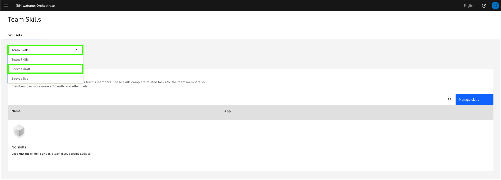
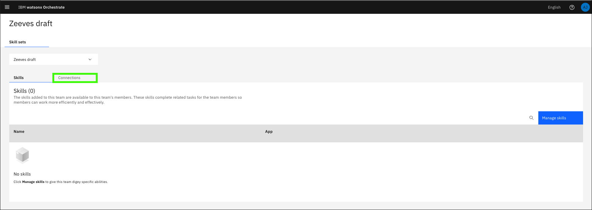
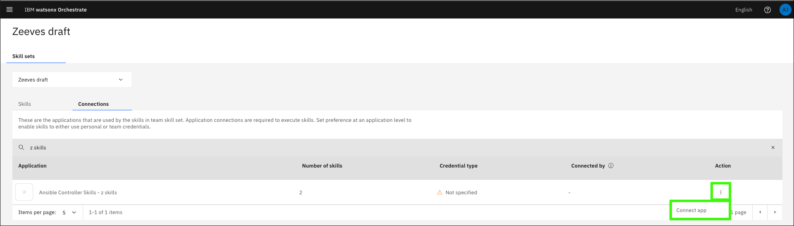
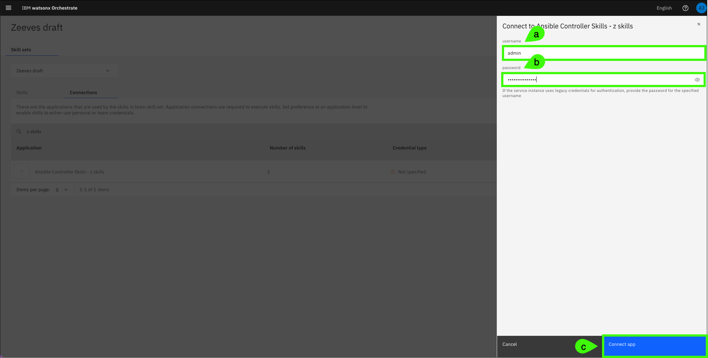

# Connecting skills to your assistant

Once you have a subset of skills published, the application you created can be connected to your assistant. 

1. Expand the main menu and select **Skill sets**.

    

2. Click the **Team Skills** drop-down and select the **Draft** of your assistant.

    

3. Click the **Connections** tab.

    

4. Click the **Search** () icon.

    

5. Search for the application name you specified in the [previous section](importSkills.md/#skillApp).

    

6. Click the ellipses () and click **Connect app**.

    

7. On the **Connect to Ansible Controller Skills** form, keep the defaults and click **Connect app**.

    

8. Enter the **username** (**a**) and **password** (**b**) using the username (`admin`) and password for your IBM Technology Zone (ITZ) *watsonx Assistant for Z Pilot - AAP & z/OS* reservation, and then click **Connect app** (**c**).

    

The application is now connected to the draft version of your assistant.

Continue to the next section to create actions for your assistant.